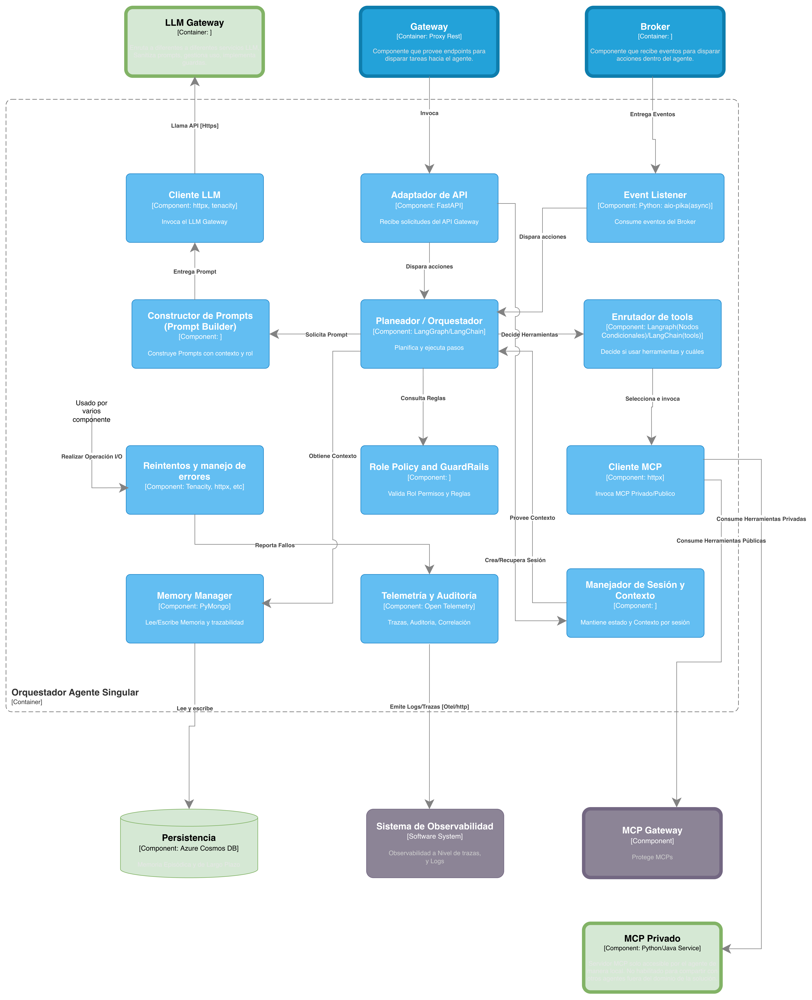

# Arquitectura de implementación v1.1

<!-- [macro: tabla de contenido] -->

# Introducción

Este documento es un complemento a la “arquitectura de referencia para la construcción de agentes de IA en SURA” y busca definir un stack tecnológico sobre el cuál se materializan los contenedores y componentes. Así mismo busca entregar elementos para seleccionar las herramientas más adecuadas cuando se cuenta con diferentes opciones.

# 1. Vista de despliegue para contenedores (En C4-Nivel 2)

El siguiente diagrama presenta los contenedores definidos en el documento de arquitectura de referencia (v1.1) y los enmarca en una tecnología definida así como en una arquitectura de despliegue especifica.

Esta visión de despliegue presenta una evolución de la arquitectura de implementación para la construcción de agentes de IA en SURA. La solución sigue alineada con la arquitectura de referencia 1.1 para **Agente Singular**, que define al sistema como una unidad de orquestación con responsabilidad unificada, enfocada en planeación, razonamiento, gestión de memoria, uso de herramientas e integración con sistemas empresariales. En esa misma línea, esta propuesta no introduce coordinación distribuida ni lógica multiagente; por el contrario, busca materializar el patrón más simple y trazable para casos de alcance acotado.

El cambio más visible frente a aproximaciones anteriores es que esta implementación aterriza el runtime del agente sobre **Azure Container Apps** en lugar de Kubernetes. La decisión es deliberada: para un caso de **agente singular**, donde no se requiere segmentación compleja de cargas, operación avanzada de clúster ni coordinación de múltiples pods especializados, el uso de Kubernetes introduciría un nivel de overhead operativo que no aporta suficiente valor. Container Apps permite conservar las ventajas de una arquitectura cloud-native basada en contenedores —portabilidad, despliegue estandarizado, elasticidad, aislamiento y facilidad de versionamiento—, pero con una huella operativa menor y una mejor relación entre simplicidad y capacidad.

Desde el punto de vista estructural, la arquitectura puede entenderse en **tres ámbitos**. El primero es el **Sistema de Agente Singular**, desplegado en una suscripción de Azure. El segundo es el **Sistema de Acceso al Conocimiento**, también en Azure, pero explícitamente modelado como un sistema externo especializado en conocimiento empresarial. El tercero es el **Sistema Catálogo MCP Público**, expuesto por fuera de ese entorno mediante **Google Cloud / Apigee**. Esta separación es importante porque en la versión 1.1 de la arquitectura de referencia se aclara expresamente que ni **Acceso al Conocimiento** ni **MCP Público** hacen parte del límite del sistema “Agente Singular”; son sistemas externos con los que el agente se integra de forma gobernada. La arquitectura, por tanto, refuerza un principio central: el agente razona y orquesta, pero no debe absorber ni el dominio del conocimiento ni el catálogo corporativo de herramientas reutilizables.

## a. Sistema de Agente Singular

Este bloque corresponde al runtime cognitivo del agente y contiene los componentes directamente responsables de su operación. En la vista de referencia, el sistema del agente se entiende como el núcleo que centraliza la orquestación y controla el acceso a modelos, memoria y herramientas; esta visión de despliegue toma ese mismo principio y lo implementa de forma más liviana.

### Orquestador Agente Singular

El **Orquestador Agente Singular** es el cerebro operativo de la solución. Es el componente que interpreta la intención, arma el contexto, decide qué capacidades necesita usar, consulta memoria, invoca herramientas y consolida la respuesta final. En la arquitectura de referencia 1.1, además, se explicita que el orquestador debe encargarse de la **instrumentación de observabilidad**, es decir, emitir trazas, logs y métricas del comportamiento del agente. Esto es relevante porque en una arquitectura AI-First no basta con que el agente funcione: también debe ser auditable, entendible y operable.

En esta vista, el orquestador se despliega como contenedor ejecutable en **Java o Python**, lo que refleja una postura tecnológica flexible. Java puede aportar robustez, estandarización y alineación con capacidades empresariales existentes, mientras Python ofrece ventajas claras para construir runtimes de agentes y aprovechar librerías especializadas del ecosistema LLM. La arquitectura evita imponer una sola implementación mientras conserva un patrón estable de despliegue.

### MCP Privado

El **MCP Privado** acompaña al orquestador como un microservicio local del dominio de la solución. Su responsabilidad no es exponer herramientas reutilizables para toda la organización, sino encapsular capacidades privadas y específicas del agente: acceso controlado a APIs internas, validaciones determinísticas, ejecución de acciones del dominio y desacoplamiento de integraciones que no deberían quedar embebidas en la lógica cognitiva.

Su presencia en la arquitectura responde a una distinción importante de la referencia 1.1: las herramientas privadas del agente no deben confundirse con las herramientas compartidas del ecosistema. El MCP Privado existe para proteger el runtime del agente de acoplamientos innecesarios y para separar con claridad el razonamiento de la integración técnica.

### Persistencia

La **Persistencia**, soportada aquí en **Azure Cosmos DB con API Mongo**, resuelve la memoria de largo plazo del agente. Esta elección es coherente con lo que la arquitectura de referencia define como necesidades de memoria: historial conversacional persistente, memoria episódica y otros artefactos de contexto de naturaleza semiestructurada. Cosmos DB ofrece una base administrada, distribuida y de baja latencia, adecuada para este tipo de cargas.

No se trata solo de guardar conversaciones. La persistencia permite que el agente mantenga continuidad entre interacciones, soporte trazabilidad operativa y reduzca dependencia de estados efímeros del runtime. En otras palabras, es un habilitador de memoria, pero también de auditabilidad y mantenibilidad.

### Servicios LLM y Azure AI Foundry

Uno de los ajustes más importantes de esta implementación es que utiliza **Azure AI Foundry** como realización concreta del acceso gobernado a modelos. Conceptualmente, esto es compatible con la responsabilidad que en la arquitectura de referencia tiene el **LLM Gateway**: abstraer el acceso a modelos, manejar políticas de uso, controlar costos y desacoplar al orquestador del proveedor de inferencia.

En esta vista, en lugar de representar un gateway lógico separado dentro del sistema del agente, se muestra a **AI Foundry** como el punto de acceso válido a los **Servicios LLM**. Esto simplifica la materialización técnica del patrón sin romper el principio arquitectónico. El agente no consume modelos de manera rígida o directa desde su lógica interna; los consume a través de una capacidad de plataforma que permite control, estandarización y evolución. Visto así, AI Foundry opera en esta arquitectura como una implementación válida del rol que el documento de referencia asigna al LLM Gateway.

### Capacidades operativas y de seguridad

Aunque el diagrama es más simple, conserva con claridad los componentes de infraestructura que sostienen una operación empresarial: **Azure Container Registry Premium** para el almacenamiento y distribución de imágenes, **Storage Account** para soportes auxiliares, **Key Vault** para manejo seguro de secretos y una red privada apoyada en **Private Endpoints**. Esta decisión mantiene el principio de seguridad desde el diseño y reduce exposición innecesaria de componentes críticos.

De igual forma, el uso de **Application Insights** y **Log Analytics** debe interpretarse a la luz de la versión 1.1 de la arquitectura de referencia, que ya no trata la observabilidad solo como un detalle técnico del contenedor, sino como un **sistema externo especializado** que centraliza logs, métricas, trazas y telemetría. En consecuencia, aunque estos componentes aparecen cercanos al runtime del agente, arquitectónicamente conviene describirlos como parte de una capacidad operativa transversal que soporta auditoría, cumplimiento, evaluación de agencia y mejora continua.

## b. Sistema de Acceso al Conocimiento

La segunda gran pieza del despliegue es el **Sistema de Acceso al Conocimiento**, modelado como un sistema externo y separado del runtime del agente. Este ajuste es plenamente consistente con la arquitectura de referencia 1.1, que refuerza la idea de que el conocimiento empresarial debe vivir en un subsistema especializado, con sus propias responsabilidades de ingestión, indexación, gobernanza de fuentes y evolución independiente.

Aquí aparecen tres elementos principales:

### Servidor MCP Público

El **Servidor MCP Público** actúa como interfaz de exposición de capacidades relacionadas con el conocimiento. Su función es permitir que el agente consuma herramientas o consultas sobre conocimiento mediante el protocolo MCP, sin necesidad de conectarse de forma directa al detalle interno de la infraestructura de datos.

### Índices

Los **Índices**, soportados por **Azure AI Search**, representan la capa de acceso semántico al conocimiento. Son el mecanismo que habilita búsquedas vectoriales o híbridas para escenarios de RAG, permitiendo recuperar fragmentos relevantes de información empresarial y enriquecer el contexto del agente.

### Gestor de Ingesta

El **Gestor de Ingesta**, implementado sobre **Databricks**, cumple la responsabilidad de preparar, transformar y publicar el conocimiento que luego será consumido mediante los índices. Esta pieza es clave porque evita que el agente asuma responsabilidades de curaduría o procesamiento documental. El conocimiento se ingesta, organiza y gobierna fuera del runtime del agente, lo cual mejora mantenibilidad y separa claramente responsabilidades.

Este bloque externo existe para expresar un principio que vale la pena dejar explícito en Confluence: **el dominio del agente no es el dominio de la información**. El agente usa conocimiento, pero no debe ser el dueño del pipeline de ingestión, ni del producto de datos, ni del gobierno semántico de las fuentes. Esa frontera es una de las mejoras más sanas de esta evolución arquitectónica.

## c. Sistema Catálogo MCP Público

El tercer ámbito visible en la arquitectura es el **Sistema Catálogo MCP Público**, materializado mediante un **MCP Gateway** desplegado en **Apigee / Google Cloud**. Su inclusión hace explícita otra frontera relevante: las herramientas públicas y reutilizables del ecosistema no pertenecen al agente singular, ni a su MCP Privado.

Este gateway protege y expone capacidades estandarizadas, facilitando descubrimiento, acceso gobernado y reutilización. La versión 1.1 de la arquitectura de referencia remarca que el sistema MCP público debe soportar la exposición centralizada y segura de herramientas accesibles por múltiples agentes. Esta vista de implementación conserva esa idea y la representa como un sistema externo que el agente puede consumir sin perder su simplicidad estructural.

# 2. Principales decisiones de implementación

## Uso de Azure AI Foundry se asume como implementación válida del concepto de LLM Gateway

Arquitectónicamente se reconoce que:

- **Foundry actúa como una abstracción de modelos**, evitando que el orquestador consuma directamente SDKs o APIs específicas de cada proveedor.
- Foundry permite:

    - Selección de modelos
    - Control de acceso
    - Gestión de cuotas/tokens
    - Ciertas capacidades de evaluación y seguridad
- Aunque **no se dibuje explícitamente como “LLM Gateway” en el diagrama**, **cumple esa función en la arquitectura actual**.

Se acepta que esta abstracción es **limitada al proveedor**, pero suficiente para la versión inicial.

## Rol y ubicación de Databricks dentro de la arquitectura de agentes

En coherencia con la **arquitectura de referencia de agentes**, **Databricks no forma parte del runtime del agente ni de la arquitectura de despliegue del Agente Singular**. Su rol se ubica de manera explícita **fuera del sistema del agente**, como una **capacidad especializada de procesamiento de datos** perteneciente al **dominio de información y conocimiento**, y no al dominio de solución del agente.

Databricks debe entenderse como un **motor de procesamiento masivo de datos por demanda**, cuya responsabilidad principal es **moler, transformar, curar y preparar activos de datos** provenientes de los dominios de información del negocio. En este contexto, su función se limita a ejecutar pipelines de ingestión, transformación y enriquecimiento de datos —por ejemplo, generación de embeddings, normalización de documentos o preparación de datasets— cuyo resultado final es disponibilizado en **índices, repositorios o productos de datos gobernados**, tales como Azure AI Search u otros mecanismos de acceso al conocimiento definidos en la arquitectura de referencia.

Es fundamental aclarar que **Databricks no debe ejecutar lógica agéntica**, ni flujos de razonamiento, ni comportarse como un componente operativo del agente. En particular, no es su responsabilidad:

- Orquestar flujos de decisión del agente.
- Ejecutar procesos “helper” o utilitarios propios del dominio funcional del agente.
- Exponer interfaces operativas directamente consumidas por el runtime del agente.
- Convertirse en un punto transversal para funcionalidades que no correspondan al procesamiento masivo de datos.

Desde el punto de vista arquitectónico, **mezclar Databricks dentro del dominio del agente rompería el principio de separación de responsabilidades** definido en la arquitectura de referencia, al introducir capacidades de ingestión, transformación y curaduría de datos —propias de un **producto de datos**— dentro de un sistema cuyo propósito es **razonar, planear y ejecutar acciones**. Esta mezcla genera acoplamientos innecesarios, riesgos de seguridad (permisos cruzados entre dominios) y una dilución del encapsulamiento que debe caracterizar a los productos de datos.

En coherencia con la arquitectura de referencia, el **acceso del agente al conocimiento** debe realizarse exclusivamente a través de **interfaces bien definidas**, como servidores MCP o servicios de acceso al conocimiento, que consumen índices y productos de datos ya preparados. El agente **no debe conocer ni depender de cómo esos datos fueron procesados**, ni interactuar directamente con Databricks. Esta separación permite que los equipos de datos y los equipos de agentes evolucionen de manera independiente, respetando los límites de cada dominio.

Adicionalmente, se establece como principio que **Databricks debe operar bajo un modelo de ejecución por demanda**, levantándose únicamente cuando es necesario procesar datos y apagándose una vez finalizada la tarea. Esto refuerza su naturaleza como **motor de procesamiento batch o semi‑batch**, evita su uso como componente siempre activo y reduce riesgos de sobreuso o de convertirlo en un “monolito” transversal de la plataforma.

En síntesis, dentro del ecosistema de agentes:

- **Databricks pertenece al dominio de información y conocimiento**, no al dominio del agente.
- Su rol es **preparar datos**, no **operar agentes**.
- El agente consume conocimiento **ya curado y gobernado**, sin dependencia directa del motor de procesamiento.
- Mantener este límite es clave para evitar lock‑in, sobre‑ingeniería y violaciones a los principios de encapsulamiento y seguridad.

Esta definición permite que la arquitectura de agentes se mantenga **simple, trazable y evolutiva**, al tiempo que preserva a Databricks como una herramienta potente y especializada en el lugar correcto del ecosistema arquitectónico.

## Uso de Azure Container Apps para el despliegue de las cargas de trabajo del agente

Para la arquitectura de implementación del **Agente Singular** se define **Azure Container Apps** como mecanismo principal de despliegue de las cargas de trabajo contenerizadas del runtime del agente. Esta decisión responde a la necesidad de contar con una plataforma **cloud-native**, administrada, con bajo overhead operativo y alineada con el nivel de madurez actual de la solución, donde el patrón arquitectónico priorizado es el de **agente singular**, es decir, una unidad de orquestación única, con responsabilidad acotada, alta trazabilidad y una cantidad limitada de artefactos desplegables.

Se establece que, para un **agente singular**, no siempre es conveniente asumir de entrada el costo operativo y la complejidad de un clúster de Kubernetes. **Container Apps es una opción válida y pertinente cuando la solución despliega uno o pocos artefactos**, por ejemplo el orquestador y uno o dos componentes adicionales, mientras que **AKS adquiere mayor sentido cuando la solución evoluciona hacia escenarios multiagente, múltiples MCP servers o capacidades transversales compartidas** con mayor densidad de componentes de despliegue y necesidades avanzadas de orquestación.

Desde la perspectiva de industria, **Azure Container Apps** es una plataforma de contenedores **serverless y totalmente administrada**, construida sobre tecnologías abiertas y orientada a ejecutar **APIs, microservicios, procesamiento en segundo plano y cargas event-driven** sin exponer al equipo a la administración directa de clústeres, nodos, control plane o detalles de orquestación. Microsoft posiciona esta opción precisamente para equipos que necesitan construir aplicaciones “Kubernetes-style” pero **sin requerir acceso directo a la API nativa de Kubernetes ni a la administración del clúster**, lo cual encaja adecuadamente con el objetivo actual de acelerar la habilitación del runtime del agente sin introducir complejidad innecesaria en la capa de infraestructura.

Esta elección se alinea además con la estructura misma del contenedor **“Orquestador Agente Singular”** descrita en el diagrama de implementación, donde el runtime del agente concentra componentes como el **Adaptador de API**, el **Planeador/Orquestador**, el **Event Listener**, el **Cliente LLM**, el **Cliente MCP**, el **Manejador de Sesión y Contexto** y la **Telemetría y Auditoría**. Se trata de una carga de trabajo claramente contenerizable, de naturaleza predominantemente stateless en su capa de ejecución, con persistencia desacoplada hacia servicios administrados como **Cosmos DB**, y con integración hacia capacidades externas como **LLM Gateway**, **MCP Gateway**, broker y observabilidad. Este patrón favorece una plataforma como Container Apps, que abstrae la infraestructura y permite enfocarse en la lógica del agente y sus integraciones.

Otro factor determinante es la **elasticidad operativa**. Azure Container Apps soporta **escalamiento automático horizontal** en función de tráfico HTTP, carga de CPU o memoria y, especialmente, de eventos mediante **KEDA**, incluyendo la posibilidad de escalar dinámicamente según colas, mensajería y múltiples fuentes de eventos soportadas. Además, la plataforma permite que muchas cargas escalen a cero cuando no hay demanda, lo que optimiza costos en escenarios de uso intermitente. Esto resulta especialmente valioso para una arquitectura de agentes donde pueden coexistir patrones **request/response**, procesamiento asíncrono vía broker y ejecuciones por eventos, tal como se contempla en la arquitectura de referencia y en la definición del Event Listener del runtime.

La plataforma también aporta capacidades relevantes para la **evolución progresiva** de la solución. Azure Container Apps incluye soporte para **revisiones inmutables**, división de tráfico entre versiones, despliegues Blue/Green o A/B, **service discovery**, ingreso HTTP/TCP, integración con redes virtuales, gestión de secretos y observabilidad integrada con **Log Analytics**. Estas capacidades son particularmente útiles en sistemas de agentes, donde se requiere iterar con rapidez sobre versiones del runtime, introducir cambios controlados y mantener trazabilidad sobre el comportamiento operativo del sistema. Desde la arquitectura de referencia, la organización ha definido como atributos prioritarios la **trazabilidad**, la **mantenibilidad**, la **eficiencia operativa** y la **adaptabilidad creciente**; Container Apps contribuye directamente a estos objetivos al ofrecer una operación más simple y gobernable para el nivel actual de complejidad.

Adicionalmente, la adopción de Container Apps preserva una ruta de evolución coherente con la arquitectura de referencia. La decisión no niega el uso futuro de **AKS**; por el contrario, define un **criterio de transición explícito**: mientras la solución permanezca en el patrón de **agente singular**, con pocos artefactos de despliegue y sin requerimientos avanzados de control del plano de Kubernetes, Container Apps ofrece el mejor balance entre simplicidad, escalabilidad y velocidad de habilitación. Cuando la arquitectura evolucione hacia patrones **multiagente**, catálogos amplios de herramientas, múltiples runtimes coordinados o capacidades transversales compartidas que exijan mayor control de orquestación, entonces AKS podrá evaluarse como la siguiente etapa natural. Esta distinción fue manifestada de forma explícita en la reunión, donde se indicó que Kubernetes empieza a justificarse más claramente cuando la solución crece en número de componentes, transversalidad y necesidades de escalado avanzado

En consecuencia, la definición de **Azure Container Apps** para esta versión de la arquitectura de implementación se fundamenta en cinco razones principales: **(1)** reduce el overhead operativo respecto a un clúster administrado de Kubernetes; **(2)** se ajusta al patrón actual de **agente singular** con pocos artefactos desplegables; **(3)** habilita escalado automático y event-driven adecuado para el comportamiento del runtime; **(4)** favorece una operación costo-eficiente mediante un modelo administrado y el potencial de scale-to-zero; y **(5)** mantiene abierta la ruta de evolución futura hacia esquemas más complejos sin sobredimensionar la solución en su etapa actual. De esta forma, la elección de Container Apps no solo es técnicamente viable, sino arquitectónicamente consistente con el principio de construir una base simple, gobernable y evolutiva para la adopción de agentes de IA en la organización

En resumen:

Se define **Azure Container Apps** como plataforma de despliegue para las cargas de trabajo del **Agente Singular** porque ofrece un modelo **serverless, administrado y cloud-native** que reduce el overhead operativo frente a Kubernetes, manteniendo al mismo tiempo capacidades clave de escalabilidad, resiliencia y gobierno. Esta decisión se ajusta al nivel de madurez actual de la arquitectura, en el que el agente se concibe como una unidad de orquestación única, con pocos artefactos desplegables y fuerte necesidad de trazabilidad, mantenibilidad y eficiencia operativa.

Container Apps resulta especialmente adecuado en este escenario porque soporta **APIs, procesamiento en segundo plano y cargas event-driven**, además de **autoscaling** basado en tráfico, CPU/memoria o eventos mediante **KEDA**, con posibilidad de optimización de costos en cargas intermitentes. La discusión de arquitectura también concluyó que esta opción es la más pertinente mientras el sistema permanezca en un patrón de **agente singular**; en cambio, una evolución hacia **multiagentes**, múltiples MCP servers o capacidades transversales compartidas podría justificar posteriormente el uso de **AKS**.

### Nota Importante Respecto a Web Apps

**Azure Web Apps for Containers** se presenta como una alternativa viable para el despliegue del **Agente Singular**, especialmente considerando que esta opción se encuentra actualmente **definida y soportada dentro del framework de IaC de SURA** para cargas simples y con bajo número de artefactos. Web Apps ofrece un modelo PaaS maduro, de rápida habilitación y con bajo overhead operativo, lo cual la convierte en una opción válida desde el punto de vista técnico para escenarios de baja complejidad.

No obstante, se decidió **no utilizar Web Apps en esta arquitectura** debido a limitaciones estructurales frente a los requerimientos del runtime del agente. En particular, Web Apps está optimizada principalmente para **cargas HTTP sincrónicas**, y ofrece capacidades más limitadas para **patrones event‑driven**, escalamiento basado en eventos, control fino de concurrencia, y evolución hacia arquitecturas más agénticas o multi‑runtime. Dado que incluso un **agente singular** puede combinar flujos request/response, procesamiento asíncrono vía mensajería y ejecución por eventos, se priorizó una plataforma que ofrezca estas capacidades de forma nativa y consistente.

En este contexto, **Azure Container Apps** representa un mejor equilibrio entre simplicidad operativa y alineación con la evolución esperada de la arquitectura de agentes, sin incurrir aún en la complejidad operativa de Kubernetes. La decisión no invalida Web Apps como alternativa dentro del framework, pero establece que, para agentes de IA, incluso en su forma singular, **Container Apps es una base más adecuada y preparada para la evolución futura del modelo**.

| **Alternativa** | **Ventajas en escenario de*****Agente Singular*** | **Desventajas / Limitaciones** |
| --- | --- | --- |
| **Web Apps for Containers** | - Muy bajo overhead operativo (PaaS). - Rápida habilitación y ampliamente soportado en el framework de IaC de SURA. - Adecuado para cargas simples y APIs HTTP puras. - Buen soporte para CI/CD y operación básica. | - Orientado principalmente a HTTP request/response. - Soporte limitado para cargas event‑driven y mensajería compleja. - Menor control sobre escalamiento por eventos y concurrencia. - Evolución más rígida hacia escenarios agénticos avanzados. |
| **Azure Container Apps *(opción seleccionada)** | - Plataforma serverless de contenedores con bajo overhead operativo. - Soporte nativo para HTTP, background jobs y cargas event‑driven (KEDA). - Escalamiento automático y posibilidad de scale‑to‑zero (es decir, que los recursos pueden reducirse completamente a cero instancias cuando no hay carga, optimizando costos). - Mejor alineación con flujos asíncronos del agente (event listener, broker). - Base sólida para evolucionar hacia escenarios más complejos sin sobredimensionar. | - Menor control que AKS sobre el plano de Kubernetes. - Requiere habilitación específica en el framework de IaC (No existe aún). - No expone todas las capacidades avanzadas de Kubernetes. |
| **AKS (Kubernetes)** | - Máximo control sobre orquestación, networking y despliegue. - Adecuado para múltiples runtimes, MCP servers y agentes concurrentes. - Base natural para arquitecturas multiagente y capacidades transversales. | - Overhead operativo alto para un agente singular. - Mayor complejidad de operación, seguridad y costos iniciales. - Sobredimensionado para cargas con pocos artefactos de despliegue. - Requiere mayor madurez organizacional y operativa. |

En pocas palabras:

Web Apps es técnicamente viable, Container Apps es arquitectónicamente más adecuado y AKS es una opción de evolución, no de arranque.

# 3. Vista de componentes (C4 - Nivel 3)

Dentro de todos los contenedores presentados en la arquitecura de referencia, se decide profundizar ahora en el contenedor de “Orquestador Agente singular” dentro del subsistema “Core del agente”. Se trata del contenedor principal sobre el cual se construye la manera en que el agente interactua con los diferentes sistemas externos incluyendo los servicios de LLM que le dan la capacidad de razonamiento.

## Vista de componentes para Contenedor “Orquestador Agente Singular”

Este contenedor representa el **runtime del agente**, es decir, la unidad desplegable que implementa la lógica de razonamiento, ejecución de herramientas, manejo de memoria y observabilidad. Es el corazón operativo del agente.

El diseño de componentes está orientado a:

· Separación de responsabilidades

· Resiliencia ante fallos

· Gobernanza (policy + observabilidad)

· Integración limpia con LLMs y herramientas MCP

· Persistencia explícita de memoria

### Adaptador de API (FastAPI)

Este componente actúa como la **puerta de entrada HTTP al agente**, recibiendo solicitudes provenientes del Gateway.

La elección de **FastAPI** se justifica en lo siguiente:

· Soporta async nativo (clave para llamadas a LLM y MCP).

· Integra validación automática con Pydantic.

· Tiene excelente rendimiento sobre Uvicorn. Uvicorn es un servidor web rápido para aplicaciones Python con ASGI. (Asynchronous Server Gateway Interface)

· Se integra fácilmente con OpenTelemetry.

El Adaptador de API no contiene lógica de negocio compleja; su función es:

· Validar la request.

· Crear o recuperar sesión.

· Invocar al Planeador/Orquestador.

Este desacoplamiento mantiene el dominio del agente separado del transporte HTTP.

### Event Listener (aio-pika async)

Este componente consume eventos del Broker.

La elección de **aio-pika** (RabbitMQ async) se justifica en que:

· Permite consumo no bloqueante.

· Encaja con el modelo async del resto del runtime.

· Facilita backpressure y control fino del consumo.

· Es una de las librerías más populares (Y en consecuencia, mejor soportadas) en el ecosistema Python para consumir y producir mensajes en RabbitMQ de manera asíncrona.

Aquí se habilitan patrones como:

· Retries controlados

· DLQ

· Procesamiento idempotente

Este componente permite que el agente no sea solo request/response, sino también reactivo a eventos.

### Planeador / Orquestador (LangGraph / LangChain)

Este es el núcleo cognitivo del agente.

Se usa:

· **LangGraph** para modelar el flujo como un grafo de estados.

· **LangChain** para herramientas, prompts y abstracciones de LLM.

La razón técnica es clara:

· LangGraph permite estados persistentes y flujos no lineales.

· Permite control explícito de decisiones (no solo ReAct simple). Es decir, se pueden seguir flujos más complejos de decisión.

· Facilita instrumentación y control del flujo.

Aquí ocurre:

· Decisión de usar herramientas.

· Construcción de prompts.

· Invocación al LLM.

· Coordinación con políticas y memoria.

Este componente es el “cerebro” del contenedor.

### Constructor de Prompts (Prompt Builder)

Encapsula la lógica de construcción de prompts con:

· Contexto

· Rol

· Reglas

Separarlo del planeador permite:

· Reutilización.

· Versionamiento de plantillas.

· Evolución sin tocar la lógica de ejecución.

Aunque aún no se ha decido una tecnología concreta, algunas opciones son:

· Jinja2

· o PromptTemplates de LangChain.

Esto evita mezclar lógica de negocio con texto estructural.

### Cliente LLM (httpx + tenacity)

Este componente invoca el LLM Gateway vía HTTPS.

La elección de:

· **httpx** el cual es un cliente HTTP moderno, async, compatible con API Manager.

· **tenacity** que sirve para implementar reintentos con backoff exponencial.

es adecuada porque:

· Permite controlar 429(demasiadas peticiones) y 5xx(Error interno del Servidor).

· Evita bloquear el event loop.

· Permite timeouts estrictos.

Este componente es responsable únicamente de la comunicación, no de decisiones de modelo.

### Enrutador de Tools (LangGraph / LangChain tools)

Aquí se decide si usar herramientas y cuáles.

Está integrado al flujo del planeador pero separado conceptualmente.

Su función:

· Analizar el estado actual.

· Determinar necesidad de tool.

· Delegar ejecución al Cliente MCP.

Este desacoplamiento permite cambiar estrategias de tool selection sin tocar el cliente MCP. Es decir, al separar el proceso de elegir y gestionar herramientas del componente que se encarga de comunicarse con el MCP (cliente MCP), es posible modificar cómo y cuándo se seleccionan las herramientas sin tener que hacer cambios en el propio cliente MCP. En otras palabras, el cliente MCP permanece independiente y no se ve afectado por alteraciones en la lógica de selección de herramientas, lo que facilita la adaptabilidad y el mantenimiento del sistema.

### Cliente MCP (httpx)

El Cliente MCP invoca herramientas privadas o públicas vía MCP Gateway.

Se usa **httpx** porque:

· MCP está expuesto vía API Manager.

· Se requiere control de headers, auth y timeouts.

· JSON-RPC sobre HTTP no requiere SDK especializado.

El cliente es fino, enfocado en transporte y contrato.

### Role Policy and GuardRails

Este componente valida:

· Permisos del rol.

· Reglas de ejecución.

· Restricciones de herramientas.

Es crítico desde el punto de vista de gobernanza.

Separarlo del planeador permite:

· Auditoría independiente.

· Cambio de motor de políticas (Casbin, OPA, etc.)

· Evolución hacia ABAC o RBAC avanzado.

Aquí se materializa el control organizacional.

### Manejador de Sesión y Contexto

Mantiene el estado por sesión:

· Historial inmediato.

· Variables de contexto.

· Identificadores de correlación.

Se comunica tanto con el Planeador como con Telemetría.

Su separación del Memory Manager permite:

· Diferenciar memoria corta (estado activo)

· De memoria larga (histórico en Cosmos)

### Memory Manager (PyMongo)

Consume Cosmos DB API Mongo para memoria larga.

El uso de **PyMongo** se justifica en que:

· Cosmos Mongo API es compatible.

· Permite pooling y manejo robusto.

· Es estándar de facto en Python.

El Memory Manager:

· Lee/escribe histórico.

· Gestiona trazabilidad persistente.

· No contiene lógica de negocio.

Separarlo de sesión evita acoplamiento entre memoria activa y persistente. Es decir, separar el manejo de sesión del Memory Manager implica que la información que se utiliza activamente durante una sesión (memoria corta, como el historial inmediato, variables de contexto o identificadores de correlación) no está directamente conectada ni depende de la memoria persistente o de largo plazo (almacenada en Cosmos DB). Esto permite que cada componente gestione su propio ámbito de datos y responsabilidades, facilitando la escalabilidad, el mantenimiento y evitando que cambios en uno afecten al otro. Así, se reduce el acoplamiento, lo que significa que los posibles problemas o modificaciones en la gestión de la memoria activa no impactan en el almacenamiento histórico y viceversa, logrando una arquitectura más robusta y flexible.

### Reintentos y Manejo de Errores (Tenacity, httpx, etc.)

Este componente es transversal.

No es un servicio externo, sino una **librería de resiliencia compartida** usada por:

· Cliente LLM

· Cliente MCP

· Memory Manager

· Event Listener

Su existencia explícita en el diagrama busca:

· Hacer visible la estrategia de resiliencia.

· Permitir el gobierno de patrones de retry.

· Evitar reintentos ad-hoc inconsistentes.

### Telemetría y Auditoría (OpenTelemetry)

Centraliza:

· Logs estructurados.

· Trazas distribuidas.

· Correlation IDs.

· Auditoría de decisiones del agente.

La elección de **OpenTelemetry** se justifica en que:

· Es estándar.

· Se integra con FastAPI y httpx.

· Permite trazas end-to-end (Gateway, LLM, MCP).

Este componente asegura observabilidad y cumplimiento.

### Persistencia (Azure Cosmos DB)

Actúa como memoria larga.

Su uso permite:

· Escalabilidad horizontal.

· Retención configurable.

· Separación entre cómputo y almacenamiento.

### Lego MCP Server en Java

Proyecto basado en Spring Boot (Java 21) que implementa un servidor MCP (Model Context Protocol) con soporte para transporte por STDIO y HTTP, resolución de herramientas (tools) y prompts, más un cliente HTTP genérico para integraciones externas.

Referencia oficial: [https://modelcontextprotocol.io/specification/2025-06-18](https://modelcontextprotocol.io/specification/2025-06-18) (Versioning y secciones relacionadas)

1. **Arquitectura del sistema**

Módulos y capas:

- Aplicación: McpServerApplication — arranque de Spring Boot.
- Protocolo MCP: com.mcp.server.protocol — mensajes, tipos y handler principal (McpProtocolHandler).
- Transporte: com.mcp.server.transport

    - STDIO: StdioTransportHandler (manejo de mensajes JSON-RPC por stdin/stdout)
    - HTTP: HttpTransportController (endpoint POST /mcp y health)
    - WebSocket: WebSocketTransportHandler (configurado, opcional)
- Herramientas (Tools): com.mcp.server.tools — interfaz McpTool y ejemplos (PingTool, EchoTool, HttpGetTool).
- Prompts: com.mcp.server.prompts — base McpPrompt y ejemplo EchoPrompt.
- Configuración: com.mcp.server.config — Jackson/encoding/prompts.
- Servicios: com.mcp.server.services — AbstractApiClient como cliente HTTP genérico.

**2.Tecnologías y dependencias:**

- Java 21, Spring Boot 3.x
- Spring WebFlux WebClient (HTTP no bloqueante)
- Reactor Netty
- Gradle Wrapper
- Docker/Docker Compose (imágenes listas)

Rol en la arquitectura:

- Spring Boot: IoC, configuración, servidor embebido (Tomcat para HTTP controller).
- WebFlux/WebClient: llamadas HTTP a APIs externas.
- Reactor Netty: runtime cliente HTTP.
- Gradle: build y empaquetado.
- Docker: empaquetado y despliegue en contenedores.

**3.Guía para desarrollos nuevos**

Levantar el proyecto:

- Build: ./gradlew clean build
- Ejecutar modo STDIO: java -jar build/libs/mcp-server.jar --mcp.stdio=true
- Ejecutar modo HTTP (Servlet): java -jar build/libs/mcp-server.jar --spring.main.web-application-type=servlet --server.port=8080 --mcp.http=true
- Ejecutar modo WebSocket (futuro): java -jar build/libs/mcp-server.jar --server.port=8081 --mcp.websocket=true

### Lego MCP Server en Python

Lego para construir servidores MCP (Model-Connector-Provider pattern) en Python. Abstrae el protocolo MCP y provee una base organizada (Clean Architecture) para exponer "tools" y "resources" a clientes MCP (p. ej. Claude u otros LLMs que soporten MCP).

**Stack y dependencias relevantes**

- Lenguaje: Python (>=3.10/3.11 recomendado)
- Pydantic v2 (pydantic-settings)
- httpx (cliente async)
- Librería MCP (mcp server/types)
- Dev: pytest, pytest-asyncio, black, ruff, mypy (Ver pyproject.toml y rocket/README.md para detalles y versiones sugeridas.)

**Arquitectura y patrones**

- Clean Architecture (capas Delivery / Application / Domain / Infrastructure).
- Repository Pattern para abstracción de acceso a datos.
- Use Case Pattern: cada operación de negocio es un caso de uso.
- Dependencia por inyección: los casos de uso reciben repositorios.
- Cliente HTTP asíncrono (HttpClient envuelto sobre httpx.AsyncClient).
