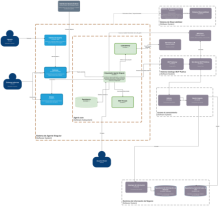
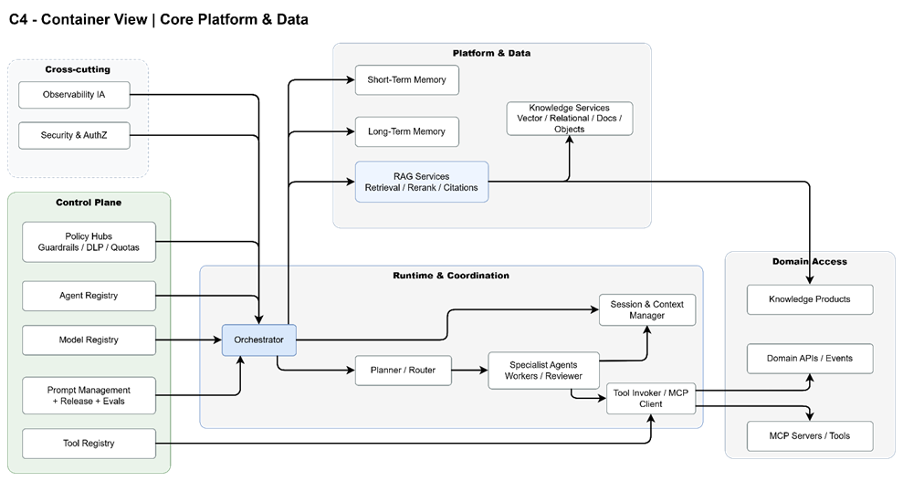
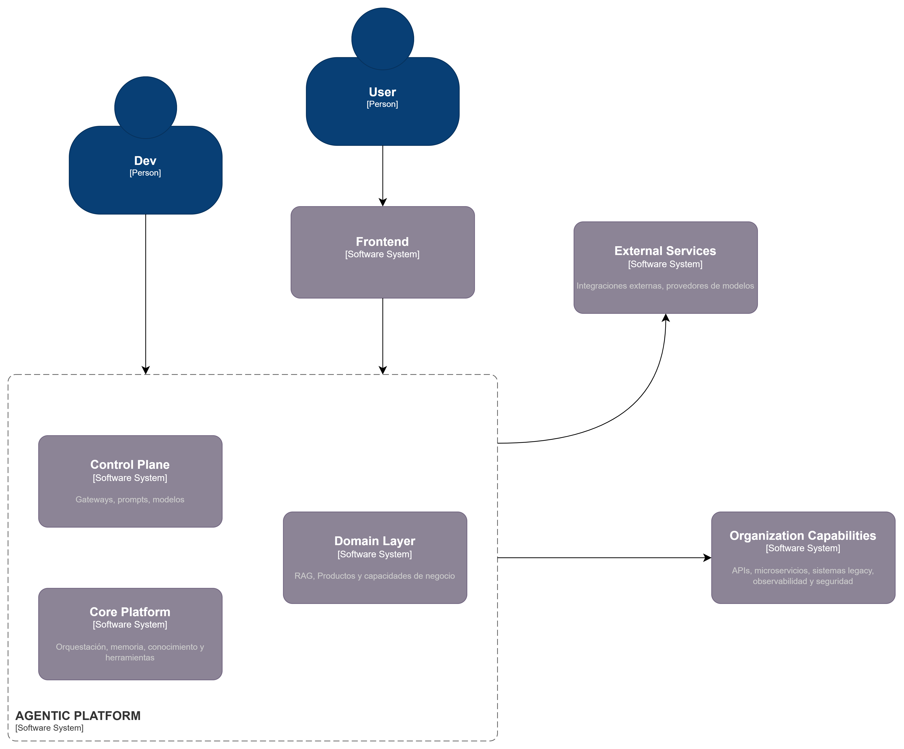
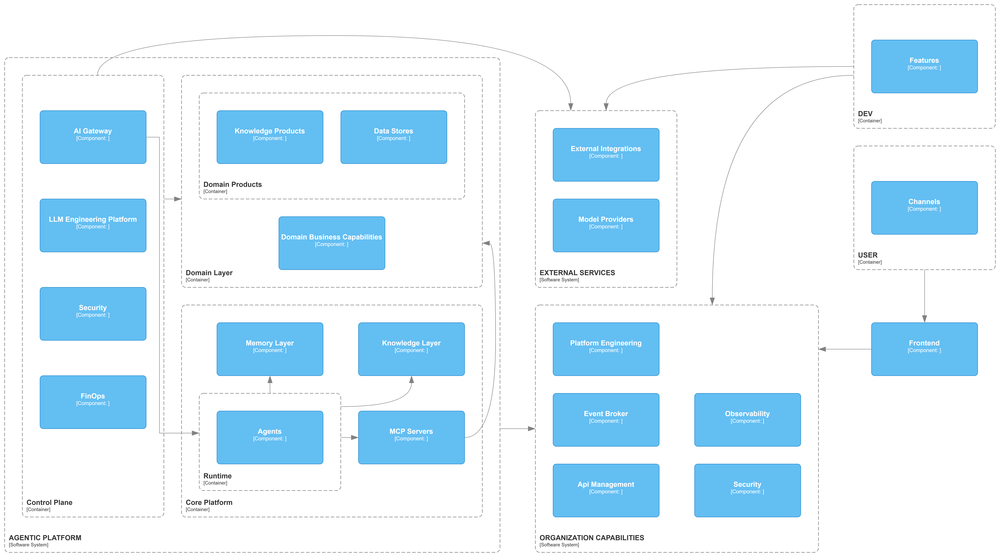
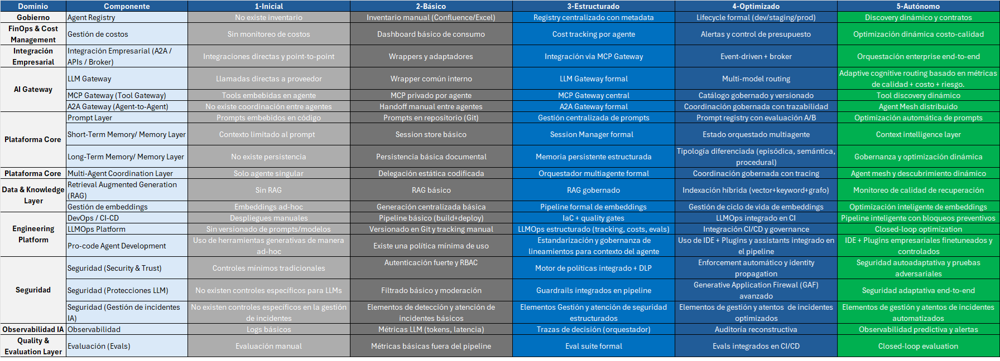
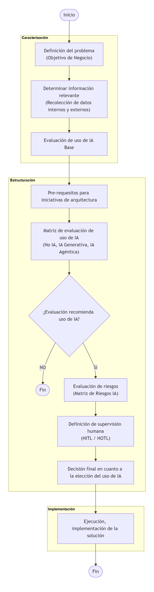
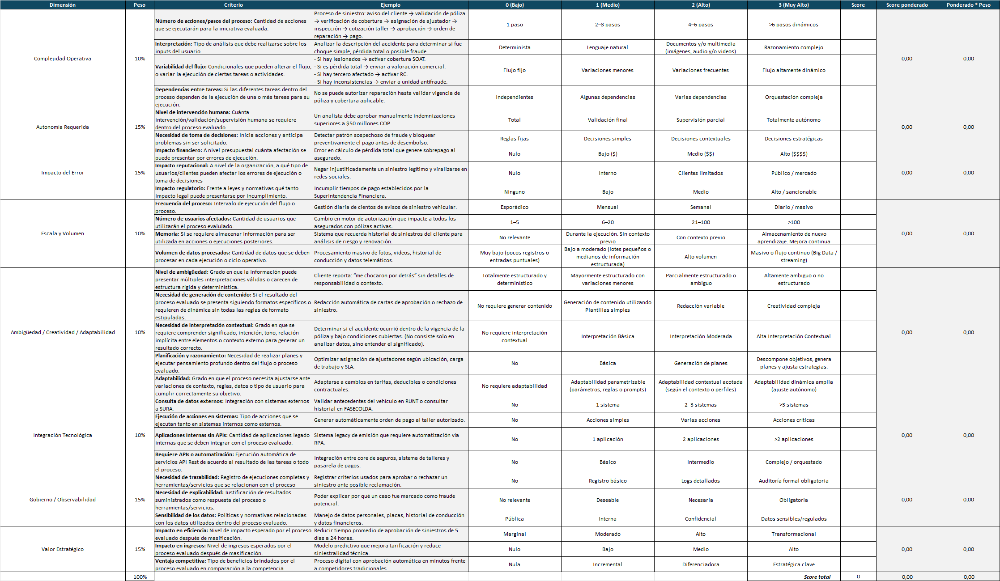

# Arquitectura Plataforma Agentica

<!-- [macro: tabla de contenido] -->

# 1. Introducción

## 1.1. Objetivo del documento

El presente documento tiene como propósito establecer el Modelo de Evolución de la Arquitectura para la Plataforma Agéntica de SURA, definiendo los principios, lineamientos, mecanismos de control y roadmap de implementación necesarios para operar agentes de IA de manera segura, auditable, escalable y alineada con la estrategia AI-First de la organización.

De manera específica, este documento busca:

- Partir del entendimiento de la situación actual (As-Is) de la arquitectura de Agentes de Sura para entender las definiciones y decisiones de arquitectura existentes y desde este punto evaluar las necesidades de evolución de dicha arquitectura.
- Establecer un roadmap estructurado de implementación, que permita evolucionar desde las implementaciones de las arquitecturas iniciales de hacia una plataforma agéntica empresarial consolidada, gobernada y sostenible.
- Escalar el uso de agentes generativos más allá de casos aislados, consolidando una plataforma común, interoperable y reutilizable que evite fragmentación tecnológica y reduzca riesgos de proliferación descontrolada de soluciones.
- Integrar desarrollos e implementaciones existentes (agentes desarrollados con frameworks y soluciones basadas en LLMs) dentro de un modelo unificado de gobierno, observabilidad y control.
- Brindar lineamientos para el uso óptimo de los componentes y capacidades existentes en la compañía, promoviendo configuraciones arquitectónicas coherentes con la Línea Base de Arquitectura (LBA), maximizando el costo-beneficio y evitando lock-in tecnológico innecesario.
- Sentar las bases para la observabilidad, seguridad y despliegue controlado de todos los componentes involucrados en el ciclo de vida de los agentes, incluyendo LLMs, prompts, memoria, herramientas, datos, pipelines y mecanismos de evaluación.
- Asegurar la alineación con principios de IA Responsable y cumplimiento regulatorio, mediante la incorporación de mecanismos como matriz de riesgos, trazabilidad de decisiones, control de identidad, guardrails y evaluación continua.

## 1.2. Alcance y audiencia

El documento abarca el diseño conceptual y técnico del core de la plataforma de agentes generativos de SURA, incluyendo la descripción de sus componentes principales, la evaluación de tecnologías candidatas y las recomendaciones de adopción.

El alcance incluye:

- El relevamiento del estado actual.
- La definición de los componentes estructurales de la plataforma para habilitar la creación y uso de agentes.
- La evaluación comparativa de herramientas y tecnologías habilitantes.

Audiencia principal:

- Arquitectos de soluciones y líderes técnicos de SURA involucrados en el diseño y despliegue de soluciones de IA generativa.
- Equipos de infraestructura y operaciones (DevOps / MLOps).
- Áreas de innovación y tecnología que impulsan la adopción de GenAI.

# 2. Visión general de la Plataforma Agéntica

La visión de la plataforma agéntica en SURA se centra en ofrecer una infraestructura unificada y gobernable donde los distintos actores (usuarios de negocio, desarrolladores y equipos técnicos) puedan diseñar, configurar, desplegar y operar agentes generativos de forma consistente, segura, auditable y escalable. Esta plataforma busca convertir la adopción de agentes en una capacidad empresarial, evitando soluciones aisladas, reduciendo el riesgo operativo y acelerando el time-to-value mediante componentes reutilizables y estándares comunes.

En términos prácticos, queremos lograr que SURA disponga de una plataforma para el despliegue de agentes que:

- Acelere la entrega de capacidades (asistentes, automatizaciones inteligentes, agentes de apoyo a operaciones y atención) sin sacrificar control ni cumplimiento.
- Centralice el gobierno y enforcement (políticas, guardrails, identidad, límites de uso/costo) a través de un control plane, garantizando que cada agente opere bajo reglas corporativas.
- Estandarice el ciclo de vida de agentes (AgentOps/LLMOps): desde prompts y herramientas (plugins) hasta evaluación, despliegue, monitoreo y mejora continua.
- Habilite integración segura con el ecosistema SURA (APIs, sistemas transaccionales, eventos, dominios de conocimiento) y con capacidades como RAG, manteniendo trazabilidad sobre fuentes y decisiones.
- Proporcione observabilidad end-to-end (trazas, métricas, auditoría, costos, calidad) para operar agentes como productos críticos, con capacidad de detección y respuesta ante incidentes.
- Evolucione de manera incremental usando la matriz de madurez como guía: pasando de adopciones puntuales a una plataforma industrializada, con estándares, automatización de controles y reutilización transversal.

# 3. Análisis As-Is

Esta sección resume el entendimiento del estado actual (As‑Is) de la arquitectura agéntica en SURA, con base en las versiones vigentes de la arquitectura de implementación (v1.1), la arquitectura de referencia (v1.1), los lineamientos conceptuales y la Línea Base de Arquitectura (LBA). El objetivo es proveer un punto de partida común para el equipo técnico, identificar fronteras actuales y preparar las transiciones necesarias hacia la arquitectura objetivo (To‑Be).

## 3.1. Visión actual de arquitectura (As‑Is)

La implementación actual se estructura como un agente singular integrado a canales empresariales y a servicios externos (LLMs, herramientas vía MCP y fuentes de conocimiento), apoyándose en capacidades transversales de identidad, seguridad y observabilidad.

En la vista As-Is de Nivel 1 (C4) se representa un patrón de “agente singular”, donde existe un núcleo de agente (Core del Agente) que orquesta la interacción con usuarios y sistemas, y concentra la lógica de decisión.

- **Entradas / Interacciones**: el agente recibe solicitudes desde *personas externas*, *eventos*, *servicios* y *agentes externos* (canales e integraciones). La figura del Owner gobierna el propósito, reglas y evolución del agente (responsable funcional/técnico).
- **Capa del agente**: el agente se estructura en elementos de interfaz/interacción que alimentan al Core, el cual coordina dos capacidades principales:

    1. Elementos LLMs (invocación de modelos para razonamiento/generación)
    2. Acceso a conocimiento y herramientas (habilita acciones y enriquecimiento de contexto).
- **Recursos**: el agente consume capacidades mediante APIs/MCP, RAG (vía MCP) y ejecución de código, conectándose finalmente a sistemas transaccionales y dominios de conocimiento corporativos.

## 3.2. Estrategias actuales

En el As‑Is se observan las siguientes estrategias técnicas y de adopción, relevantes para la evolución controlada de la plataforma:

- **Evolución incremental**: adopción inicial en forma de agente singular, con el objetivo de escalar hacia escenarios multiagente y capacidades compartidas a medida que madure el control operativo y de gobierno.
- **Desacoplamiento por gateways**: separación del orquestador respecto al proveedor de modelo (LLM Gateway) y respecto a herramientas (MCP), habilitando intercambiabilidad, reducción de lock‑in y control centralizado de políticas.
- **Despliegue cloud‑native**: ejecución del runtime del agente como contenedor, uso de Azure Container Apps como alternativa administrada para acelerar despliegue y operación, AKS como opción para escenarios con mayor densidad y complejidad de orquestación.
- **Exposición segura y reutilizable de herramientas**: uso de un MCP Gateway público (ApigeeX / GCP) para herramientas compartidas, manteniendo separación entre herramientas públicas y privadas.
- **Observabilidad como requisito**: instrumentación del orquestador y componentes asociados mediante estándares de telemetría (p. ej., OpenTelemetry), con capacidad de integración a monitoreo corporativo.

## 3.3. Vista resumida de tecnologías/capacidades

| Capa / Capacidad | Tecnologías / Servicios | Nota As‑Is |
| --- | --- | --- |
| Identidad y acceso | Microsoft Entra ID / SEUS (SSO/MFA), políticas condicionales | Base para propagación de identidad y control de sesiones |
| Gestión de APIs | API Manager / API Gateway; ApigeeX (GCP) | Publicación controlada de capacidades LLM y MCP |
| Runtime | Azure Container Apps, AKS | Container Apps para adopción ágil. AKS para alta densidad |
| Modelos LLM | Proveedor LLM vía LLM Gateway (p. ej., Azure AI Foundry) | Desacoplamiento del orquestador, habilita ruteo/costos |
| Herramientas | MCP (catálogo público + privadas), cliente MCP HTTP/JSON‑RPC | Tool‑calls gobernados, separación público/privado |
| Observabilidad | OpenTelemetry; integración SIEM | Telemetría y auditoría, base para SLOs |
| Datos y conocimiento | RAG + Vector DB (según lineamientos/catálogo) | Requiere gobierno de fuentes |

Tabla 1 – Inventario Tecnológico AS-IS

## 3.4. Brechas de adopción de Plataforma Agéntica

De acuerdo al análisis de la arquitectura As-Is se evalúan cada uno de los componentes presentes, con el fin de encontrar las brechas o diferencias para la adopción de la Plataforma Agéntica, utilizando como referencia las capacidades esperadas en una plataforma de este tipo:

| **Capacidad** | **Brecha** | **Objetivo** |
| --- | --- | --- |
| **MCP / APIs.** | No todas las APIs están diseñadas para consumo agéntico. | Estandarización de contratos OpenAPI y catálogo de tools. |
| **AI / LLM Gateway** | Consumo de modelos no centralizado ni gobernado. | Implementar gateway con control y trazabilidad. |
| **Observabilidad end‑to‑end** | No se trazan decisiones ni uso de tools. | Incorporar observabilidad integral de IA. |
| **Prompt Management** | No existe gestión formal de prompts. | Incluir versionamiento y control de cambios de prompts. |
| **Guardrails** | No hay validaciones previas a despliegue. | Implementar pruebas y controles de release. |
| **Knowledge Products** | Conocimiento no estructurado como producto. | Definición de productos de conocimiento gobernados. |
| **RAG Services** | No existe servicio corporativo estandarizado. | Implementar servicio RAG con Base de Datos vectorial. |
| **Memory Layer** | No hay gestion formal de memoria. | Incorporar capa de memoria persistente y temporal (Long Time & Short Time) |
| **Quality Evals** | No se mide precisión ni grounding. | Incorporar métricas de calidad de retrieval. |
| **Orchestrator** | Orquestación solo determinística. | Implementar orquestador con planificación dinámica. |
| **FinOps IA** | No se mide costo por agente/interacción. | Incorporar métricas FinOps específicas. |
| **Experimentación** | No existe entorno controlado de pruebas. | Implementar sandbox y pruebas A/B (Pruebas comparativas). |

# 4. Arquitectura de Referencia

La siguiente sección describe la arquitectura objetivo de la plataforma agéntica diseñada para integrarse de manera controlada con capacidades corporativas de Sura, sistemas de dominio, plataformas externas y proveedores de modelos. Su finalidad es establecer una visión arquitectónica común para equipos de arquitectura, ingeniería y plataforma, definiendo las capas principales, sus componentes, sus responsabilidades y los patrones de implementación asociados.

Se enfatiza particularmente la **Plataforma Agéntica**, por ser el núcleo de ejecución de capacidades, y precisa el rol de los componentes transversales requeridos para operar la solución con criterios empresariales de seguridad, gobierno, observabilidad y escalabilidad.

## 4.1. Alcance

Esta arquitectura cubre los siguientes ámbitos:

- Canales y experiencias de interacción con usuarios y desarrolladores.
- Capacidades compartidas de integración organizacional.
- Plataforma agéntica y su separación entre Control Plane y Core Platform.
- Exposición y consumo de capacidades de dominio.
- Integración con servicios externos y proveedores de modelos.
- Requerimientos no funcionales y patrones de implementación.

No forma parte del alcance de este documento la definición detallada de productos de dominio específicos, modelos de datos particulares ni decisiones tecnológicas cerradas por componente, salvo cuando son necesarias para precisar el rol arquitectónico de una capa.

## 4.2. Principios Arquitectónicos

La arquitectura se rige por los siguientes principios:

- **Separación de responsabilidades:** el contexto operativo del agente se mantiene separado del conocimiento empresarial y de las capacidades transversales corporativas.
- **Capacidades empresariales compartidas:** seguridad, observabilidad, identidad, integración, gobierno y plataforma se consumen como capacidades comunes, no como implementaciones embebidas en cada agente.
- **Consumo gobernado del dominio:** el conocimiento y las capacidades del negocio se exponen mediante contratos explícitos, tales como RAG, MCP, APIs y Events.
- **Punto único de control para modelos y tools:** el acceso a modelos y herramientas debe resolverse mediante gateways y registries, evitando integraciones directas desde los agentes.
- **Observabilidad extremo a extremo:** toda ejecución/decisión/acción del agente/modelo debe poder correlacionarse por usuario, canal, sesión, agente, tool, modelo y fuente de datos para su posterior análisis y evaluación.
- **Seguridad y cumplimiento normativa**: la seguridad constituye un principio estructural de la plataforma y debe incorporarse de manera transversal desde el diseño, cubriendo identidad, autenticación, autorización, protección de datos, control de tools, protección frente a prompt injection, trazabilidad y cumplimiento.
- **Diseño para escalabilidad operativa:** la plataforma debe soportar evolución incremental, incorporación de nuevos agentes, nuevos dominios y nuevos proveedores sin rediseño estructural.
- **Uso de estandares de industria:**

## 4.3. Vista arquitectónica general

La arquitectura se organiza en seis dominios principales:

**Experience & Delivery**

Concentra las capacidades de interacción y construcción, incluyendo:

- Dev
- Users
- Channels
- Frontend

Esta capa desacopla la experiencia de usuario y de desarrollo respecto del runtime agéntico, permitiendo que la evolución de interfaces, canales y mecanismos de despliegue no impacte directamente la lógica central de ejecución.

**External Services**

Agrupa capacidades fuera del perímetro de control directo de la plataforma, tales como:

- 3rd-Party Agents
- External MCP Servers
- APIs / SaaS
- Legacy Systems
- Model Providers

Su función es ampliar las capacidades disponibles para la plataforma, manteniendo un modelo de integración controlado y gobernado.

**Organization Capabilities**

Representa capacidades organizacionales compartidas que prestan servicios de integración, seguridad, observabilidad y operación. En el diagrama actual aparecen en dos franjas:

- Capacidades de integración (API Management, Event Broker). (Parte superior del diagrama)
- Capacidades de base (Observability, Security, Platform Engineering). (Parte inferior del diagrama)

Desde el punto de vista arquitectónico, ambas pueden interpretarse como capacidades empresariales transversales.

**Agentic Platform**

Constituye el núcleo especializado de la solución e incluye:

- Control Plane
- Core Platform
- Domain Layer

Esta capa concentra las capacidades específicas necesarias para construir, operar y gobernar agentes de forma reusable.

**Domain Layer**

Representa los activos de conocimiento y las capacidades operativas del negocio. Su inclusión dentro del marco general de la plataforma no implica que pertenezca al core agéntico, por el contrario, su propósito es exponer capacidades del dominio para consumo gobernado por los agentes.

**Enterprise Foundation**

Aunque en el diagrama se expresa como parte de las capacidades organizacionales, conceptualmente corresponde a la base operativa de la plataforma, incluyendo observabilidad, seguridad e ingeniería de plataforma.

## 4.4. Capas y Componentes

### 4.4.1. Experience & Delivery

**Development**

La capacidad Development representa el conjunto de mecanismos mediante los cuales los equipos técnicos construyen, configuran, despliegan y evolucionan agentes, herramientas y componentes de plataforma. La presencia de Pro-Code Agent Deployment es consistente con un entorno empresarial, en la medida en que los agentes deben ser promovidos entre ambientes mediante procesos auditables y controlados.

Su inclusión en la arquitectura responde a los siguientes objetivos:

- Habilitar ciclos de ingeniería formales para agentes y componentes asociados.
- Desacoplar la construcción y el despliegue de la operación en tiempo de ejecución.
- Integrar prácticas de versionado, revisión, automatización y promoción entre ambientes.

**Users**

La capa de Users representa a los consumidores humanos de la plataforma. Su relevancia arquitectónica radica en que permite modelar explícitamente la relación entre identidad humana, interacción de negocio y capacidad agéntica.

Su inclusión es necesaria para:

- Delimitar el origen de las solicitudes.
- Habilitar trazabilidad por usuario, rol, canal y contexto de negocio.
- Soportar controles diferenciados según perfil, dominio o caso de uso.

**Channels**

Los Channels definen los mecanismos concretos de interacción con la plataforma. En el diagrama se incluyen:

- Teams.
- Chat with Model Selection.
- Agent Section.
- No/Low Code Agent Builder.

Esta separación es pertinente, dado que distintos perfiles requieren experiencias diferentes:

- Usuarios finales orientados a productividad.
- Usuarios avanzados con necesidad de selección de modelos.
- Constructores de agentes con capacidades low-code o no-code.
- Equipos técnicos que administran o prueban agentes.

**Frontend**

El Web App Container opera como adaptador de experiencia y punto de integración con los canales. Su rol es desacoplar la experiencia de interacción respecto del runtime y concentrar aspectos propios de la interfaz, tales como autenticación de sesión, soporte para streaming, carga de archivos y continuidad conversacional.

### 4.4.2. External Services

**3rd-Party Agents**

Estos componentes permiten la federación o integración con agentes operados por terceros. Son relevantes cuando la plataforma requiere orquestar o invocar capacidades externas que ya encapsulan lógica especializada.

**External MCP Servers**

Corresponden a capacidades expuestas mediante MCP fuera del perímetro de la organización. Su presencia es coherente con una arquitectura extensible basada en contratos de tools desacoplados del runtime central.

**APIs / SaaS**

Este grupo agrupa servicios de terceros y capacidades SaaS consumidas por la plataforma o por los agentes. Su inclusión reconoce que una plataforma empresarial debe integrarse con ecosistemas externos sin asumir control directo sobre su ciclo de vida.

**Legacy Systems**

Los sistemas heredados representan una condición estructural del entorno empresarial. Su presencia en la arquitectura es esencial, ya que muchos casos de uso dependen de información y procesos que continúan residiendo en plataformas preexistentes.

**Model Providers**

La capa de Model Providers abstrae los modelos consumidos por la plataforma. En el diagrama se contemplan LLMs y SLMs, Esto se define para poder soportar estrategias diferenciadas de costo, latencia, soberanía y criticidad de uso.

Desde el punto de vista arquitectónico, estos modelos deben ser consumidos de forma gobernada a través del LLM Gateway. En caso de incorporar modelos alojados internamente u on-premise, se recomienda complementar esta capa con una capacidad explícita de Model Serving Platform o Inference Platform dentro de Platform Engineering, manteniendo el gateway como punto unificado de acceso.

### 4.4.3. Organization Capabilities

**API Management**

La capacidad de API Management, compuesta por Policies y API Proxy, concentra el gobierno de las APIs corporativas expuestas o consumidas por la plataforma.

Su presencia es pertinente porque:

- Centraliza autenticación, rate limiting, versionado y enforcement de políticas.
- Desacopla el gobierno de integración respecto de la implementación de agentes o servicios.
- Estandariza la exposición de capacidades de dominio a consumidores internos y externos.

**Event Broker**

El Event Broker representa la capacidad organizacional para integración asíncrona, intercambio de eventos y coordinación desacoplada.

Su incorporación es necesaria para:

- Soportar flujos asíncronos de larga duración.
- Permitir consumo y emisión de eventos de dominio.
- Reducir acoplamiento temporal entre la plataforma agéntica y los sistemas empresariales.

**Observability**

La capa de Observability incluye:

- Metrics
- Logs
- Traces
- Monitoring
- Alerts

Esta capacidad es obligatoria en una plataforma agéntica empresarial, dado que la operación debe ser trazable extremo a extremo y no solo a nivel de infraestructura.

**Security**

La capa de Security incluye:

- IDP
- Identity
- Authentication
- Authorization (RBAC)
- Secrets.

Su propósito es proveer una base corporativa común para identidad, autenticación, autorización y manejo de secretos, evitando implementaciones ad hoc por agente o por canal.

**Platform Engineering**

Incluye:

- CI / CD
- IDP
- IaC

Su función es proporcionar los mecanismos de automatización, promoción y operación necesarios para ejecutar la plataforma bajo criterios enterprise. En caso de incorporar modelos on-premise, esta capa es también el lugar natural para incluir Model Serving Platform, Inference Platform o GPU Platform.

### 4.4.4. Agentic Platform

La Agentic Platform constituye el núcleo arquitectónico de la solución. Su objetivo es proveer capacidades reutilizables para construir, desplegar, ejecutar y gobernar agentes de manera consistente.

La separación entre Control Plane, Core Platform y Domain Layer es una decisión que permite distinguir claramente entre:

- Gobierno y administración.
- Ejecución agéntica.
- Exposición de conocimiento y capacidades de negocio.

**A. Control Plane**

El Control Plane concentra capacidades de configuración, catálogos, políticas, observabilidad funcional, presupuestos y evaluación.

**A2A Gateway (Agent Registry)**

Actúa como punto de entrada y resolución para comunicación orientada a agentes y definiciones registradas.

Su presencia permite:

- Desacoplar clientes de implementaciones específicas.
- Administrar discoverability y versionado de agentes.
- Habilitar publicación controlada de capacidades agénticas.

**MCP Gateway (Tool Registry)**

Centraliza la resolución de tools y capacidades expuestas bajo contratos MCP.

Su propósito es:

- Gobernar tools por contrato y por política.
- Reducir acoplamientos directos entre runtime y herramientas.
- Habilitar discoverability y autorización contextual.

**LLM Gateway (Model Registry)**

Constituye el punto único de acceso a proveedores de modelos y runtimes de inferencia.

Su inclusión permite:

- Abstrae proveedores externos e internos.
- Permite routing por costo, latencia, riesgo o criticidad.
- Centraliza observabilidad, enforcement y control de consumo.

**Prompt Management**

Gestiona prompts como artefactos versionados y reutilizables. Su rol es evitar la proliferación de prompts embebidos en implementaciones sin trazabilidad ni control de cambios.

**Prompt Release Management**

Administra la promoción de prompts entre ambientes y su publicación controlada. Esta capacidad es particularmente importante cuando diferentes agentes comparten plantillas, variantes o cadenas de instrucciones.

**Evaluations**

La capacidad de Evaluations permite validar calidad, precisión, robustez, seguridad y alineación con objetivos de negocio. Debe considerarse parte integral del ciclo de vida de agentes y prompts.

**LLM Observability**

Se ocupa de la observabilidad funcional específica del uso de modelos, incluyendo trazabilidad de prompts, respuestas, latencias, costos y comportamiento de ejecución.

**Experimentation**

Habilita pruebas controladas sobre prompts, modelos, configuraciones de inferencia y combinaciones de tools. Esta capacidad resulta necesaria para evolución incremental y mejora continua.

**FinOps**

La inclusión de FinOps en el Control Plane es pertinente desde una perspectiva táctica, ya que esta capa es el lugar natural para presupuestos, cuotas, límites de consumo y políticas de routing por costo.

Desde una perspectiva arquitectónica, no obstante, FinOps debe entenderse como capacidad transversal, alimentada también por Observability, Platform Engineering y LLM Gateway.

**Budgets**

Establecen límites y marcos de consumo por agente, equipo, tenant, dominio o caso de uso.

**Quota Management**

Permite controlar el consumo por usuario, canal, producto, agente o unidad organizacional, evitando degradación de servicio o sobrecostos no gobernados.

**Security**

El bloque de seguridad del Control Plane incluye:

- Authorization (Agents, Tools)
- Prompt Injection Protection
- Retrieval Access Control
- Data Loss Protection (DLP)
- Guardrails
- PII Detection & Redaction

Estos controles operan sobre el ciclo funcional de ejecución y no únicamente sobre la infraestructura subyacente.

**B. Core Platform**

La Core Platform es el motor de ejecución agéntica. Desde el punto de vista arquitectónico, su responsabilidad es proveer una base reusable para:

- Ejecutar agentes y sesiones.
- Coordinar tools y capacidades.
- Resolver memoria y contexto.
- Consumir conocimiento y servicios de dominio.
- Aplicar políticas en tiempo de ejecución.
- Producir telemetría operacional.

**Runtime**

El Runtime incluye:

- Orchestrator Agent
- Agent Patterns

Su función es coordinar la ejecución de tareas, seleccionar herramientas, resolver contexto, gestionar estado y controlar el flujo agéntico extremo a extremo.

**Agents**

El bloque Agents reúne los assets y capacidades necesarios para materializar agentes ejecutables:

- Frameworks
- Tools
- Prompts
- Memory
- MCP Client

Este agrupamiento es adecuado porque concentra las dependencias funcionales del agente sin trasladarlas a las capas de experiencia o integración.

**Memory Layer**

La Memory Layer contiene:

- Short-Term Memory (session state, working memory)
- Long-Term Memory (episodic memory, durable memory)

Su propósito es separar memoria de sesión, contexto operativo y persistencia duradera.

**Knowledge Layer**

La Knowledge Layer incluye:

- Relational Databases
- Vector Database
- Document Store
- Object Store

Su rol es proveer patrones de acceso diferenciados para distintos tipos de información utilizada por el runtime:

- Almacenamiento estructurado con consistencia relacional.
- Retrieval semántico.
- Persistencia documental semiestructurada.
- Almacenamiento de objetos y artefactos.

**MCP Servers**

Los MCP Servers internos exponen tools y capacidades reutilizables para el runtime. Estos desacoplan la invocación de herramientas de las implementaciones concretas.

- Soportan evolución independiente de capacidades.
- Facilitan gobierno, registro y trazabilidad.

### 4.4.5. Domain Layer

El Domain Layer representa conocimiento empresarial y capacidades operativas del negocio. Arquitectónicamente, esta capa no pertenece al core agéntico, sino al espacio de capacidades que el agente consume de forma gobernada.

**Domain Products**

Agrupa activos de conocimiento preparados para consumo:

- RAG Ready Datasets.
- Curated Document Collections.
- Semantic Indexes.
- Business Ontologies.

Su presencia responde al principio de tratar el dato como producto empresarial gobernado, evitando que cada agente reconstruya o interprete el conocimiento de negocio de manera ad hoc.

**Data Stores**

Incluye:

- Relational Databases
- Vector Databases
- Document Store
- Object Store

Estos componentes permiten persistir y servir los productos de conocimiento con el patrón tecnológico más adecuado según el tipo de activo.

**Domain Business Capabilities**

Incluye:

- Microservices
- Domain APIs (Expose through API Gateway).

Esta capa existe porque los agentes no se limitan a consultar conocimiento, también deben poder ejecutar acciones de negocio, consultar estados, disparar procesos o integrarse con capacidades operativas del dominio.

## 4.5. Core Platform

La Core Platform v2 separa con claridad las capacidades de coordinación, memoria y conocimiento respecto del gobierno, el acceso a tools y la exposición de capacidades de dominio. El objetivo es que el runtime conserve foco en la ejecución agéntica, mientras que las capas de Platform & Data proporcionan servicios especializados, gobernados y reutilizables.

### 4.5.1. Rol arquitectónico

Constituye el núcleo técnico de la arquitectura agéntica. Es la capa donde se ejecuta la lógica central que permite diseñar, orquestar, ejecutar y gobernar agentes de forma estandarizada, desacoplada y escalable. A su vez, es la capa encargada de gestionar el runtime, prompts, memoria y conocimiento del agente. No debe asumir responsabilidades propias de:

- La experiencia de usuario.
- La identidad corporativa.
- El gobierno enterprise de apis.
- La observabilidad de infraestructura.
- La ingeniería de datos del dominio.

Su responsabilidad es proporcionar una base común para que múltiples agentes operen de manera segura, gobernada y reusable.

### 4.5.2. Responsabilidades principales

Las responsabilidades principales de la Core Platform son:

- Gestionar sesiones y estado de ejecución.
- Coordinar razonamiento, tool use y resolución de pasos.
- Recuperar y persistir contexto mediante la capa de memoria.
- Consumir conocimiento empresarial de forma controlada.
- Interactuar con tools y capacidades expuestas mediante mcp.
- Soportar ejecución síncrona y asíncrona.
- Emitir trazabilidad, métricas y eventos operacionales.

### 4.5.3. Límites recomendados

La Core Platform debe incluir:

- Runtime de agentes.
- Orquestación.
- Assets y definiciones ejecutables.
- Integración con memoria.
- Integración con tools internas.
- Integración con conocimiento y capacidades de dominio.

La Core Platform no debería absorber directamente:

- Interfaces de usuario.
- Capacidades enterprise de identidad.
- Api management corporativo.
- Observabilidad base de infraestructura.
- Procesos batch de ingesta y curación documental.
- Gobierno corporativo general.

### 4.5.4. Patrones internos del core

**Runtime centrado en Orchestrator Agent**

El patrón base del core consiste en un Orchestrator Agent que:

- Recibe la intención, solicitud o tarea.
- Determina el flujo de ejecución.
- Selecciona tools y capacidades.
- Resuelve memoria y contexto.
- Consume productos y servicios de dominio.
- Coordina subagentes cuando la tarea requiere especialización.

**Tool use gobernado**

Las tools no deben ser invocadas directamente desde prompts sin mediación de contratos y políticas. La resolución de herramientas debe apoyarse en:

- Registries
- Contratos
- Autorizaciones
- Controles de observabilidad
- Políticas de uso

**Retrieval desacoplado del agente**

El agente no debería conectarse de forma directa a cualquier repositorio o base de datos. El acceso al conocimiento debe realizarse preferentemente a través de:

- Productos de conocimiento
- Índices semánticos
- Retrieval apis
- Mcps de dominio

Este patrón mejora seguridad, calidad de grounding y evolución independiente del dominio.

## 4.6. Patrones de implementación

### 4.6.1. Patrón Single-Agent conversacional

**Aplicabilidad**

Este patrón es apropiado para:

- Asistentes de productividad.
- Consultas de conocimiento empresarial.
- Copilotos con un número reducido de tolos.
- Escenarios en los que la especialización distribuida no aporta valor sustancial.

**Flujo de referencia**

1. El usuario interactúa con un canal y el Frontend establece la sesión.
2. La solicitud se enruta al A2A Gateway.
3. El runtime resuelve la definición del agente, sus prompts y sus políticas.
4. El Orchestrator Agent recupera contexto desde la Memory Layer.
5. Cuando se requiere grounding, consulta Domain Products mediante RAG o retrieval.
6. Cuando se requiere acción, invoca Tools o MCP Servers.
7. El LLM Gateway resuelve el modelo adecuado.
8. La respuesta se devuelve al canal con telemetría y controles aplicados.

**Ventajas**

- Menor complejidad operativa.
- Menor latencia.
- Menor costo.
- Trazabilidad más directa.

### 4.6.2. Patrón Single-Agent transaccional con tools

**Aplicabilidad**

Este patrón resulta adecuado para:

- Actualización de tickets.
- Consulta de estados.
- Ejecución de procesos simples.
- Automatización basada en APIs bien definidas.

**Características**

- Un solo agente.
- Fuerte dependencia de tool use.
- Validación estricta de entradas y salidas.
- Controles robustos de autorización.

Es un patrón recomendable cuando la precisión operacional es más importante que la sofisticación del razonamiento distribuido.

### 4.6.3. Patrón Multi-Agent tipo orchestrator-worker

**Aplicabilidad**

Este patrón es apropiado para:

- Tareas complejas que requieren especialización.
- Procesamiento sobre múltiples fuentes o dominios.
- Separación explícita entre planeación y ejecución.
- Escenarios donde subagentes encapsulan capacidades diferenciadas.

**Estructura**

- Orchestrator Agent: planifica, distribuye y consolida.
- Sub Agents: ejecutan subtareas delimitadas.
- Memory Layer: preserva contexto compartido o de subtarea.
- MCP Servers y Domain Capabilities: proveen herramientas y acciones.

**Beneficios**

- Mayor especialización.
- Mejor reusabilidad de capacidades.
- Separación más clara de responsabilidades.
- Menor complejidad individual por agente.

**Riesgos**

- Incremento de costo.
- Aumento de latencia acumulada.
- Mayor complejidad de trazabilidad.
- Riesgo de loops, solapamientos o coordinación ineficiente.

### 4.6.4. Patrón Multi-Agent planner-executor-reviewer

**Aplicabilidad**

Este patrón resulta adecuado para:

- Tareas críticas.
- Generación de artefactos complejos.
- Procesos que requieren validación previa a su entrega o ejecución.

**Roles**

- Planner: descompone la tarea y propone el plan de ejecución.
- Executor: realiza consultas, retrieval y acciones.
- Reviewer: valida consistencia, seguridad, calidad y cumplimiento de políticas.

**Encaje con la arquitectura**

Este patrón se soporta de manera natural con:

- Orchestrator Agent como coordinador.
- Sub Agents especializados.
- Evaluations y Guardrails en el Control Plane.
- Memory Layer para continuidad.
- Domain Products y Domain APIs como fuentes externas.

### 4.6.5. Patrón asíncrono orientado a eventos

**Aplicabilidad**

Es pertinente para:

- Workflows prolongados-
- Procesamiento batch o near-real-time.
- Integraciones desacopladas con sistemas empresariales.

**Implementación de referencia**

- El agente consume eventos desde el Event Broker.
- Ejecuta enriquecimientos, análisis o acciones.
- Publica eventos de resultado.
- Persiste estado y trazabilidad para continuidad y auditoría.

Este patrón es particularmente útil cuando la ejecución no debe quedar acoplada a una interacción síncrona de chat o interfaz.

### 4.6.6. Capacidades y NFR del motor de orquestación

| **Capacidad / NFR** | **Implicación en Core Platform V2** | **Criterio mínimo esperado** |
| --- | --- | --- |
| Control explícito de estado | El orquestador debe representar pasos, decisiones, retries y checkpoints de forma observable. | Modelo de estado trazable y recuperación desde puntos intermedios. |
| Coordinación sync y async | Debe soportar interacciones conversacionales y procesos largos desacoplados por eventos o colas. | Ejecución por request y también por workflows durables. |
| Integración con tools / MCP | Las invocaciones a capacidades externas deben ser gobernables, auditables y desacopladas del prompt. | Hooks nativos o adaptadores claros para APIs, MCP y eventos. |
| Gestión de memoria y contexto | Debe separar contexto inmediato, memoria persistente y retrieval, evitando mezclar toda la lógica en el prompt. | Interfaces explícitas para session state, memory y knowledge access. |
| Seguridad y policy hooks | La ejecución debe permitir aplicar autorización contextual, guardrails, DLP y quotas en puntos previsibles. | Puntos de extensión para enforcement y revisión antes/después de acciones. |
| Observabilidad end-to-end | Cada paso debe emitir trazas, logs y métricas correlacionables por agente, tool, prompt y modelo. | Compatibilidad con telemetría distribuida y auditoría funcional. |
| Resiliencia y fallback | La plataforma debe tolerar fallos parciales en modelos, tools o retrieval sin perder control del flujo. | Retries, timeouts, circuit breakers y degradación controlada. |
| Portabilidad y bajo lock-in | La selección del framework no debe bloquear el cambio de modelos, runtimes o despliegue. | Separación entre lógica de negocio, contracts y proveedor específico. |

Tabla 4 – Capacidades del motor de orquestación

## 4.7. Vistas de Arquitectura C4

### 4.7.1. Nivel 1 - Contexto

Se presenta el contexto general de la Plataforma Agéntica, identificando actores, sistemas externos y dominios principales de interacción. Con estructura en tres capas internas: Control Plane, Core Platform y Domain Layer, que habilitan gobierno, orquestación y capacidades de negocio basadas en agentes.

### 4.7.2. Nivel 2 - Contenedores

Descompone la Plataforma Agéntica en sus principales contenedores, mostrando cómo se organizan las capacidades de gobierno, dominio y ejecución. Se distinguen el Control Plane, la Core Platform y la Domain Layer. También se detallan las integraciones externas con proveedores de modelos y servicios corporativos como API Management, observabilidad y event broker. Esta vista permite comprender la distribución de responsabilidades técnicas, los flujos principales de interacción y la separación entre capacidades transversales y capacidades de dominio.

# 5. Mapa de dominios

## 5.1. Estrategia

Dominio encargado de definir la visión, prioridades, modelo operativo y criterios de valor para la adopción y evolución de la plataforma agéntica, asegurando además la alineación con los objetivos de negocio. Su propósito se centra en:

- Asegurar que la plataforma de agentes responda a los objetivos estratégicos de negocio.
- Priorización de los casos de uso.
- Optimización para la inversión en modelos, infraestructura y capacidades.

Las definiciones realizadas bajo este dominio se realizan en conjunto (SURA+NTT Data) en la Comunidad de IA, en el HUB de AI First.

El dominio de Estrategia está a cargo de las siguientes responsabilidades clave:

- Definición del roadmap estratégico de la plataforma.
- Determinar el nivel de madurez deseada para la plataforma.
- Asegurar la alineación con los objetivos empresariales.

## 5.2. Gobierno

Conjunto de capacidades, políticas y controles transversales que aseguran que la plataforma agéntica trabaje de forma segura, controlada y auditable alineada al negocio, gestionando riesgos de tipo técnico, regulatorios y operativos. Es un dominio transversal que impacta:

- AI Gateway.
- Plataforma Core.
- LLM Providers.
- Seguridad.
- Observabilidad.

Los componentes relacionados directamente con el dominio de Gobierno son:

- **Gobierno y Riesgo IA:**Aplicación de la matriz de IA vigente antes de avanzar, junto con la definición del RACI y la existencia de un comité o instancia formal de gobierno de inteligencia artificial.
- **Control Plane Agéntico:** Servicio central con configuración y monitoreo, pero sin enforcement obligatorio.
- **Agent Registry:** Servicio que registra owner, versión, riesgo, políticas.

Dentro de la arquitectura agéntica el dominio de Gobierno cuenta con varios objetivos:

- A nivel de seguridad, asegurar que solo actores autorizados puedan ejecutar, modificar o desplegar agentes y promtps.
- En cuanto a gobierno de modelos LLM, brinda control de los LLMs que pueden ser usados, políticas de uso, versionamiento y evaluación continua de calidad y riesgo, evitando así el uso no controlado de modelos o fuga de datos.
- Frente al gobierno de Prompts, brinda el control de las versiones de prompts, control de cambios sobre los prompts, tratando así los prompts como activos *críticos* versionables y también auditables (trazabilidad de ejecuciones).

El dominio de Gobierno está a cargo de varias responsabilidades clave:

- Definir políticas de uso de IA.
- Establecer controles técnicos obligatorios.
- Asegurar trazabilidad completa de decisiones.
- Medir impacto y desempeño de agentes.

## 5.3. FinOps & Cost Management

Dominio responsable de gestionar, optimizar y gobernar los costos asociados con el uso de la plataforma agéntica, asegurando sostenibilidad económica, transparencia y eficiencia financiera respecto al use de IA.

Su propósito se centra en controlar el gasto de los modelos, infraestructura y almacenamiento, así como optimizar la relación costo/rendimiento por cada caso de uso y apoyar la toma de decisiones basándose en datos financieros.

Es un dominio transversal que tiene como alcance:

- Gestión de costos de modelos LLM (Incluyendo LLM Providers y LLM Gateway).
- Gestión de costos en RAG y almacenamiento (Bases de datos Vectoriales).
- Observabilidad financiera.

A su vez, con el dominio de FinOps & Cost Management se espera mitigas algunos riesgos como pueden ser:

- **Escalamiento no controlado de gastos en LLMs:**incremento exponencial del consumo de tokens y llamadas a modelos de lenguaje sin mecanismos de monitoreo, límites presupuestarios o políticas de uso definidas. En entornos agénticos, donde múltiples agentes pueden invocar modelos de manera autónoma, la falta de control puede generar sobrecostos significativos en cortos periodos de tiempo.
- **Uso ineficiente de modelos premium:** utilización de modelos de alto costo (por ejemplo, modelos de última generación o con capacidades avanzadas) en escenarios donde un modelo más pequeño o económico podría cumplir adecuadamente la tarea. Sin una estrategia de enrutamiento y selección de modelos, se desperdician recursos financieros sin una mejora proporcional en calidad o desempeño.
- **Crecimiento desmedido de embeddings:** aumento continuo del volumen de vectores almacenados en bases de datos vectoriales sin estrategias de depuración, retención o consolidación. Esto impacta directamente en costos de almacenamiento, indexación y consulta, especialmente en arquitecturas RAG donde el conocimiento puede crecer rápidamente si no se gestiona adecuadamente su ciclo de vida.
- **Costos ocultos por llamadas redundantes:** invocaciones innecesarias o repetidas a modelos, herramientas o servicios externos, ya sea por falta de caching, mala orquestación o diseño ineficiente de prompts y flujos agénticos. Estas redundancias no siempre son visibles a nivel funcional, pero generan un consumo incremental que impacta el gasto total.
- **Falta de trazabilidad financiera:** ausencia de mecanismos que permitan atribuir el gasto a agentes, áreas de negocio, casos de uso o usuarios específicos. Sin visibilidad granular del consumo, es difícil establecer presupuestos, aplicar modelos de showback/chargeback o tomar decisiones estratégicas basadas en datos financieros confiables.

## 5.4. Integración Empresarial

Es el encargado de habilitar la conexión segura, escalable y gobernada entre la plataforma agéntica y el ecosistema tecnológico de la organización a través de MCP (Model Context Protocol), donde se incluyen sistemas code, aplicaciones SaaS, APIs y aplicaciones externas. Para la arquitectura de referencia, MCP es el mecanismo principal de integración, permitiendo que los agentes consuman funcionalidades de negocio sin depender de implementaciones específicas ni integraciones punto a punto (A2A).

Algunos de sus propósitos son:

- Desacoplar agentes de los sistemas empresariales.
- Estandarizar el acceso a herramientas y servicios.
- Facilitar la reutilización de conectores.
- Seguridad, trazabilidad y gobierno en el acceso.

Las capacidades clave del dominio incluyen:

- **Diseño de contratos MCP:**Definición formal de las interfaces mediante las cuales una capacidad empresarial es expuesta como herramienta MCP, incluyendo parámetros de entrada, esqueams de datos, validaciones, estructura de respuestas, manejos de errores, etc.
- **Desarrollo de conectores internos y externos:** Implementación de componentes técnicos que permiten que una herramienta MCP se comunique de manera efectiva con otros sistemas, tanto internos como externos.
- **Versionamiento de herramientas MCP:** Gestión controlada de cambios en los contratos y/o comportamientos de herramientas MCP. El versionamiento permite la coexistencia de múltiples versiones, migraciones progresivas y trazabilidad histórica, reduciendo los riesgos operativos y facilitando la auditoría.
- **Catálogo empresarial:** Consiste en mantener un repositorio centralizado y gobernado de todas las herramientas MCP disponibles en la organización; incluyendo documentación funcional y técnica, dominio al que pertenece cada herramienta, responsables, versiones disponibles, políticas de acceso y métricas de uso.
- **Monitoreo de uso:** Implica la observabilidad completa de las invocaciones a herramientas MCP, incluyendo métricas de latencia, frecuencia, errores, consumo y agente invocador. Este monitoreo permite la detección de fallas, cuellos de botella, usos indebidos o sobreconsumo; aportanto información tanto para la optimización técnica como para control financiero y gobierno.
- **Gestión de ciclo de vida de integraciones:** Administración integral de herramientas MCP desde el diseño inicial hasta el retiro o finalización. Incluye etapas de definición, desarrollo, pruebas, validación, despliegue, monitoreo, evolución y finalmente la desactivación. Esta gestión evita integraciones obsoletas, reduce la deuda técnica, y asegura que las capacidades expuestas a los agentes se mantengan alineadas con la arquitectua y necesidades de negocio.

En conclusión, el dominio de Integración Empresarial, estandariza, abtrae y gobierna el acceso de los agentes a las capacidades del negocio mediante herramientas MCP reutilizables, seguras y desacopladas, garantizando la interoperabilidad, trazabilidad y escalabilidad dentro del ecosistema corporativo. Finalmente mitigando algunos riesgos:

- Integraciones directas y frágiles desde los agentes.
- Acoplamiento a sistemas específicos (Internos y Externos).
- Duplicación de conectores.
- Poco control sobre acciones críticas.
- Inconsitencias en contratos de integración.

## 5.5. AI Gateway

El AI Gateway actúa como una capa centralizada de control que estandariza y gobierna el acceso a modelos y servicios de inteligencia artificial dentro de la organización, asegurando el cumplimiento de políticas de seguridad y gobernanza. Facilita la integración con múltiples proveedores de IA mediante mecanismos uniformes de autenticación, autorización y gestión de políticas. Asimismo, proporciona visibilidad operativa integral a través de capacidades de monitoreo, auditoría y métricas de consumo de tokens. A nivel de rendimiento, optimiza la operación mediante balanceo de carga, enrutamiento inteligente y mecanismos de caché semántico. Finalmente, habilita una gestión eficiente de costos mediante el control del consumo y la aplicación de límites operativos que garantizan un uso seguro, escalable y sostenible de la inteligencia artificial.

Dentro de la arquitectura agéntica este componente cuenta con varios objetivos:

- **Control de acceso centralizado**
    Autenticación y autorización para evitar accesos no autorizados a modelos de IA.
- **Protección de datos sensibles**
    Aplicación de políticas y filtros para prevenir fugas de información en prompts y respuestas.
- **Gestión y control de costos**
    Límites de uso, cuotas y monitoreo del consumo de tokens para evitar gastos inesperados.
- **Protección contra ataques a la IA**
    Mitigación de amenazas como *prompt injection* y manipulación del modelo mediante controles especializados (por ejemplo, AI Prompt Shield).
- **Visibilidad y auditoría**
    Monitoreo y trazabilidad para detectar comportamientos anómalos y asegurar el cumplimiento normativo.

note8bc05dab40f0
Las definiciones de AI Gateway se alinearan con el equipo de seguridad y los proyectos que se encuentran en curso para este componente critico de la arquitectura.

Las definiciones de AI Gateway se alinearan con el equipo de seguridad y los proyectos que se encuentran en curso para este componente critico de la arquitectura.

## 5.6. Plataforma Core

Dominio que constituye el núcleo operativo de la plataforma agéntica, proporcionando las capacidades fundamentales para la gestión de prompts, memoria (corto y largo plazo) y coordinación multiagente. Este dominio reconoce que los prompts, el estado conversacional y la orquestación de agentes son activos críticos que impactan directamente la calidad, consistencia y capacidad de los agentes para resolver tareas complejas.

- Prompt Layer.
- Short-Term Memory / Memory Layer.
- Long-Term Memory / Memory Layer.
- Multi-Agent Coordination Layer.

Los componentes relacionados directamente con el dominio de Plataforma Core son:

**Prompt Layer:**Capacidad responsable de gestionar los prompts como activos críticos de software. Incluye Prompt Registry (fuente de verdad con versionado semántico, estados del ciclo de vida y metadata estructurada), Prompt Compiler (compilación determinística con templates, variables y generación de Prompt Manifest auditable), Prompt-as-Code Pipeline (CI/CD automatizado con gates de calidad, evaluaciones y promoción controlada) y Evaluation Service (evals con golden sets para validar calidad, seguridad y adherencia a formato).

**Short-Term Memory / Memory Layer:** Gestión del contexto conversacional y estado de sesión del agente. Incluye Session Manager formal con contexto estructurado, variables explícitas y capacidad de compartir estado entre subagentes. Permite mantener coherencia en conversaciones multi-turno y coordinar información entre componentes del agente durante la ejecución.

**Long-Term Memory / Memory Layer:**Persistencia estructurada de información entre sesiones con tipología diferenciada (memoria episódica, semántica y procedimental). Utiliza vector databases con metadata para recuperación semántica, aplica políticas de retención y anonimización, y habilita que los agentes "recuerden" interacciones pasadas, aprendizajes y contexto histórico del usuario.

**Multi-Agent Coordination Layer:**Orquestación formal de múltiples agentes con coordinación gobernada, tracing de delegaciones y registro de políticas. Implementa patrones como AutoGen, CrewAI o graph-based orchestration para habilitar colaboración entre agentes especializados, handoffs controlados y flujos de trabajo complejos que requieren múltiples capacidades.

Dentro de la arquitectura agéntica el dominio de Plataforma Core cuenta con varios objetivos:

- Gestionar prompts como activos críticos versionables y auditables, con trazabilidad completa de ejecuciones y capacidad de rollback rápido.
- Mantener contexto conversacional coherente mediante gestión estructurada de memoria de corto plazo (sesión).
- Habilitar persistencia de conocimiento y aprendizaje mediante memoria de largo plazo con recuperación semántica.
- Coordinar múltiples agentes especializados para resolver tareas complejas que requieren colaboración y delegación controlada.
- Asegurar calidad y consistencia mediante evaluaciones automatizadas de prompts antes de promoción a producción.

El dominio de Plataforma Core está a cargo de varias responsabilidades clave:

- Gestión del ciclo de vida completo de prompts (diseño, versionado, evaluación, promoción, rollback).
- Administración de memoria conversacional (corto plazo) y persistente (largo plazo).
- Orquestación y coordinación de arquitecturas multiagente.
- Integración con LLM Gateway, Data & Knowledge Layer y Observabilidad.

## 5.7. Data & Knowledge Layer

Dominio responsable de proporcionar acceso estructurado y gobernado al conocimiento empresarial, habilitando que los agentes augmenten sus capacidades mediante Retrieval Augmented Generation (RAG) y gestión eficiente de embeddings. Este dominio asegura que los agentes accedan a información actualizada, certificada y relevante, reduciendo alucinaciones y mejorando la precisión de las respuestas.

- Retrieval Augmented Generation (RAG).
- Gestión de embeddings.

Los componentes relacionados directamente con el dominio de Data & Knowledge Layer son:

**Retrieval Augmented Generation (RAG):**Capacidad de augmentar las respuestas del LLM con información recuperada de fuentes certificadas. Incluye pipeline de ingesta con fuentes gobernadas, indexación híbrida (vector + keyword + grafo) para recuperación precisa, chunking strategies optimizadas por tipo de documento, reranking para mejorar relevancia y monitoreo de calidad de recuperación (recall, precision, MRR). Evoluciona desde RAG básico (índice vectorial simple) hacia RAG gobernado con fuentes certificadas y métricas de calidad.

**Gestión de embeddings:** Administración del ciclo de vida de embeddings (vectores semánticos) con selección de modelos de embedding apropiados por dominio, versionado de índices vectoriales, estrategias de actualización (incremental vs full refresh), optimización de dimensionalidad y costo, y monitoreo de drift semántico. Incluye gestión de vector databases (Pinecone, Weaviate, Qdrant, pgvector) con políticas de retención, backup y recuperación.

Dentro de la arquitectura agéntica el dominio de Data & Knowledge Layer cuenta con varios objetivos:

- Reducir alucinaciones de LLMs mediante augmentación con información factual y actualizada de fuentes certificadas.
- Proporcionar acceso gobernado a conocimiento empresarial con trazabilidad de fuentes y control de acceso.
- Optimizar relevancia de recuperación mediante indexación híbrida y reranking.
- Asegurar frescura de información mediante pipelines de ingesta automatizados y actualizaciones incrementales.
- Medir y mejorar calidad de recuperación mediante métricas de recall, precision y relevancia.

## 5.8. Seguridad

Este dominio constituye un pilar esencial dentro del marco referencia de arquitectura de inteligencia artificial agentica, asegurando la protección de datos, la integridad de los procesos, el cumplimiento normativo y lineamiento organizativo.

En esta sección se presentan los componentes clave de seguridad en cada capa de la arquitectura, junto con los servicios y controles fundamentales que aseguran una protección integral: gestión de accesos, cifrado, protección integral, monitoreo continuo, entre otros.

Los componentes relacionados directamente con el dominio:

**Protección de identidad**

La protección de identidad asegura que el acceso a recursos se realice únicamente por usuarios válidos y bajo condiciones controladas de SURA. Para lo anterior, se utilizan tecnologías como autenticación multifactor, políticas condicionales, límites de sesión y revisión continua de accesos privilegiados. SEUS, Microsoft Entra ID y otros componentes integra flujos de acceso internos, autenticación multifactor adaptable, y control de sesiones persistentes.

Dentro de la arquitectura agéntica este item tiene como objetivos:

- **Control de Capacidades:** Restringir el uso de herramientas de IA exclusivamente al personal autorizado.
- **Prevención de Exfiltración:** Bloquear fugas de información sensible derivadas de accesos indebidos.
- **Cumplimiento Normativo:** Asegurar la alineación con las leyes de privacidad y protección de datos.

Finalmente se pueden mitigar riesgos:

- **"Shadow AI":** Usar modelos o APIs no autorizadas por fuera del control de SURA, lo que expone datos corporativos a terceros.
- **Abuso de API Keys:** Si las credenciales de conexión al modelo se filtran, terceros podrían consumir tu cuota o acceder a logs de consultas privadas.
- **Escalada de Privilegios en el Modelo:** Un usuario con permisos básicos de consulta que logra acceder a funciones de administración o re-entrenamiento del sistema.
- **Suplantación por Robo de Sesión:** Si un atacante roba un "token" de sesión persistente, puede saltarse el MFA y actuar como el usuario legítimo.

**Protección de red**

La capa de protección de red está diseñada para salvaguardar la confidencialidad, integridad y disponibilidad del ecosistema mediante el aislamiento estratégico del tráfico entre servicios, zonas de confianza y dominios. Su función principal es garantizar que la comunicación de datos ocurra bajo perímetros de seguridad estrictos y visibilidad total.

Dentro de la arquitectura agéntica este item tiene como objetivos:

- **Aislamiento de Flujos Críticos:** Establecer canales de comunicación privados y cifrados entre el usuario, la interfaz y el modelo de IA, neutralizando cualquier intento de interceptación externa.
- **Contención de Amenazas:** Prevenir la propagación de vectores de ataque (*movimiento lateral*) entre los diferentes microservicios y componentes de la arquitectura.
- **Inspección Inteligente:** Garantizar la supervisión del tráfico, tanto cifrado como en texto claro, para identificar anomalías sin comprometer la integridad operativa.

Finalmente se pueden mitigar riesgos:

- **Exfiltración vía Prompts:** Detectamos y bloqueamos la salida no autorizada de datos sensibles o información de identificación personal (PII) hacia nubes públicas o entidades externas.
- **Intercepción de Inferencia:** Neutralizamos ataques de interceptación (*Man-in-the-Middle*) mediante protocolos robustos que protegen el intercambio de información entre la aplicación y el motor de IA.
- **Impacto Operativo por Inspección:** Minimizamos el impacto en el rendimiento mediante técnicas de inspección de seguridad en tiempo real, equilibrando la detección de *malware* con la baja latencia requerida para la experiencia del usuario.

**Protección de aplicación**

La protección de aplicaciones establece el conjunto de controles necesarios para asegurar la lógica de negocio y los servicios expuestos (incluyendo front-ends web, APIs, entre otros), frente a interacciones provenientes de usuarios, componentes y otros sistemas. En arquitecturas basadas en Azure App Service, como las utilizadas en portales de autoservicio, la superficie de exposición se amplía debido a la heterogeneidad de automatizaciones, orígenes de tráfico y validaciones externas. Esta capa permite integrar y asegurar que únicamente se procesen solicitudes legítimas, correctamente estructuradas, autenticadas, autorizadas y sujetas a un monitoreo continuo y centralizado.

Dentro de la arquitectura agéntica este item tiene como objetivos:

- **Gobierno Centralizado de Secretos:** Orquestar de forma segura la gestión de llaves de API y credenciales, eliminando la exposición de identidades técnicas en el código o interfaces.
- **Integridad de la "Materia Prima":** Asegurar que los datos destinados al procesamiento de IA se mantengan íntegros, disponibles y libres de riesgos de fuga o manipulación externa.
- **Saneamiento de Interacciones:** Implementar controles de validación en los puntos de entrada y salida para evitar que el modelo sea utilizado como vector de ataque contra la infraestructura corporativa.

Finalmente se pueden mitigar riesgos:

- **Inyección de Prompts (*****Prompt Injection*****):** Bloqueamos intentos de manipulación en las entradas del usuario diseñados para eludir las directivas de seguridad o extraer información privilegiada de las bases de datos.
- **Gestión de Salidas Inseguras (*****Insecure Output Handling*****):** Supervisamos las respuestas generadas por el modelo para prevenir la ejecución automática de código malicioso o scripts que pudieran comprometer la estabilidad de los servidores.
- **Riesgos de Orquestación y Agentes (SSRF):** Mitigamos vulnerabilidades donde la IA, al interactuar con recursos externos o archivos internos, pueda ser redirigida de forma malintencionada para atacar segmentos privados de la infraestructura de **SURA**.

**Protección de datos y modelo**

La capa de Protección de Datos asegura la confidencialidad, integridad, disponibilidad, trazabilidad y cumplimiento de los datos estructurados y no estructurados gestionados en la arquitectura. En este entorno, los datos residen principalmente en servicios de almacenamiento (Datalake, bases de datos, etc), mientras que los secretos, claves y credenciales críticas se custodian.

Dentro de la arquitectura agéntica este item tiene como objetivos:

- **Garantía de Fiabilidad:** Asegurar que los procesos de inferencia y análisis generados por la IA sean precisos, íntegros y estén protegidos contra manipulaciones malintencionadas.
- **Preservación Ética y Operativa:** Detectar y contener amenazas en etapas tempranas para evitar impactos en el desempeño del modelo o desviaciones en sus lineamientos éticos corporativos.
- **Resiliencia ante Explotación:** Blindar el entorno contra la explotación de vulnerabilidades específicas de modelos de lenguaje, protegiendo la calidad y reputación de los servicios de **SURA**.

Finalmente se pueden mitigar riesgos:

- **Envenenamiento de Datos (*****Data Poisoning*****):** Prevenimos la introducción de información falsa o sesgada en el *Datalake* o en las etapas de entrenamiento, evitando que el modelo tome decisiones incorrectas o comprometidas.
- **Exposición del*****System Prompt*****:** Protegemos las "instrucciones maestras" y la lógica de negocio subyacente, evitando que actores externos extraigan la propiedad intelectual que define el comportamiento del agente.
- **Extracción de Datos de Entrenamiento:** Implementamos controles para neutralizar ataques de ingeniería social o consultas malintencionadas que busquen forzar al modelo a revelar fragmentos de información privada o confidencial utilizada en su creación.

**Protección de monitoreo**

La Protección contra Amenazas se refiere a la capacidad del entorno para detectar, investigar, contener y responder ante comportamientos anómalos, accesos no autorizados, explotación de vulnerabilidades, movimientos laterales y ataques persistentes avanzados (APT).

El uso de soluciones como QRadar, Tenable, Cortex Cloud, y algunos componentes de la familiar de Defender para recursos específicos, permite un enfoque de defensa en profundidad con visibilidad multicapas.

Dentro de la arquitectura agéntica este item tiene como objetivos:

- **Optimización de Respuesta (MTTR):** Automatizar la detección de anomalías para reducir drásticamente los tiempos de respuesta, minimizando el impacto económico y operativo ante cualquier evento de seguridad.
- **Visibilidad Unificada:** Centralizar la telemetría del SOC y herramientas avanzadas para facilitar una toma de decisiones informada, basada en datos en tiempo real.
- **Gobierno del Desempeño:** Supervisar no solo la infraestructura técnica, sino también la salud y el comportamiento ético de los agentes de IA desplegados.

Finalmente se pueden mitigar riesgos:

- **Identificación de Alucinaciones Críticas:** Implementamos controles de monitoreo para detectar cuando el modelo genera información falsa o incoherente con altos niveles de confianza, evitando que dichas salidas lleguen al usuario final o afecten procesos de negocio.
- **Degradación del Modelo (*****Model Drift*****):** Establecemos alertas tempranas para identificar caídas en el rendimiento o precisión del modelo debido a la evolución de los datos en el mundo real, asegurando la vigencia y calidad del servicio.
- **Detección de Sesgos y Toxicidad:** Supervisamos continuamente las interacciones para mitigar proactivamente la generación de respuestas discriminatorias o inapropiadas que puedan comprometer la reputación de marca y los valores de **SURA**.

## 5.9. Observabilidad IA

Dominio transversal responsable de proveer trazabilidad, monitoreo y evidencia operativa del comportamiento de agentes, modelos y tool‑calls. La observabilidad en IA no se limita a métricas técnicas; incluye además señales de calidad, costo y riesgo para soportar operación, auditoría y mejora continua.

Componentes y prácticas clave:

- Trazas distribuidas end‑to‑end (canal → orquestador → LLM Gateway → MCP/Tools → RAG) con correlación por request/agent/version.
- Logs estructurados con metadatos de prompt, modelo, versión, tool invocada, decisiones de ruteo y resultado de guardrails.
- Métricas operativas (latencia, errores, disponibilidad), métricas de negocio (task success, tool‑use success) y métricas de costo (tokens, costo por caso de uso).
- Integración con monitoreo corporativo y SIEM para detección de anomalías, alertas y respuesta a incidentes.
- Recolección estándar (p. ej., OpenTelemetry) y dashboards/alertas basadas en SLOs por agente y por flujo.
- Responsabilidades clave: definir estándar de telemetría, establecer SLOs por agente/caso de uso, habilitar auditoría y correlación, y asegurar observabilidad mínima obligatoria en releases.

## 5.10. Modelo de excelencia

Dominio transversal encargado de medir, validar y mejorar de manera continua la calidad, confiabilidad y el desempeño de los agentes, modelos y flujos agénticos, para asegurar que se cumplan los estándares técnicos, funcionales y además de negocio, tanto antes como después del despliegue. En resumen, el dominio de Quality & Evaluation asegura que el resultado realmente cumpla con los estándares definidos además de los siguientes propósitos:

- Validar que los agentes funcionen correctamente.
- Medir calidad de respuestas y de razonamiento.
- Detectar degradaciones en cuanto al desempeño del agente.
- Reducción de errorers.
- Habilitar la mejora continua de agentes basada en evidencias.

Algunas capacidades clave para este dominio son:

- Framework de evaluación estandarizado.
- Datasets de pruebas.
- Métricas (Cuantitativas y Cualitativas).
- Trazabilidad completa de ejecuciones.

Se mitigan algunos riesgos que pueden presentarse tales como:

- Despliegue de agentes inestables.
- Degradación de calidad silenciosa.
- Uso de prompts defectuosos.

Es el dominio que evalúa otros dominios en cuanto a seguridad, desempeño de agentes, versiones de prompts y modelos LLM, incluyendo las capacidades de AI Gateway, memoria, métricas, trazabilidad y orquestación.

# 6. Matriz de Madurez

Con el objetivo de evolucionar la plataforma de manera estructurada y medible, se ha definido una **Matriz de evaluación de Madurez** que permite evaluar el nivel actual frente a la arquitectura de IA de SURA en cuanto a capacidades, identificar brechas y establecer una hoja de ruta clara de mejora continua. Un modelo de madurez proporciona un marco sistemático para responder tres preguntas clave:

1. ¿Dónde estamos hoy?
2. ¿Qué capacidades nos faltan para operar a escala y de forma sostenible?
3. ¿Cuál es el siguiente nivel lógico de evolución?

En el contexto de una plataforma agéntica empresarial, la madurez no se limita a la tecnología. Abarca múltiples dimensiones, tales como:

- Estrategia y alineación con el negocio.
- Gobierno y gestión de riesgos.
- FinOps y control de costos.
- Seguridad, cumplimiento, observabilidad y privacidad.

El modelo de madurez permite:

- Estandarizar criterios de evaluación entre dominios.
- Priorizar inversiones de forma objetiva.
- Reducir riesgos asociados al crecimiento acelerado.
- Facilitar conversaciones ejecutivas basadas en evidencia.
- Medir progreso de forma periódica.

Cada nivel de madurez representa un estado evolutivo en términos de formalización, automatización, medición y optimización de capacidades. A medida que la organización avanza en los niveles, la plataforma transita desde un enfoque experimental o táctico hacia un modelo industrializado, gobernado y optimizado a escala empresarial.

Para ver mayor detalle en cuanto al modelo de madurez ver el archivo:
> **[Archivo adjunto]** [MatrizModeloMadurez.xlsx](../recursos/5696061457/MatrizModeloMadurez.xlsx)

# 7. Roadmap de evolución

## 7.1. Evolución arquitectura de referencia v2

El roadmap V2 organiza la transición desde el baseline actual hacia una plataforma agéntica reusable. La lógica propuesta es incremental: primero se estabiliza y gobierna el patrón simple, luego se externalizan capacidades reusables de conocimiento, finalmente se habilitan patrones multiagente y capacidades avanzadas de operación.

| **Fase** | **Objetivo** | **Capacidades / entregables principales** | **Workflow / gate de salida** |
| --- | --- | --- | --- |
| F0 - Alineación baseline | Consolidar el As-Is y definir la ruta objetivo. | Inventario de capacidades, restricciones LBA, C4 As-Is, ownership, NFR base y selección del perfil inicial. | Gate: perfil seleccionado y artefactos mínimos aprobados. |
| F1 - Gobernar el patrón simple | Pasar de agente singular aislado a agente singular gobernado. | Registries, observabilidad end-to-end, AI/LLM gateway, prompt management, quotas, guardrails y release control. | Gate: agente productivo con trazabilidad, políticas y operación mínima. |
| F2 - Industrializar Platform & Data | Desacoplar memoria, conocimiento y tools como capacidades compartidas. | Knowledge products, RAG services, memory layer, contracts MCP/APIs, quality evals y access control sobre retrieval. | Gate: reuse comprobable entre dos o más soluciones / dominios. |
| F3 - Escalar a multiagente | Habilitar coordinación especializada y workflows complejos. | Orchestrator V2, planner/reviewer, HITL, async workflows, experimentation, finops y mejora continua. | Gate: patrón multiagente operando con métricas, costo y riesgo controlados. |

Tabla 5 – Evolución arquitectura referencia v2

## 7.2. Workflows de referencia para la evolución V2

| **Workflow** | **Pasos de referencia** | **Artefactos mínimos** |
| --- | --- | --- |
| Onboarding de agente | Idea de negocio -> modelo de decisión AI First -> matriz de riesgos -> selección de perfil -> C4 / blueprint -> backlog -> despliegue controlado. | Ficha de iniciativa, perfil V2, riesgos, C4, NFR y owner. |
| Publicación de tool / MCP | Diseño de contrato -> revisión de seguridad -> pruebas funcionales -> registro -> publicación -> monitoreo. | Contrato MCP/API, políticas de acceso, versionado y dashboards básicos. |
| Publicación de knowledge product / RAG | Curación -> ingesta -> indexación -> validación de calidad -> ACL -> publicación para consumo. | Owner del producto, fuentes certificadas, índices, métricas de calidad y frescura. |
| Release de prompt / modelo / agente | Cambio -> pruebas/evals -> aprobación -> promoción -> observación post-release -> rollback si aplica. | Versionado, golden sets, evidencia de aprobación y plan de reversa. |
| Operación y mejora continua | Monitoreo -> incidentes / tuning -> nuevas hipótesis -> experimentación -> nueva release. | KPIs operativos, métricas de calidad/costo y registro de decisiones. |

Tabla 6 – Workflows de referencia v2

# 8. Requerimientos no Funcionales

Un conjunto mínimo de NFRs expresados como objetivos cuantificables, por ejemplo:

- **Rendimiento / Latencia**

    - Latencia objetivo por tipo de interacción (chat, acción transaccional, RAG, tool-call).
    - Presupuestos de latencia por capa: canal → orquestador → gateway → LLM → guardrails → respuesta.
    - Reglas de degradación: fallback a LLM, respuesta parcial, modo “no tool-calls”, etc.
- **Costos / FinOps**

    - Presupuesto por caso de uso (costo por conversación, por acción, por 1.000 interacciones).
    - Políticas de ruteo por costo: uso LLM, caching, límites de tokens, batch, top-k, etc.
    - Límites y alertas: cuotas por equipo/agente, controles por ambiente.
- **Cumplimiento, Seguridad y Privacidad**

    - Requisitos de manejo de datos (PII, datos sensibles, retención, residencia de datos).
    - Controles obligatorios: autenticación/autorización (RBAC/ABAC), cifrado, gestión de secretos, DLP, auditoría.
    - Guardrails requeridos (prompt-injection, exfiltración, contenido, políticas de herramientas).
- **Disponibilidad, Resiliencia y Continuidad**

    - SLAs/SLOs (disponibilidad mensual, RTO/RPO si aplica).
    - Comportamiento ante fallas del proveedor LLM, del vector DB, del broker, etc.
    - Estrategias: retries con backoff, circuit breakers, multi-provider, colas, degradación.
- **Observabilidad y Auditoría**

    - Trazabilidad end-to-end (traceID) por conversación/acción.
    - Logging estructurado (inputs/outputs con redacción), métricas y evaluación continua (evals).
    - Evidencia de cumplimiento: quién ejecutó qué, con qué prompt/modelo/versión y resultado.
- **Escalabilidad y Operabilidad**

    - TPS/Concurrencia objetivo y modelo de escalamiento (horizontal, colas, rate limiting).
    - Requisitos de despliegue (IaC, CI/CD, entornos) y operación (runbooks, alertas, on-call).
- **Confiabilidad**

    - Tasa mínima de éxito por tipo de interacción (chat, RAG, etc) y por agente.
    - Umbrales máximos de error funcional y de alucinación.
    - Score mínimo de groundedness en escenarios RAG (Sustentación de la respuesta).
    - Control de regresión y consistencia, variación máxima permitida entre versiones de modelos y prompts ante inputs equivalentes.

# 9. Roles mínimos y RACIVD

Se recomienda usar RACIVD y no RACI plana, la cual es una herramienta de gestión que define y clarifica roles y responsabilidades dentro de un proyecto o proceso, ampliando el modelo tradicional RACI con dos roles adicionales; porque el ciclo de vida descrito tiene gates, validaciones y decisiones explícitas en Caracterización.

| **Sigla** | **Nombre** | **Uso en esta propuesta** |
| --- | --- | --- |
| **R** | Responsible | Ejecuta la actividad o produce el entregable. |
| **A** | Accountable | Responde por el resultado final. |
| **C** | Consulted | Debe ser consultado por su criterio funcional, técnico o de control. |
| **I** | Informed | Debe mantenerse informado, sin ejecutar. |
| **V** | Validate / Verify | Valida riesgos, seguridad, calidad o cumplimiento metodológico. |
| **D** | Decide | Toma la decisión estructural o de continuidad en un gate formal. |

## 9.1. Roles candidatos

| **Código** | **Rol** | **Descripción** | **Etapas foco** |
| --- | --- | --- | --- |
| **SP** | Sponsor / Business Owner | Patrocina la iniciativa, habilita prioridad y funding. | Ideación, gates relevantes, cierre |
| **PO** | Product Owner | Responsable del valor funcional y priorización. | Todo el ciclo |
| **BN** | Analista de negocio / funcional | Estructura contexto, problema, métricas, proceso y backlog funcional. | Ideación a Estructuración |
| **UO** | Usuario Owner / líder de dominio | Representa el área que recibirá la solución en operación. | Ideación, Implementación, Producción |
| **MGI** | Equipo Modelo de Gestión de Iniciativas | Facilita el flujo metodológico de ideación, caracterización y estructuración. | Ideación, Caracterización, Estructuración |
| **AIA** | AI Architect | Define patrón agéntico y decisiones de arquitectura IA. | Caracterización, Estructuración |
| **AS** | Arquitecto de solución | Aterriza diseño técnico e integraciones. | Caracterización, Estructuración |
| **DL** | Delivery Lead / PM / Scrum Master | Coordina plan, secuencia, backlog y seguimiento. | Caracterización, Estructuración, cierre |
| **CIA** | Comité de IA Responsable | Instancia que interviene cuando la evaluación de riesgo da score alto. | Caracterización |
| **ETI** | Equipos técnicos de acompañamiento | Equipos técnicos que apoyan caracterización, estructuración e implementación. | Caracterización a Implementación |
| **TL** | Tech Lead | Lidera la ejecución técnica del delivery. | Estructuración, Implementación |
| **DATA** | Data Team / Data Engineer | Habilita fuentes, RAG, índices, datos y conocimiento. | Caracterización a Implementación |
| **UX** | UX / UI | Diseña experiencia y flujo de interacción. | Caracterización, Estructuración, Implementación |
| **SEC** | Seguridad / Cyber | Define y valida controles, identidad y riesgos técnicos. | Caracterización a Producción |
| **CAI** | Comunidad AI First | Espacio de alineación, aprendizaje y revisión sobre prácticas y decisiones AI First. | Caracterización, Estructuración |
| **QA** | QA / Pruebas | Asegura estrategia y ejecución de pruebas. | Implementación |
| **DEV** | Desarrollo | Construye la solución y sus integraciones. | Implementación, Hypercare |
| **PLT** | Plataforma / DevOps | Gestiona CI/CD, infraestructura y despliegue. | Implementación, Producción |
| **SRE** | SRE / Operaciones / Observabilidad | Asegura monitoreo, estabilización y operación técnica. | Implementación, Producción |

## 9.2. Etapas, entregables y gates complementados

| **Etapa** | **Entregables / actividades clave** | **Gate** | **Lógica de decisión** | **Roles foco** |
| --- | --- | --- | --- | --- |
| **Ideación** | Problema/oportunidades, métricas, alcance, propósito, proceso actual/ideal, riesgos iniciales. | Paso a Caracterización | Se valida si existe problema real, valor y continuidad básica. | SP, PO, BN, UO, MGI |
| **Caracterización** | Contexto, plan de entregas, mapa de actores, flujo, tallaje/dimensión, matrices. | Paso a Estructuración | Se ejecutan tres matrices: tipo de solución, Low/Pro Code y riesgos. Si el score es alto, escala a Comité IA Responsable. | MGI, PO, BN, AIA, SEC, GIA, CIA, ETI |
| **Estructuración** | Impact/Story mapping, diseño técnico/arquitectónico, backlog, sprint 0, plan de trabajo (tiempo, costo, personas/roles). | Paso a Implementación | Se valida si la iniciativa ya es ejecutable con diseño, capacidad y plan. | DL, AIA, AS, TL, PO, ETI |
| **Implementación** | Desarrollo, pruebas, despliegues, readiness de producción. | Go / No-go a Producción | Se valida calidad, seguridad, despliegue y preparación técnica. | TL, DEV, QA, PLT, SRE, SEC, PO |
| **Producción / Estabilización** | Entrega a operación, entrega al dominio, monitoreo, cierre. | Paso a operación regular | La solución se estabiliza y se transfiere a operación y dominio. | SRE, PLT, UO, PO, DEV, TL |

Para la aplicación de la Matriz RACIVD de Roles y Responsabilidades ver el archivo
> **[Archivo adjunto]** [Matriz_RACIVD_Ciclo_Vida_Iniciativa_v1.2.xlsx](../recursos/5696061457/Matriz_RACIVD_Ciclo_Vida_Iniciativa_v1.2.xlsx)

# 10. Modelo de toma de decisiones

Modelo estructurado cuyo objetivo es apoyar el proceso de evaluar, seleccionar e implementar soluciones con Inteligencia Artificial, alineado a objetivos de negocio y gestionado bajo criterios de riesgo y gobernanza.

Por definición de la comunidad de IA, este modelo debe ser ejecutado en cada una de las nuevas soluciones propuestas para implementación, siguiendo el principio del marco “AI First”.

Las responsabilidades respecto a los roles que se deben encargar de realizar cada una de las actividades del modelo de toma de decisiones se encuentra detallada en la Matriz RACIVD (*ver*[*9. Roles mínimos y RACIVD*](../paginas/Arquitectura-Plataforma-Agentica.md))

Se consideran varias actividades dentro del flujo para la toma de decisión del uso de IA:

- ***Determinar información relevante:*** Hace referencia a la recopilación de información relevante para la necesidad presentada (objetivo de negocio). En este punto es importante definir los requerimientos funcionales de la solución propuesta, es decir, segmentar las funcionalidades esperadas ya que la evaluación de uso de IA se realizará por cada una de ellas. Por ejemplo si el objetivo es solucionar solicitudes específicas de los usuarios se debería evaluar: cantidad de solicitudes de la misma naturaleza presentadas en un rango determinado de tiempo, flujo actual con el cual se brinda respuesta a la solicitud, etc.
- ***Evaluación de uso de IA Base:*** Alineado a las definiciones de gobierno por parte de la Comunidad de IA, se incluye la evaluación *inicial* del uso de IA para una necesidad en primera instancia, siguiendo el modelo de toma de decisiones de uso de IA actual documentado en confluence (ver página [Arquitectura de Referencia V1.1.](../paginas/ARQ-AI-First-Arquitectura-de-referencia/Arquitectura-Agentes-V1.1/Arquitectura-de-Referencia-V1.1.md)*).*
- ***Pre-requisitos para las iniciativas de arquitectura:*** Comprende todas aquellas definiciones, documentos, diagramas (blueprint) necesarios para una propuesta de solución de acuerdo a las políticas actuales de SURA, apoyadas por el resultado de la evaluación de uso de IA Base realizada anteriormente. (*ver página*[Mínimos de Arquitectura (Obligatorios)](https://segurosti.atlassian.net/wiki/spaces/AFGLYP/pages/))
- ***Matriz de evaluación de uso de IA:*** En este punto, con toda la información recopilada en pasos anteriores es posible realizar una evaluación más detallada frente al uso de IA, contando con una herramienta que de acuerdo a algunos valores de entrada para ciertos criterios puede sugerir una evaluación más precisa en cuanto a las posibilidades de uso de IA en la necesidad abordada. La evaluación deberá ser realizada por cada una de las funcionalidades esperadas dentro de la solución o iniciativa propuesta. (ver [10.1. Matriz de Decisión](../paginas/Arquitectura-Plataforma-Agentica.md)).
- ***Evaluación de riesgos:*** Posteriormente, de acuerdo a la sugerencia del punto anterior si el resultado es usar IA, se debe realizar la respectiva evaluación de riesgos, definida igualmente por la comunidad de IA; esta evaluación es fundamental, ya que de acuerdo a los riesgos presentes en la solución propuesta la conclusión de usar IA generativa o IA agéntica puede variar.
- ***Definición de supervisión humana:*** Teniendo en cuenta el resultado de la evaluación de uso de IA, y la evaluación de riesgos es posible establecer de forma clara, confiable y segura el nivel de intervención humana que requiere la solución.
- ***Decisión final en cuanto a la elección del uso de IA:*** Finalmente recopilando la información de todos los pasos anteriores se concluirá el uso de IA, incluyéndola dentro de la solución, con controles específicos, supervisión, riesgos y una visión más clara del uso de agentes y/o IA generativa para las necesidades presentadas en la organización.

El modelo de toma de decisiones espera acelerar el proceso de decisión respecto al uso de IA en diferentes escenarios, pero no excluye dentro de sus resultados de evaluación que la conclusión obtenida tras el ejercicio sea la implementación o desarrollo de plataformas tradicionales.

## 10.1. Matriz de Decisión

Su funcionamiento se divide en tres etapas principales:

1. ***Evaluación por Dimensiones:*** Se analiza el proceso bajo las dimensiones clave, cada una con un peso específico sobre el total (100%). Estas incluyen:

- Complejidad y Autonomía: Miden el número de pasos, la variabilidad del flujo y cuánta intervención humana se requiere.
- Riesgo e Impacto: Evalúan el impacto financiero, reputacional y regulatorio de posibles errores.
- Capacidad Técnica y Estratégica: Analizan el volumen de datos, la necesidad de integración con APIs y el valor estratégico para la eficiencia del negocio.
- Gobierno y observabilidad: Evalúa la necesidad de registrar logs y la sensibilidad de la información tratada.

1. ***Calificación de Criterios:*** Dentro de cada dimensión, se asignan puntajes basados en criterios objetivos. Por ejemplo, en la "Complejidad Operativa", se evalúa si el proceso es de un solo paso o si requiere interpretaciones subjetivas y múltiples condicionales.
2. ***Resultado y Recomendación:*** Según el puntaje final obtenido (en una escala de 0.0 a 3.0), el sistema emite una recomendación técnica.

Para ver mayor detalle en cuanto a la matriz de decisión de uso de IA ver el archivo
> **[Archivo adjunto]** [MatrizDecision_v1.2.xlsx](../recursos/5696061457/MatrizDecision_v1.2.xlsx)

# 11. KPIs esenciales (En Construcción)
