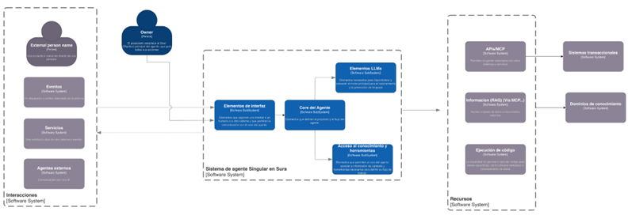
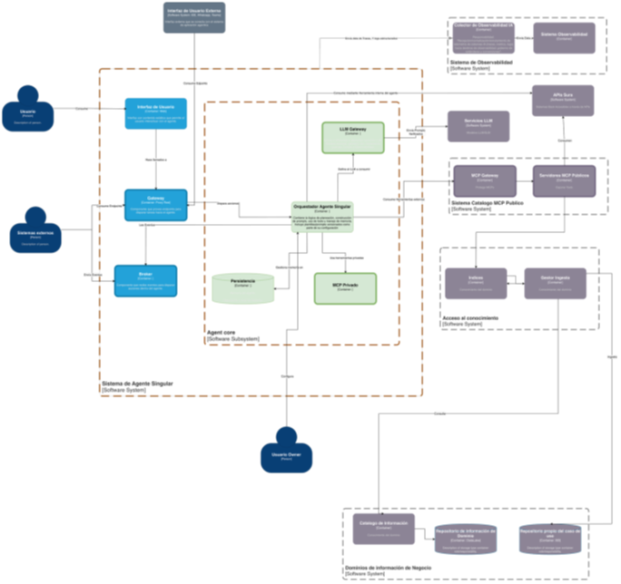

# Análisis As-Is

<!-- [macro: tabla de contenido] -->

## 1. Introducción

Esta sección resume el entendimiento del estado actual (As‑Is) de la arquitectura agéntica en SURA, con base en las versiones vigentes de la arquitectura de implementación (v1.1), la arquitectura de referencia (v1.1), los lineamientos conceptuales y la Línea Base de Arquitectura (LBA). El objetivo es proveer un punto de partida común para el equipo técnico, identificar fronteras actuales y preparar las transiciones necesarias hacia la arquitectura objetivo (To‑Be).

## 2. Visión actual de arquitectura (As‑Is)

La implementación actual se estructura como un agente singular integrado a canales empresariales y a servicios externos (LLMs, herramientas vía MCP y fuentes de conocimiento), apoyándose en capacidades transversales de identidad, seguridad y observabilidad.

En la vista As-Is de Nivel 1 (C4) se representa un patrón de “agente singular”, donde existe un núcleo de agente (Core del Agente) que orquesta la interacción con usuarios y sistemas, y concentra la lógica de decisión.

1. **Entradas / Interacciones**: el agente recibe solicitudes desde *personas externas*, *eventos*, *servicios* y *agentes externos* (canales e integraciones). La figura del Owner gobierna el propósito, reglas y evolución del agente (responsable funcional/técnico).
2. **Capa del agente**: el agente se estructura en elementos de interfaz/interacción que alimentan al Core, el cual coordina dos capacidades principales:

      1. Elementos LLMs (invocación de modelos para razonamiento/generación)
      2. Acceso a conocimiento y herramientas (habilita acciones y enriquecimiento de contexto).
3. **Recursos**: el agente consume capacidades mediante APIs/MCP, RAG (vía MCP) y ejecución de código, conectándose finalmente a sistemas transaccionales y dominios de conocimiento corporativos.

Ilustración 2 – Diagrama de componentes As-Is Nivel 2

## 3. Estrategias actuales

En el As‑Is se observan las siguientes estrategias técnicas y de adopción, relevantes para la evolución controlada de la plataforma:

- **Evolución incremental**: adopción inicial en forma de agente singular, con el objetivo de escalar hacia escenarios multiagente y capacidades compartidas a medida que madure el control operativo y de gobierno.
- **Desacoplamiento por gateways**: separación del orquestador respecto al proveedor de modelo (LLM Gateway) y respecto a herramientas (MCP), habilitando intercambiabilidad, reducción de lock‑in y control centralizado de políticas.
- **Despliegue cloud‑native**: ejecución del runtime del agente como contenedor, uso de Azure Container Apps como alternativa administrada para acelerar despliegue y operación, AKS como opción para escenarios con mayor densidad y complejidad de orquestación.
- **Exposición segura y reutilizable de herramientas**: uso de un MCP Gateway público (ApigeeX / GCP) para herramientas compartidas, manteniendo separación entre herramientas públicas y privadas.
- **Observabilidad como requisito**: instrumentación del orquestador y componentes asociados mediante estándares de telemetría (p. ej., OpenTelemetry), con capacidad de integración a monitoreo corporativo.

### 3.1. Gestión de Datos y Conocimiento

En el estado actual, la gestión de datos y conocimiento para los agentes IA de SURA se caracteriza por un patrón de implementación ad-hoc por proyecto, con Insuregent como la única excepción que ha formalizado un pipeline . El análisis se realizó sobre los proyectos con arquitectura IA Gen más robusta en producción: Insuregent, Copiloto Teams, SuperApp WhatsApp, Auditoría Compliance, Autorizaciones EPS , Turismo Médico entre otras.

- **RAG**: Azure AI Search es el motor de recuperación semántica (MRS) predominante en todas las implementaciones analizadas. Sin embargo, cada proyecto implementó su propio mecanismo de ingesta documental sin estandarización. Insuregent es el único con un pipeline ETL completo de 3 capas (Bronze → Silver → Gold) con checkpoints incrementales, deduplicación y limpieza automatizada. Los demás proyectos replican el patrón inicial de Azure Functions ad-hoc.
- **Knowledge**: Insuregent gestiona 8 índices vectoriales en Azure AI Search organizados por dominio de negocio (ARL, autonomía, movilidad, salud, canales, conectividad, competitividad, servicios financieros), con búsqueda híbrida (semántica HNSW + keyword + re-ranking). Los demás proyectos operan con índices aislados sin esquema estandarizado ni catálogo centralizado de conocimiento. No existe un catálogo corporativo que gobierne los Knowledge Products (RAG Ready Datasets, Curated Document Collections, Semantic Indexes) definidos en la Arquitectura de Referencia.
- **Memory**: La memoria de corto plazo existe de forma parcial en Insuregent (checkpoints en Cosmos DB sin summarization). La memoria de largo plazo (episódica, semántica, procedimental) no está implementada en ningún proyecto. No existe un patrón corporativo para gestión de historial conversacional ni persistencia entre sesiones.

Patrones identificados:

- Patrón predominante de ingesta: Azure Functions ad-hoc por proyecto, sin esquema estandarizado de índices, sin trazabilidad de fuentes y sin separación de responsabilidades entre ingesta y consumo.
- Patrón evolucionado (Insuregent): Pipeline ETL como Container Apps Job con ejecución diaria, modelo medallion (Bronze/Silver/Gold), embeddings con text-embedding-3-large (3072 dimensiones) y MCP Server con 1 tool por dominio de conocimiento.
- Multi-cloud: SuperApp WhatsApp opera en GCP con Vertex AI Vector Search, mientras el resto opera en Azure. Esto confirma la necesidad de abstracción agnóstica en la capa de conocimiento.

**Posicionamiento de Databricks en la gestión de datos:**Databricks está en producción para ML tradicional con modelos desplegados (propensión, pronóstico, detección de atípicos, scoring) en las áreas de ARL, EPS, Vida y Televentas. Sin embargo, su rol dentro de la plataforma agéntica requiere una reubicación:

- En Domain Layer → Data Stores, Delta Lake ya opera como lakehouse para los modelos ML en producción. Este rol es correcto y está validado.
- En Domain Layer → Knowledge Products, Unity Catalog tiene potencial como catálogo corporativo para gobernar los RAG Ready Datasets, Curated Document Collections y Semantic Indexes que hoy no tienen catálogo centralizado. Este es un gap identificado que Unity Catalog podría resolver.
- En Control Plane → Experiments, MLflow encaja como estándar de industria para experiment tracking y model registry, alineado con lo definido en la LLM Engineering Platform de la Arquitectura de Referencia.
- En RAG Layer, Databricks podría aportar capacidad de procesamiento masivo con Spark para la fase de ingesta documental. Sin embargo, Insuregent ya resuelve este escenario con Container Apps Jobs.

La evolución del Framework LLMOps implica que Databricks debe posicionarse como proveedor especializado en Domain Layer y Experiments, no como componente central de la plataforma agentica.

## 4. Vista resumida de tecnologías/capacidades

| **Capa / Capacidad** | **Tecnologías / Servicios** | **Nota As‑Is** |
| --- | --- | --- |
| **Identidad y acceso** | Microsoft Entra ID / SEUS (SSO/MFA), políticas condicionales | Base para propagación de identidad y control de sesiones |
| **Gestión de APIs** | API Manager / API Gateway, ApigeeX (GCP) | Publicación controlada de capacidades LLM y MCP |
| **Runtime** | Azure Container Apps, AKS | Container Apps para adopción ágil. AKS para alta densidad |
| **Modelos LLM** | Proveedor LLM vía LLM Gateway (p. ej., Azure AI Foundry) | Desacoplamiento del orquestador, habilita ruteo/costos |
| **Herramientas** | MCP (catálogo público + privadas), cliente MCP HTTP/JSON‑RPC | Tool‑calls gobernados, separación público/privado |
| **Observabilidad** | OpenTelemetry, integración SIEM | Telemetría y auditoría, base para SLOs |
| **Datos y conocimiento** | RAG + Vector DB (según lineamientos/catálogo) | Requiere gobierno de fuentes |

Tabla 1 – Inventario Tecnológico AS-IS

## 5. Brechas de adopción de Plataforma Agéntica

De acuerdo al análisis de la arquitectura As-Is se evalúan cada uno de los componentes presentes, con el fin de encontrar las brechas o diferencias para la adopción de la Plataforma Agéntica, utilizando como referencia las capacidades esperadas en una plataforma de este tipo:

| **Capacidad** | **Brecha** | **Objetivo** |
| --- | --- | --- |
| **MCP / APIs.** | No todas las APIs están diseñadas para consumo agéntico. | Estandarización de contratos OpenAPI y catálogo de tools. |
| **AI / LLM Gateway** | Consumo de modelos no centralizado ni gobernado. | Implementar gateway con control y trazabilidad. |
| **Observabilidad end‑to‑end** | No se trazan decisiones ni uso de tools. | Incorporar observabilidad integral de IA. |
| **Prompt Management** | No existe gestión formal de prompts. | Incluir versionamiento y control de cambios de prompts. |
| **Guardrails** | No hay validaciones previas a despliegue. | Implementar pruebas y controles de release. |
| **Knowledge Products** | Conocimiento no estructurado como producto. | Definición de productos de conocimiento gobernados. |
| **RAG Services** | No existe servicio corporativo estandarizado. | Implementar servicio RAG con Base de Datos vectorial. |
| **Memory Layer** | No hay gestion formal de memoria. | Incorporar capa de memoria persistente y temporal (Long Time & Short Time) |
| **Quality Evals** | No se mide precisión ni grounding. | Incorporar métricas de calidad de retrieval. |
| **Orchestrator** | Orquestación solo determinística. | Implementar orquestador con planificación dinámica. |
| **FinOps IA** | No se mide costo por agente/interacción. | Incorporar métricas FinOps específicas. |
| **Experimentación** | No existe entorno controlado de pruebas. | Implementar sandbox y pruebas A/B (Pruebas comparativas). |

Tabla 2 – Brechas de adopción plataforma agéntica
