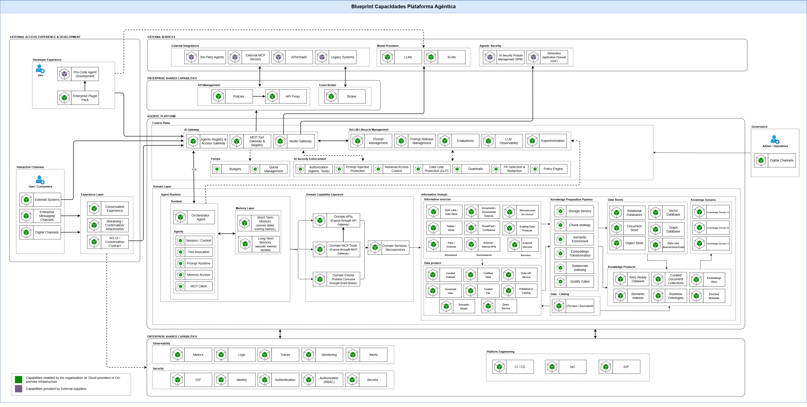
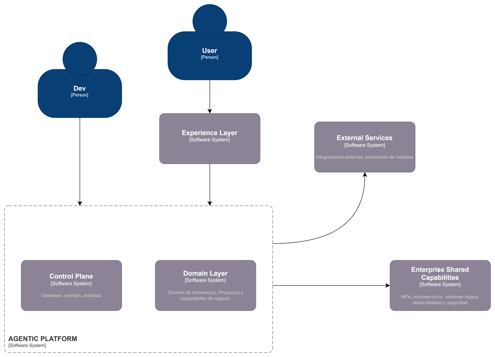
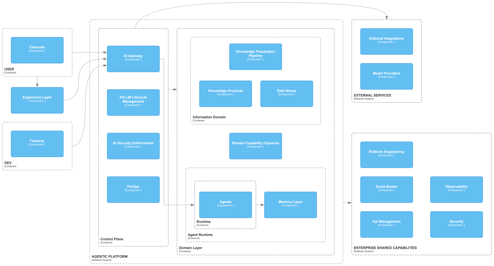

# Blueprint de Capacidades Arquitectura Agéntica

<!-- [macro: tabla de contenido] -->

# 1. Introducción

La presente sección describe el blueprint de capacidades de la plataforma agéntica de SURA, concebido como una visión objetivo de alto nivel para organizar, estructurar y comunicar las capacidades necesarias para construir, exponer, operar y gobernar agentes de IA de forma reusable, segura y escalable. Su propósito no es reemplazar la arquitectura de referencia vigente ni cerrar decisiones de implementación por componente, sino servir como punto de partida para la evolución de futuras arquitecturas de referencia, footprints de arquitectura y diseños de solución alineados con los distintos escenarios de adopción de la plataforma. Esta orientación es consistente con la evolución To-Be definida por SURA, en la que el acceso a modelos, herramientas, prompts, evaluaciones, observabilidad y conocimiento empresarial se consolida como una plataforma compartida de capacidades de IA utilizada por múltiples agentes.

El blueprint establece una visión arquitectónica común para equipos de arquitectura, ingeniería, plataforma, seguridad y datos, definiendo las capas principales, sus responsabilidades, sus relaciones y los patrones generales de consumo entre ellas. En esta visión, la Plataforma Agéntica constituye el núcleo especializado de capacidades compartidas, mientras que el runtime del agente se mantiene enfocado en la orquestación del contexto, la memoria, las tools y el acceso gobernado a capacidades externas. A su vez, el blueprint deja explícita la relación de la plataforma con capacidades empresariales compartidas y con servicios externos, de manera que las futuras arquitecturas de referencia puedan aterrizar estas definiciones según el nivel de madurez, el dominio de negocio y las restricciones tecnológicas de cada caso.

# 2. Alcance

Esta arquitectura cubre los siguientes ámbitos:

- Canales y experiencias de interacción con usuarios y desarrolladores.
- Capacidades compartidas de integración organizacional.
- Plataforma agéntica y su separación entre Control Plane y Core Platform.
- Exposición y consumo de capacidades de dominio.
- Integración con servicios externos y proveedores de modelos.
- Requerimientos no funcionales y patrones de implementación.

No forma parte del alcance de este documento la definición detallada de productos de dominio específicos, modelos de datos particulares ni decisiones tecnológicas cerradas por componente, salvo cuando son necesarias para precisar el rol arquitectónico de una capa.

# 3. Principios Arquitectónicos

La arquitectura se rige por los siguientes principios:

- **Separación de responsabilidades:** el runtime del agente, el conocimiento empresarial, las tools, los modelos y las capacidades transversales de gobierno deben mantenerse desacoplados. El agente no debe absorber la lógica transaccional del negocio ni el procesamiento del conocimiento; debe orquestarlos de forma gobernada.
- **Capacidades empresariales compartidas:** seguridad, observabilidad, identidad, integración, gobierno y plataforma se consumen como capacidades corporativas comunes, no como implementaciones embebidas en cada agente o dominio. Esto es coherente con la evolución hacia una plataforma compartida de capacidades de IA.
- **Consumo gobernado del dominio:** el conocimiento y las capacidades del negocio se exponen mediante contratos explícitos, principalmente **APIs**, **MCP Tools** y **Events**, preservando trazabilidad, reutilización y control de acceso. En particular, las capacidades para agentes deben seguir una lógica API-LED, donde primero se publican como APIs y luego, cuando aplica, se disponibilizan mediante MCP.
- **Punto único de control para modelos y tools:** el acceso a modelos, herramientas reutilizables y agentes expuestos debe resolverse mediante gateways y registries compartidos, evitando integraciones directas desde los agentes y reduciendo duplicidad de lógica de control. La transición To-Be de SURA introduce precisamente la transversalización del LLM Gateway como capacidad compartida de plataforma.
- **Trazabilidad extremo a extremo:** toda ejecución debe poder correlacionarse por usuario, canal, sesión, agente, tool, modelo y fuente de datos. Los sistemas de agentes deben emitir logs estructurados, métricas y trazas correlacionables para reconstruir una ejecución de extremo a extremo.
- **Seguridad y cumplimiento normativo desde el diseño:** la seguridad constituye un principio estructural de la plataforma y debe incorporarse de manera transversal, cubriendo identidad, autenticación, autorización, protección de datos, control de tools, protección frente a prompt injection, guardrails, trazabilidad y cumplimiento. La evolución To-Be refuerza esto mediante Guardrails Service y Policy Engine como capacidades explícitas de gobernanza.
- **Diseño para escalabilidad operativa y evolución incremental:** la plataforma debe soportar incorporación progresiva de nuevos agentes, dominios, tools, canales y proveedores sin rediseño estructural. La arquitectura base parte de agente singular, pero se diseña preparada para escalar hacia agentes con roles, multiagentes y una plataforma más completa de capacidades compartidas.
- **LLMOps como práctica central de gobierno operativo:** la gestión de prompts, evaluaciones, observabilidad y calidad debe tratarse como una disciplina transversal integrada al ciclo de vida de los agentes. LLMOps articula prompts y evals de forma sistemática, auditable y alineada con objetivos de negocio, seguridad y cumplimiento.
- **Uso de estándares de industria:** la plataforma debe privilegiar estándares abiertos y prácticas ampliamente adoptadas para exposición, integración, observabilidad, seguridad y consumo de capacidades agénticas, con el fin de reducir acoplamientos innecesarios, facilitar interoperabilidad, mejorar portabilidad tecnológica y acelerar la evolución del ecosistema. Este principio es consistente con la adopción de MCP como estándar para publicación y consumo seguro de herramientas reutilizables, con la orientación API-LED para exposición de capacidades y con el uso de prácticas de LLMOps, trazabilidad y observabilidad integradas a nivel de plataforma.

# 4. Vista arquitectónica general

La arquitectura se organiza en cinco dominios principales y dos bandas de capacidades compartidas.

### 4.1. External Access, Experience & Development

Agrupa las capacidades externas de interacción y construcción que rodean a la plataforma agéntica, pero no forman parte de su runtime ni de su control interno. Incluye:

- **Developer Experience**, donde se habilita la construcción pro-code de agentes y el uso de extensiones empresariales para acelerar el desarrollo bajo lineamientos corporativos.
- **Interaction Channels**, que representan los medios de entrada desde usuarios y sistemas externos.
- **Experience Layer**, donde se materializa la experiencia conversacional, el streaming, las confirmaciones, los adjuntos y el contrato de interacción hacia la plataforma.

Esta capa desacopla la evolución de interfaces, canales y tooling de desarrollo respecto del núcleo agéntico y del dominio de negocio, permitiendo que la plataforma mantenga un modelo estable de consumo y gobierno.

### 4.2. External Services

Agrupa los servicios, proveedores y plataformas fuera del perímetro de control principal de la organización o de la plataforma agéntica, tales como:

- **3rd-Party Agents**
- **External MCP Servers**
- **APIs / SaaS**
- **Legacy Systems**
- **Model Providers**
- **Agentic Security externa**

Su función es ampliar las capacidades disponibles para la plataforma, manteniendo un modelo de integración mediado, trazable y gobernado. En esta arquitectura, el runtime del agente no consume directamente estas dependencias de forma ad hoc, lo hace a través de capacidades compartidas de plataforma y de integración corporativa.

### 4.3. Enterprise Shared Capabilities

Representa las capacidades empresariales internas reutilizables que habilitan la operación de la plataforma sin pertenecer exclusivamente a ella. Se expresan en dos bandas:

- **Capacidades superiores de integración**, como **API Management** y **Event Broker**.
- **Capacidades inferiores de base**, como **Observability**, **Security** y **Platform Engineering**.

Desde el punto de vista arquitectónico, ambas deben interpretarse como capacidades corporativas transversales sobre las que la plataforma agéntica se apoya para exponer APIs, consumir eventos, instrumentar trazabilidad, operar identidades, administrar secretos y desplegar artefactos bajo CI/CD e IaC.

### 4.4. Agentic Platform

Constituye el núcleo especializado de la solución y se divide en dos grandes planos:

- **Control Plane**, donde se concentran las capacidades transversales de acceso gobernado, lifecycle management, seguridad específica para IA y control operativo.
- **Domain Layer**, donde se ubican los runtimes agénticos por dominio, la exposición de capacidades del negocio y el dominio de información y conocimiento.

La plataforma agéntica no debe entenderse como una sola herramienta ni como un monolito funcional, sino como una **capacidad compuesta de plataforma** que agrupa servicios especializados para que múltiples agentes operen bajo reglas comunes de gobierno, seguridad, calidad, observabilidad y eficiencia.

### 4.5. Domain Layer

Representa las capacidades específicas alineadas a un dominio de negocio e incluye tres ámbitos:

- **Agent Runtime**, donde vive el orquestador, la gestión de contexto y memoria, la invocación de tools y el acceso gobernado a capacidades externas.
- **Domain Capability Exposure**, donde el dominio expone sus capacidades mediante **Domain APIs**, **Domain MCP Tools** y **Domain Events**.
- **Information Domain**, donde residen los productos de conocimiento, los stores y el pipeline de preparación del conocimiento.

La inclusión de esta capa dentro del blueprint general no implica que el negocio o el conocimiento pertenezcan al core agéntico; por el contrario, su propósito es mostrar cómo el agente consume esas capacidades de manera desacoplada y gobernada.

# 5. Vistas de arquitectura

## 5.1. C4. Nivel 1 - Contexto

Se presenta el contexto general de la Plataforma Agéntica, identificando actores, sistemas externos y dominios principales de interacción. Con estructura en tres capas internas: Control Plane, Agentic Platform y Domain Layer, que habilitan gobierno, orquestación y capacidades de negocio basadas en agentes.

## 5.2. C4. Nivel 2 – Contenedores

Descompone la Plataforma Agéntica en sus principales contenedores, mostrando cómo se organizan las capacidades de gobierno, dominio y ejecución. Se distinguen el Control Plane, Agentic Platform y Domain Layer. También se detallan las integraciones externas con proveedores de modelos y servicios corporativos como API Management, observabilidad y event broker. Esta vista permite comprender la distribución de responsabilidades técnicas, los flujos principales de interacción y la separación entre capacidades transversales y capacidades de dominio.

---

# Catalogo de capacidades agenticas

Con el fin de aterrizar la visión arquitectónica del Blueprint de Capacidades de la Plataforma Agéntica en un instrumento utilizable para diseño, planeación y gobierno, se consolidó un catálogo de capacidades alineado con la estructura objetivo del blueprint y complementado con las definiciones de la arquitectura de referencia e implementación vigentes. Este catálogo toma como punto de partida el inventario base previamente trabajado, pero lo reorganiza para que responda de manera más precisa a la separación entre capacidades de experiencia, capacidades compartidas empresariales, plataforma agéntica y dominio de negocio, tal como lo plantea la visión objetivo de SURA

> **[Archivo adjunto]** [catalogo_capacidades_ia.xlsx](../../recursos/5821300740/catalogo_capacidades_ia.xlsx)

El propósito del catálogo no es definir productos concretos ni cerrar de manera rígida decisiones tecnológicas por componente. Su función es servir como puente entre la visión de arquitectura de alto nivel y los ejercicios posteriores de arquitectura de referencia, footprint y diseño de solución. En otras palabras, el catálogo traduce el blueprint en un lenguaje operativo: identifica qué capacidades deben existir, cómo se agrupan, qué rol cumplen dentro de la plataforma y en qué horizonte deben consolidarse.
