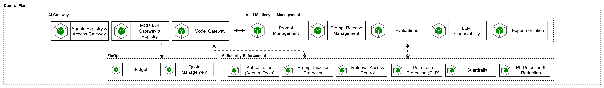

# Control  Plane

El Control Plane es la capacidad de gobierno transversal de la plataforma agéntica. Su propósito es separar el runtime operativo de los agentes de las capacidades compartidas de control, gestión y cumplimiento que deben administrarse de forma centralizada a nivel de plataforma. En esta capa se concentran los mecanismos que permiten gobernar el acceso a modelos, herramientas y agentes, gestionar el ciclo de vida de prompts y evaluaciones, aplicar políticas y controles de seguridad, operar con trazabilidad y observabilidad, y controlar costos y cuotas de consumo. Su existencia responde a una necesidad explícita de la arquitectura To-Be de SURA: evitar que cada agente implemente localmente estas funciones, reducir duplicidad, fortalecer la estandarización y consolidar una plataforma compartida de capacidades de IA reutilizables por múltiples agentes. En este modelo, los agentes dejan de gestionar por sí mismos el acceso a modelos y demás capacidades transversales, y pasan a consumir servicios especializados provistos por la plataforma bajo reglas comunes de gobierno, seguridad, calidad y operación.

### AI Gateway

El AI Gateway constituye el plano transversal de acceso gobernado a capacidades agénticas y cognitivas de la plataforma. Su intención es centralizar el consumo de modelos, tools y agentes expuestos, permitiendo que los runtimes operen sobre interfaces comunes, desacopladas y reutilizables, y no sobre integraciones puntuales o dependencias rígidas. Esta visión se alinea con la arquitectura To-Be de SURA, donde el acceso a LLMs se transversaliza como una capacidad compartida y el AI Gateway evoluciona incorporando mecanismos adicionales de gobernanza.

#### Agent Registry & Access Gateway

Esta capacidad se encarga del registro, descubrimiento y acceso gobernado a agentes expuestos dentro del ecosistema. Permite identificar qué agentes existen, segmentarlos por dominio o contexto, publicar endpoints de invocación y aplicar controles de autenticación y autorización sobre su uso. Su objetivo es habilitar interoperabilidad y exposición controlada de agentes, sin obligar a que todos los escenarios adopten desde el inicio una arquitectura multiagente.

#### MCP Tool Gateway & Registry

Esta capacidad se encarga de la publicación, descubrimiento y gobierno de tools expuestas mediante MCP. Su propósito es permitir que capacidades del negocio, previamente expuestas como APIs, puedan publicarse como tools reutilizables y gobernadas dentro de la plataforma. También permite exponer y administrar MCPs ya existentes, centralizando control, trazabilidad y reutilización. Esta definición es consistente con el principio de SURA según el cual toda capacidad para agentes debe exponerse primero como API y luego, cuando aplique, ser publicada mediante MCP para consumo estandarizado y seguro.

#### Model Gateway

Esta capacidad abstrae y gobierna el acceso a proveedores de modelos. Permite implementar selección de modelos, routing, fallback, control de acceso, gestión de consumo y desacoplamiento del runtime frente a proveedores específicos. En SURA, esta función ya se reconoce en la referencia y en la implementación como una responsabilidad central del LLM Gateway.

note49c7ac5fb469
El AI Gateway pertenece al plano operativo compartido de la plataforma, AI/LLM Lifecycle Management pertenece al plano de gestión del ciclo de vida, FinOps y AI Security Enforcement son capacidades transversales de control y gobierno.

El AI Gateway pertenece al plano operativo compartido de la plataforma, AI/LLM Lifecycle Management pertenece al plano de gestión del ciclo de vida, FinOps y AI Security Enforcement son capacidades transversales de control y gobierno.

---

### AI/LLM Lifecycle Management

Esta subcapa agrupa las capacidades asociadas al ciclo de vida de prompts, evaluaciones, observabilidad y experimentación. Su objetivo es tratar prompts, evaluaciones y métricas como activos gestionados de plataforma, alineados con LLMOps y no embebidos localmente en cada agente.

#### Prompt Management

Gestiona prompts de forma centralizada, con trazabilidad, versionado, reutilización y control sobre su diseño y evolución.

#### Prompt Release Management

Administra el paso de prompts y configuraciones desde estados de diseño hacia estados liberados o aprobados para uso operativo en agentes.

#### Evaluations

Gestiona la evaluación sistemática de prompts y agentes, incluyendo calidad funcional, robustez, alineamiento, uso de tools y seguridad. Su propósito es habilitar quality gates y mejora continua.

#### LLM Observability

Centraliza la observabilidad del uso de modelos y flujos agénticos, incluyendo métricas, trazas, tiempos, costos, tool calls y comportamiento general del sistema.

#### Experimentation

Habilita pruebas controladas, comparación de variantes, iteración sobre prompts/modelos y validación de hipótesis antes de formalizar releases.

---

### FinOps

La subcapa de **FinOps** agrupa las capacidades necesarias para controlar el costo operativo del consumo de IA. Su intención es hacer visible y gobernable el uso de modelos, cuotas y presupuestos, alineando la operación de la plataforma con restricciones de costo y eficiencia.

#### Budgets

Permite definir y controlar presupuestos de consumo asociados a modelos, dominios, agentes o entornos.

#### Quota Management

Administra límites de uso, rate limits y cuotas operativas para evitar sobreconsumo, proteger la plataforma y reforzar el gobierno del acceso.

notee698a5e2e5e7
LLM Observability y FinOps deben operar de forma coordinada, ya que el control real de costos requiere telemetría detallada del consumo de modelos y herramientas.

LLM Observability y FinOps deben operar de forma coordinada, ya que el control real de costos requiere telemetría detallada del consumo de modelos y herramientas.

---

### AI Security Enforcement

Esta subcapa agrupa los mecanismos de seguridad y cumplimiento específicos para sistemas agénticos y consumo de LLMs. Su propósito es aplicar controles preventivos y correctivos sobre prompts, tools, retrieval y salidas del modelo, reforzando el cumplimiento normativo, la protección de datos y la trazabilidad del comportamiento del sistema. Esto está alineado con el énfasis de la arquitectura de SURA en guardrails, control de acceso, cumplimiento y seguridad IA como capacidades obligatorias.

#### Authorization (Agents, Tools)

Controla qué agentes, usuarios o runtimes pueden acceder a determinadas capacidades, herramientas o flujos.

#### Prompt Injection Protection

Aplica mecanismos para prevenir, detectar y mitigar ataques de prompt injection y manipulaciones del contexto de entrada.

#### Retrieval Access Control

Gobierna el acceso a productos de conocimiento, índices y resultados de retrieval, garantizando aislamiento por dominio, permisos y contexto autorizado.

#### Data Loss Protection (DLP)

Previene exposición indebida o fuga de información sensible durante la interacción con modelos, tools o canales de salida.

#### Guardrails

Define y aplica restricciones sobre el comportamiento del agente y del modelo, tanto en entrada como en salida.

#### PII Detection & Redaction

Detecta y, cuando aplique, enmascara o elimina datos personales sensibles antes o después del paso por el modelo.

note38eaf47ada0d
Capacidades externas como GAF o AI Security Posture deben entenderse como servicios complementarios de enforcement y postura de seguridad que se integran con el AI Gateway y el bloque de AI Security Enforcement, no únicamente con el Model Gateway.

Capacidades externas como GAF o AI Security Posture deben entenderse como servicios complementarios de enforcement y postura de seguridad que se integran con el AI Gateway y el bloque de AI Security Enforcement, no únicamente con el Model Gateway.

---

## Mapa de gobierno del Control Plane de IA First

### Propósito

El Control Plane es la capa que traduce políticas corporativas, de riesgo, seguridad, cumplimiento y operación en controles ejecutables sobre puntos únicos de enforcement, sin meter esa lógica dentro de cada agente. Su objetivo es que todos los agentes consuman modelos, tools, datos y capacidades de dominio bajo reglas comunes de autorización, seguridad, observabilidad, costo y calidad.

### Principio de operación

**Política → Regla ejecutable → PEP → Acción → Evidencia → Gate de gobierno**

Donde:

- **Política**: lineamiento corporativo, de cyber, riesgo, datos, arquitectura o LLMOps.
- **PEP (Policy Enforcement Point)**: punto de enforcement donde se aplica el control.
- **Acción**: permitir, bloquear, redirigir, enmascarar, degradar, escalar a HITL, registrar.
- **Evidencia**: registro auditable de que el control fue evaluado y qué decisión tomó.
- **Gate**: momento formal de gobierno donde se aprueba, condiciona o rechaza.

### Gates de gobierno propuestos

El gobierno del ecosistema agéntico no puede quedar concentrado en una única revisión final, sino que debe distribuirse a lo largo del ciclo de vida de la iniciativa, desde el registro arquitectónico hasta la operación continua. En SURA, la arquitectura de referencia ya establece la **Matriz de Riesgo** como un gate formal para decidir si una iniciativa puede continuar, requiere controles adicionales o debe detenerse, y además plantea gobierno, observabilidad, evaluación y operación como prácticas transversales del ciclo de vida. Por eso, la matriz de gates organiza en qué momento se valida riesgo, arquitectura, cambios, seguridad y operación, evitando vacíos de control entre diseño, release y producción.

| Gate | Objetivo | Qué valida |
| --- | --- | --- |
| **G0. Registro arquitectónico** | Registrar el agente/capacidad en plataforma | owner, caso de uso, patrón, tecnologías, alineación LBA, canales, tools, dominios de datos |
| **G1. Clasificación de riesgo IA** | Determinar si la iniciativa puede seguir y con qué controles | riesgo prohibido / alto / limitado / mínimo, necesidad de HITL, criticidad de acciones y datos |
| **G2. Release / cambio** | Autorizar el despliegue de una nueva versión | prompts versionados, policies as code, evals, contratos MCP/APIs, cambios de modelo/tool, rollback |
| **G3. Go-live / autorización operativa** | Autorizar la ejecución en entorno | authn/authz, quotas, budgets, guardrails, DLP/PII, observabilidad, alertas |
| **G4. Operación continua / revalidación** | Mantener control en producción | incidentes, costo, degradación, revisiones periódicas, cambios regulatorios |

### Mapa de gobierno por fuente de política

Las decisiones de control sobre agentes no provienen de una sola disciplina, sino de múltiples fuentes: arquitectura, riesgo, seguridad, datos, operación y LLMOps. El blueprint de capacidades plantea precisamente que la plataforma debe separar el runtime del agente de las capacidades compartidas de control, gestión y cumplimiento, concentrando esas funciones en un **Control Plane** y en capacidades transversales como AI Gateway, lifecycle management, FinOps y AI Security Enforcement. Bajo esa lógica, el mapa permite relacionar cada fuente de política con las capacidades de enforcement que la materializan y con la evidencia que debe producirse para sostener trazabilidad y gobierno unificado.

| Fuente de política | Qué gobierna | Capacidades del Control Plane | Evidencia principal | Gate |
| --- | --- | --- | --- | --- |
| **Arquitectura / LBA** | tecnologías permitidas, patrón de integración, uso de gateways, versiones soportadas | registries, release controls, architecture checks | ADR, inventario técnico, aprobación o excepción | G0, G2 |
| **Riesgo IA / Compliance** | clasificación de riesgo, prohibiciones, controles reforzados, HITL | risk classification, policy engine, approval workflows | matriz de riesgo, dictamen, aceptación de riesgo residual | G1, G3 |
| **Cyber / Privacidad** | identidad, authz, DLP, PII, guardrails, seguridad de tool use | authorization service, DLP/PII redaction, guardrails, secret governance | resultados de policy checks, logs de bloqueo, redaction records | G2, G3, G4 |
| **LLMOps / Calidad** | prompts, evals, regresión, calidad de respuestas, grounding | prompt registry, eval registry, observability, model routing | versiones, scorecards, resultados de eval, trazas de ejecución | G2, G4 |
| **FinOps / Operación** | quotas, budgets, rate limits, fallback, alertas | quota/budget service, routing, observability | reportes de costo, budget alerts, throttling events | G3, G4 |
| **Gobierno de datos** | clasificación, fuentes aprobadas, acceso a conocimiento | retrieval/data access gateway, source registry | source access logs, evidencia de clasificación, freshness | G1, G3, G4 |

---

## Matriz de Políticas / Cumplimiento

Esta matriz traduce lineamientos y principios de alto nivel en controles realmente ejecutables dentro de la plataforma. La arquitectura objetivo refuerza que el acceso a modelos debe pasar por una capa transversal compartida, y además incorpora explícitamente capacidades como **Guardrails Service** y **Policy Engine** para aplicar restricciones sobre modelos, herramientas y validaciones de cumplimiento. El blueprint indica que el acceso a modelos, agentes y tools debe resolverse mediante gateways y registries compartidos, con control de acceso, routing, fallback, cuotas, budgets, DLP, PII redaction y protección frente a prompt injection. Por ello, la matriz Policy → PEP → Acción → Evidencia convierte el gobierno en enforcement operativo y auditable, en lugar de dejarlo como lineamiento declarativo.

**Formato: Policy → PEP → Acción → Evidencia**

> PEP (Policy Enforcement Point) = punto de enforcement.

| ID | Política | PEP | Acción de enforcement | Evidencia requerida | Gate |
| --- | --- | --- | --- | --- | --- |
| **P-01** | **Solo identidades autenticadas pueden invocar agentes o gateways** | **A2A Gateway / API ingress** | validar identidad de usuario, sistema o agente, propagar identidad y sesión | auth log, actor ID, canal, session ID, correlation ID | G3 |
| **P-02** | **Autorización contextual y mínimo privilegio** | **Authorization Service + Tool/MCP Gateway + Retrieval Gateway** | evaluar actor + agente + tool + recurso + acción, deny by default, scopes/ABAC | decision log de policy engine, scopes efectivos, deny reasons | G3 |
| **P-03** | **Solo modelos aprobados y registrados pueden usarse** | **LLM/Model Gateway** | permitir únicamente modelos/proveedores/versiones aprobados, bloquear modelos no registrados | model registry snapshot, routing decision, model/version usados | G0, G2, G3 |
| **P-04** | **Routing de modelo según riesgo, costo y clasificación de datos** | **LLM/Model Gateway + Quota/Budget Service** | enrutar a modelo permitido, degradar o fallback cuando aplique, bloquear uso de modelos premium sin permiso | policy hit, route selected, costo estimado/real, fallback event | G2, G3, G4 |
| **P-05** | **Control de consumo: quotas, rate limits y budgets** | **Quota/Budget Service + LLM Gateway + A2A Gateway** | throttling, rechazo, cola o degradación controlada al superar umbrales | counters de consumo, budget alerts, throttle/block records | G3, G4 |
| **P-06** | **Protección de datos sensibles y PII en entrada y salida** | **DLP/PII Redaction Service** | detectar, enmascarar, redactar o bloquear PII/datos restringidos antes y después del modelo/tool | clasificación de contenido, redaction action, masked payload/hash | G2, G3, G4 |
| **P-07** | **Protección frente a prompt injection, jailbreak y salida insegura** | **Guardrails Service** | inspección pre y post, bloquear, sanitizar, pedir confirmación o degradar respuesta | rule hits, safety scores, block/degrade event, reason code | G2, G3, G4 |
| **P-08** | **Solo tools registradas y gobernadas pueden ejecutarse** | **Tool/Action + MCP Gateway** | allow-list de tools, validar owner, contrato, versión, riesgo y schema | tool registry entry, schema/version, allow-list decision | G0, G2, G3 |
| **P-09** | **Las acciones sensibles requieren aprobación humana (HITL)** | **Tool/Action Gateway + Approval Workflow** | aprobación antes de ejecutar transacciones o acciones críticas | approval record, approver, timestamp, payload hash, resultado | G1, G3 |
| **P-10** | **Las interacciones A2A deben ser confiables y trazables** | **A2A Gateway** | mutual trust, validación de identidad de agente, chain of delegation, loop prevention | agent IDs, delegation chain, message IDs, loop guard events | G2, G3, G4 |
| **P-11** | **El agente solo puede consultar fuentes de conocimiento aprobadas** | **Retrieval / Data Access Gateway** | source allow-list, control por dominio/clasificación, row/attribute filtering, frescura mínima | source IDs, query policy result, freshness metadata, access log | G1, G3, G4 |
| **P-12** | **Las capacidades de dominio deben exponerse con contrato explícito** | **Tool/MCP Gateway + API Gateway** | consumir APIs canónicas; usar MCP solo para tools seleccionadas, bloquear acceso ad hoc | API/MCP contract version, owner, request/response schema validation | G0, G2, G3 |
| **P-13** | **Toda ejecución debe ser trazable end-to-end** | **Observability Service** | emitir logs, métricas y trazas por usuario, sesión, agente, modelo, tool y fuente | trace ID, span chain, structured logs, métricas por ejecución | G3, G4 |
| **P-14** | **Debe existir evidencia auditable sin exponer Chain of Thought** | **Observability + Audit** | guardar hechos de ejecución y reason codes, no almacenar scratchpad/CoT oculto | execution ledger, tool chain, source refs, policy decisions, no CoT raw | G3, G4 |
| **P-15** | **Toda release debe pasar evals, versionado de prompts y control de cambio** | **Lifecycle Manager / Prompt Registry / Eval Registry** | bloquear despliegues sin evals mínimos, sin versionado o sin aprobación de cambio | prompt version, eval report, release approval, rollback plan | G2 |
| **P-16** | **Las tecnologías del Control Plane deben cumplir LBA** | **Architecture Gate** | aprobar nuevas tecnologías, restringir betas y versiones fuera de soporte | acta de aprobación, inventario tecnológico, excepción aprobada | G0, G2 |

---

## Reglas de evidencia auditable sin exponer CoT

En los procesos corporativos se necesita trazabilidad extremo a extremo y evidencia suficiente para auditoría, cumplimiento y análisis operativo, pero sin almacenar información innecesaria o riesgosa del razonamiento interno del modelo. La arquitectura de referencia exige que los sistemas de agentes emitan logs estructurados, métricas y trazas correlacionables, y que la observabilidad sea obligatoria para auditoría, cumplimiento regulatorio y optimización continua. A la vez, el blueprint establece la trazabilidad extremo a extremo como principio arquitectónico y ubica la observabilidad, evaluaciones y seguridad como capacidades transversales del Control Plane. En ese contexto, la sección define qué hechos de ejecución sí deben preservarse como evidencia y qué elementos no deben almacenarse, especialmente el Chain of Thought, para mantener un equilibrio entre auditabilidad, seguridad y cumplimiento.

### Sí se debe conservar

| Evidencia permitida | Ejemplo |
| --- | --- |
| Identidad y contexto operativo | user ID, agent ID, channel, session ID, correlation ID |
| Versionado | prompt version, policy bundle version, tool/API contract version, model version |
| Decisiones de control | allow/deny/challenge/redact/degrade con reason code |
| Cadena de ejecución | tools invocadas, orden de llamadas, tiempos, resultados resumidos |
| Grounding | source IDs, índices consultados, documentos/citas recuperadas |
| Aprobaciones | quién aprobó, cuándo, sobre qué payload hash |
| Métricas | latencia, tokens, costo, tasa de error, safety score |

### No se debe conservar

| Evidencia prohibida | Motivo |
| --- | --- |
| Chain of Thought crudo | expone razonamiento interno y aumenta riesgo de fuga |
| Scratchpad interno del agente | no es necesario para auditoría formal |
| prompts completos con datos sensibles sin redacción | riesgo de privacidad/compliance |
| outputs no sanitizados cuando contienen PII o datos restringidos | incumplimiento de seguridad y datos |

### Regla operativa recomendada

La evidencia de auditoría debe almacenar hechos verificables de ejecución y reason codes de política, no el razonamiento oculto del modelo. En otras palabras, la auditoría debe poder responder:

- quién ejecutó,
- qué intentó hacer,
- qué modelo/tool/fuente usó,
- qué políticas aplicaron,
- qué acción tomó el sistema,
- con qué aprobación,
- y cuál fue el resultado,

sin necesidad de guardar el CoT.

---

### ADRs del Control Plane

Los **Arquitectural Decision Records (ADRs)** permiten registrar de manera estructurada las decisiones adoptadas, el contexto que las motivó, la resolución definida y sus principales implicaciones sobre la arquitectura objetivo. Su propósito es asegurar trazabilidad de las definiciones, reducir ambigüedad en la interpretación del diseño y alinear a los distintos equipos involucrados sobre los principios que deberán respetarse en la materialización del Control Plane.

Los ADRs que se presentan a continuación consolidan las decisiones más relevantes asociadas a la naturaleza del AI Gateway, la topología objetivo del Control Plane, la adopción progresiva por planos, la separación funcional entre capacidades, el enforcement compartido de seguridad y cumplimiento, y los principios que regirán la selección tecnológica. En conjunto, estas decisiones constituyen la base arquitectónica sobre la cual se apoyará la evolución del capítulo de Control Plane y la futura implementación de sus capacidades dentro de la plataforma agéntica.

### ADR-CP-01. Naturaleza del AI Gateway corporativo

**Estado:** Pendiente de aprobación
**Contexto:**
La plataforma agéntica requiere una capacidad de gobierno común para controlar el acceso a modelos, tools, agentes expuestos, observabilidad, seguridad específica para IA y control operativo. En la arquitectura objetivo, el Control Plane concentra estas capacidades transversales y evita que queden embebidas en cada runtime agéntico. El análisis de benchmark también concluye que el AI Gateway no debe entenderse como un único producto ni como un único runtime, sino como una capacidad paraguas que articula LLM Gateway, MCP Gateway y A2A Gateway bajo gobierno transversal común.

**Decisión:**
Se establece que el **AI Gateway corporativo** será tratado en SURA como una **capacidad arquitectónica compuesta de plataforma**, y no como sinónimo de una única herramienta o producto comercial. Su materialización podrá realizarse mediante uno o varios componentes especializados, siempre que operen bajo un modelo común de identidad, políticas, trazabilidad, observabilidad, seguridad y control de consumo.

**Implicaciones:**

- La selección tecnológica no se hará buscando una herramienta que “resuelva todo” de manera monolítica, sino una combinación coherente de capacidades.
- La arquitectura del Control Plane deberá preservar separación entre acceso a modelos, acceso a tools/contexto y colaboración entre agentes.
- La documentación de solución y los futuros footprints deberán referirse al AI Gateway como capacidad paraguas y no como producto único.

---

### ADR-CP-02. Topología base del Control Plane

**Estado:** Pendiente de aprobación
**Contexto:**
La organización opera en un contexto regulado, con integración a múltiples dominios, capacidades corporativas compartidas y una estrategia de evolución que no debe depender de un único runtime central. El benchmark concluye que la topología más robusta para este contexto es **federada**, combinando gobierno central corporativo con enforcement local por cloud o dominio, en lugar de centralizar todo el tráfico en un solo gateway global.

**Decisión:**
Se adopta como topología base del Control Plane una **arquitectura federada**, compuesta por:
a) un **gobierno central corporativo** para identidad, políticas, catálogos, observabilidad, evaluación, auditoría y FinOps y
b) uno o más **data planes / gateways locales** por cloud, dominio o entorno, encargados del enforcement cercano a modelos, tools, agentes y fuentes de conocimiento.

**Implicaciones:**

- El diseño deberá evitar dependencias operativas excesivas sobre un runtime único.
- Las capacidades de gobierno deberán ser consistentes entre dominios, aun cuando el enforcement se distribuya.
- La selección de herramientas deberá favorecer esquemas híbridos, federados o composables, con gestión central y ejecución local donde sea necesario.

---

### ADR-CP-03. Adopción progresiva por planos

**Estado:** Pendiente de aprobación
**Contexto:**
La madurez funcional del mercado no es homogénea para LLM Gateway, MCP Gateway y A2A Gateway. El benchmark recomienda una adopción progresiva: LLM Gateway como base obligatoria; MCP Gateway para tools/contexto de alto valor; y A2A Gateway sólo cuando exista una necesidad real de colaboración entre agentes.

**Decisión:**
Se define un camino de adopción incremental del Control Plane, con el siguiente orden de prioridad:

1. **LLM / Model Gateway** como capacidad base obligatoria.
2. **MCP Tool Gateway & Registry** para tools y contexto reutilizable de alto valor.
3. **A2A / Agent Access Gateway** únicamente en escenarios justificados de interoperabilidad entre agentes o dominios.
4. Convergencia futura a experiencias más unificadas sólo cuando la madurez del producto lo permita y no comprometa la separación lógica por planos.

**Implicaciones:**

- No se exigirá desde la primera fase un AI Gateway unificado extremo a extremo.
- Las iniciativas iniciales deberán priorizar control de acceso a modelos, trazabilidad, cuotas, presupuestos y observabilidad.
- Los casos de uso A2A deberán justificarse explícitamente y pasar por revisión de riesgo, autonomía, trazabilidad y seguridad.

---

### ADR-CP-04. Separación obligatoria de planos funcionales

**Estado:** Pendiente de aprobación
**Contexto:**
La arquitectura objetivo y el blueprint establecen que el runtime del agente no debe absorber la lógica de negocio, el acceso directo a modelos, el gobierno de tools ni las funciones transversales de seguridad y observabilidad. El benchmark refuerza que no deben confundirse el plano de modelos, el plano de gateway, el plano de tools/contexto y el plano de colaboración entre agentes.

**Decisión:**
Se establece como principio obligatorio del Control Plane la **separación explícita** entre los siguientes planos:

- acceso y gobierno de modelos,
- publicación y gobierno de tools/contexto,
- exposición y control de agentes,
- gobierno transversal de seguridad, observabilidad, evaluación y costos.

**Implicaciones:**

- No se permitirán integraciones directas desde los agentes a modelos, tools o agentes remotos por fuera de gateways y registries compartidos, salvo excepción aprobada.
- Los diseños de solución deberán mostrar con claridad dónde se ubican los PEPs de cada plano.
- Las decisiones de producto deberán evaluarse según el plano que resuelven, evitando comparaciones impropias entre productos de inferencia y productos de gateway.

---

### ADR-CP-05. Enforcement de seguridad y cumplimiento como capacidad compartida

**Estado:** Pendiente de aprobación
**Contexto:**
La arquitectura de SURA exige trazabilidad extremo a extremo, seguridad y cumplimiento desde el diseño, con énfasis en guardrails, control de acceso, protección de datos y observabilidad. El blueprint ubica estas funciones dentro del Control Plane, en especial a través de AI Security Enforcement, FinOps y capacidades de observabilidad y evaluación.

**Decisión:**
Se establece que el **enforcement de seguridad, cumplimiento y control operativo** será una responsabilidad del **Control Plane** y no del runtime individual de cada agente. En consecuencia, controles como autorización contextual, DLP, PII redaction, guardrails, cuotas, budgets, hooks de observabilidad y evidencias de auditoría deberán implementarse como capacidades compartidas o integradas al gateway, con comportamiento verificable y reutilizable.

**Implicaciones:**

- Los equipos de dominio no deberán reimplementar lógica de seguridad o gobierno ya resuelta por la plataforma.
- La selección de herramientas deberá comprobar enforcement real, no solo configuración documental.
- La auditoría y el cumplimiento se evaluarán sobre hechos de ejecución emitidos por el Control Plane y no sobre implementaciones aisladas por agente.

---

### ADR-CP-06. Principios de selección tecnológica del Control Plane

**Estado:** Pendiente de aprobación
**Contexto:**
El benchmark concluye que no se recomienda optar por un build completamente custom antes de agotar opciones productizadas y composables, y advierte sobre el riesgo de lock-in excesivo o de sobrecentralizar el runtime. También recomienda apoyarse en estándares abiertos y contratos desacoplados.

**Decisión:**
Se define que la selección tecnológica del Control Plane deberá regirse por los siguientes principios:
a) preferencia por soluciones **productizadas o componibles** antes que desarrollos completamente a medida.
b) soporte para **topología federada**.
c) uso preferente de **estándares abiertos y contratos explícitos**.
d) capacidad de integrarse con observabilidad, identidad, seguridad y gobierno corporativo.
e) minimización del lock-in funcional y operativo.

**Implicaciones:**

- Una alternativa completamente custom sólo podrá considerarse mediante justificación explícita de ventaja estratégica y capacidad real de producto/plataforma.
- La evaluación de herramientas deberá privilegiar portabilidad de contratos, neutralidad arquitectónica y facilidad de integración con capacidades corporativas.
- La decisión final de producto deberá quedar subordinada a la arquitectura objetivo y no al revés.
