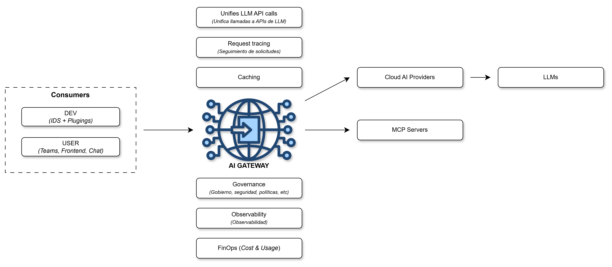
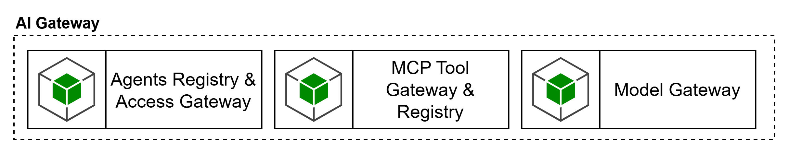
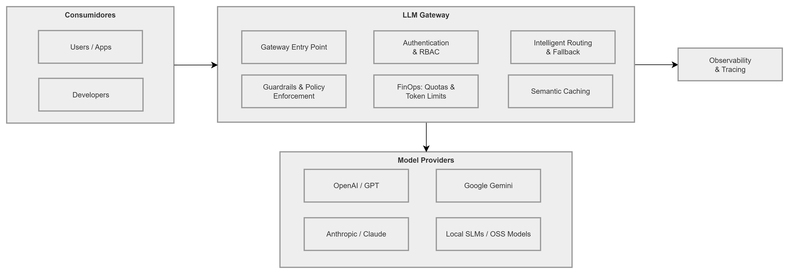
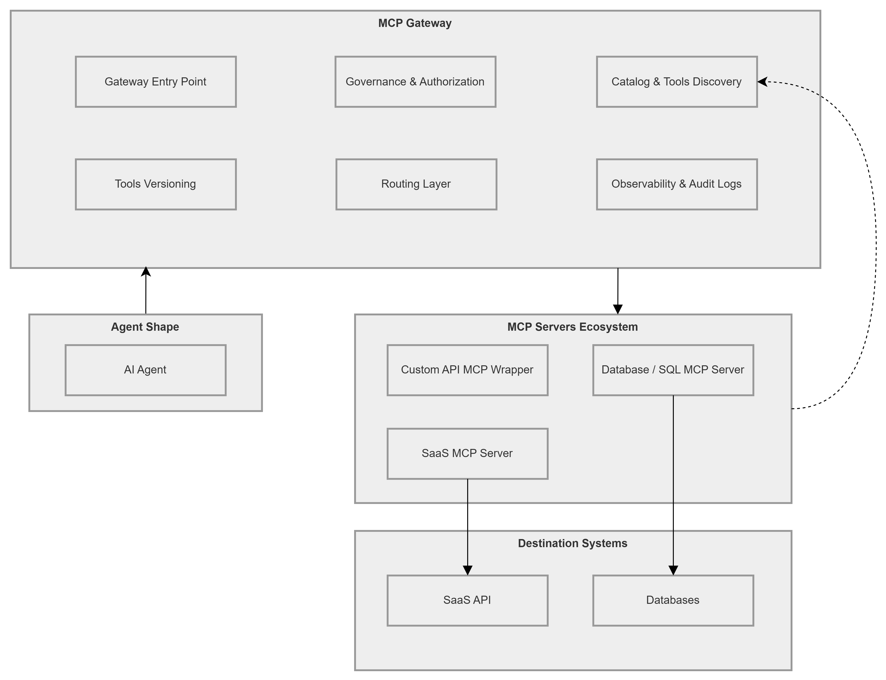
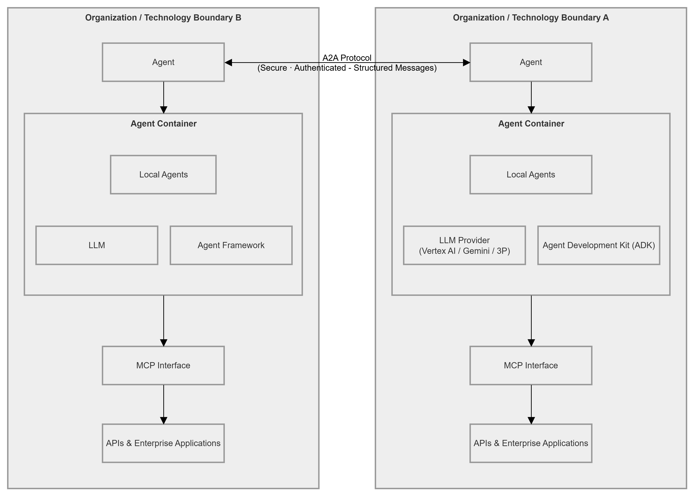
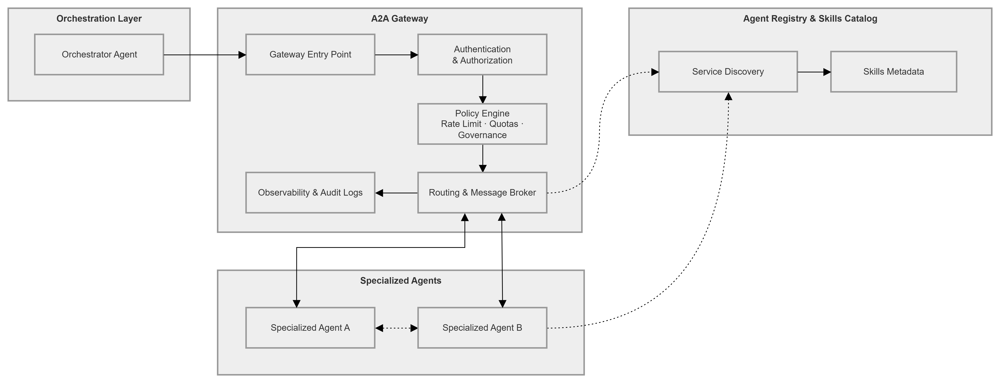

# AI Gateway

Capa ubicada dentro del dominio de **Control Plane**, es posible representarla de acuerdo a los consumidores, capacidades del AI Gateway, y modelos o servicios de destino, de la siguiente manera:

En cuanto al “**Blueprint Capacidades Plataforma Agéntica**” el AI Gateway se encuentra relacionado con las capas de:

- AI/LLM Lifecycle Management.
- Agent Runtime.
- FinOps.
- AI Security Enforcement.
- Enterprise Shared Capabilities.
- Model Providers.
- Agentic Security.

# Agent Registry & Access Gateway

Esta capacidad se encarga del registro, descubrimiento y acceso gobernado a agentes expuestos dentro del ecosistema. Permite identificar qué agentes existen, segmentarlos por dominio o contexto, publicar endpoints de invocación y aplicar controles de autenticación y autorización sobre su uso. Su objetivo es habilitar interoperabilidad y exposición controlada de agentes, sin obligar a que todos los escenarios adopten desde el inicio una arquitectura multiagente. La capacidad de **Agent Registry & Access Gateway** deberá:

- Mantener un registro gobernado de agentes expuestos, con ownership, criticidad, dominio, entorno, políticas y estado de publicación.
- Permitir descubrimiento controlado de agentes autorizados y evitar exposición informal o no inventariada.
- Aplicar autenticación, autorización, scopes, allow-lists y trazabilidad al acceso entre agentes o consumidores autorizados.
- Soportar A2A de forma selectiva, sólo cuando el caso de uso requiera colaboración real entre agentes.
- Registrar evidencia de quién invocó qué agente, bajo qué política, con qué resultado y con qué contexto.
- Permitir revisión diferenciada para escenarios de mayor autonomía, delegación o colaboración interdominio.

# MCP Tool Gateway & Registry

Esta capacidad se encarga de la publicación, descubrimiento y gobierno de tools expuestas mediante MCP. Su propósito es permitir que capacidades del negocio, previamente expuestas como APIs, puedan publicarse como tools reutilizables y gobernadas dentro de la plataforma. También permite exponer y administrar MCPs ya existentes, centralizando control, trazabilidad y reutilización. Esta definición es consistente con el principio de SURA según el cual toda capacidad para agentes debe exponerse primero como API y luego, cuando aplique, ser publicada mediante MCP para consumo estandarizado y seguro. La capacidad de **MCP Tool Gateway & Registry** deberá:

- Soportar la publicación, descubrimiento y gobierno de **tools reutilizables** expuestas mediante MCP.
- Respetar el principio **API-first / API-led**, de modo que las capacidades de negocio se expongan primero como APIs y luego, cuando aplique, como MCP tools gobernadas.
- Mantener un **catálogo/registro** de tools con owner, criticidad, dominio, contratos, políticas, clasificación de datos y estado de publicación.
- Aplicar **autorización contextual**, scopes y allow-lists sobre qué agentes, usuarios o runtimes pueden invocar qué tools.
- Emitir trazabilidad completa de **tool discovery, tool selection, invocación, respuesta, errores y policy enforcement**.
- Soportar versionamiento y control de compatibilidad de tools.
- Integrarse con controles de seguridad, observabilidad y FinOps cuando el uso de tools tenga impacto operativo o económico.

# Model Gateway

Esta capacidad abstrae y gobierna el acceso a proveedores de modelos. Permite implementar selección de modelos, routing, fallback, control de acceso, gestión de consumo y desacoplamiento del runtime frente a proveedores específicos. En SURA, esta función ya se reconoce en la referencia y en la implementación como una responsabilidad central del LLM Gateway. La capacidad de **Model Gateway** deberá:

- Abstraer el acceso a **proveedores de modelos** y evitar acoplamiento directo del runtime con vendors específicos.
- Implementar **routing**, selección de modelo, fallback y políticas de consumo por producto, dominio, entorno o agente.
- Permitir **control de acceso** a modelos por identidad, rol, agente, entorno o criticidad del caso de uso.
- Soportar **rate limits, quotas, budgets, token limits y políticas de protección de sobreconsumo**.
- Emitir telemetría suficiente para **correlacionar costo, latencia, tool calls, proveedor, modelo, versión y contexto de uso**.
- Integrarse con guardrails y controles de seguridad sobre prompts y respuestas.
- Permitir evolución multicloud sin que los agentes deban cambiar su contrato de consumo.

---

# **LLM Gateway**

Es la capacidad que **abstrae y gobierna el acceso a los proveedores de modelos de lenguaje**. Actúa como un punto único de entrada que desacopla el tiempo de ejecución (runtime) de los agentes de proveedores específicos, permitiendo una evolución multicloud sin cambiar los contratos de consumo.

Este gateway unifica las llamadas a APIs de diversos proveedores (como OpenAI, Anthropic o modelos locales) bajo un estándar común. Implementa funciones de **routing, fallback, rate limits y gestión de tokens** para optimizar el consumo y la disponibilidad de los modelos.

## Herramientas recomendadas

- **LiteLLM:** Es la recomendación principal para un entorno **AWS**. Se utiliza sobre ECS o EKS para gestionar la mediación de modelos, presupuestos y límites de consumo.
- **Azure API Management (APIM):** Es la herramienta recomendada en **Azure** para gobernar el acceso a modelos de Azure OpenAI y Foundry.
- **Apigee:** Es la pieza recomendada en **Google Cloud (GCP)** para aplicar políticas de cuotas de tokens (LLMTokenQuota) y seguridad de modelos (Model Armor).

---

# **MCP Gateway**

Es el componente encargado de la **publicación, descubrimiento y gobierno de herramientas (tools)** expuestas para que los agentes las utilicen. Su propósito es permitir que las capacidades de negocio (APIs) se conviertan en herramientas reutilizables y seguras dentro del ecosistema de IA.

Utiliza el **Model Context Protocol (MCP)**, un estándar abierto diseñado para conectar aplicaciones de IA con fuentes de datos, herramientas y flujos de trabajo externos de manera estandarizada, similar a un "puerto USB-C" para la IA.

## Herramientas recomendadas

- **Azure API Management (APIM):** Es la única herramienta **validada explícitamente** con soporte nativo para el registro, seguridad y exposición de **servidores MCP**.
- **Desarrollo Custom / Composición:** Para **AWS** y **Google Cloud**, no existe una oferta nativa madura equivalente a APIM, por lo que se requiere una **composición de servicios o desarrollo a la medida** para exponer capacidades mediante el protocolo MCP.

---

# **A2A Gateway**

Esta capacidad gestiona el **registro, descubrimiento y acceso gobernado a los agentes** del ecosistema. Permite identificar qué agentes existen, segmentarlos por dominio y aplicar controles de seguridad (autenticación y autorización) para habilitar la interoperabilidad controlada.

Se fundamenta en el **Agent-to-Agent (A2A) Protocol**, un estándar que proporciona un lenguaje común para que agentes construidos en diferentes frameworks (como LangGraph o CrewAI) colaboren y se deleguen tareas de forma segura y transparente.

## Herramientas recomendadas

- **Azure API Management (APIM):** Se recomienda para la importación y aplicación de políticas sobre **A2A Agent APIs**, algunas de estas capacidades se encuentran en fase *preview*.
- **Vertex AI Agent Engine:** En el caso de **Google Cloud**, se recomienda como el runtime de agentes que soporta el estándar A2A, cabe aclarar que el gateway dedicado no aparece aún productizado en Apigee como una oferta explícita.
- **Composición / Capas separadas:** Para **AWS**, no se evidencia aún una oferta nativa, se sugiere que la interoperabilidad entre agentes debe resolverse mediante capas de software adicionales.

---

# Integración de Gateways

La integración de estos gateways permite una **orquestación inteligente y federada** donde los agentes pueden escalar de forma segura. Utilizados de forma individual, resuelven problemas específicos de acceso a modelos (LLM), herramientas (MCP) o identidad (A2A). Sin embargo, su **uso combinado** transforma la plataforma en un "sistema operativo" agéntico: el **LLM Gateway** provee el razonamiento, el **MCP Gateway** otorga la capacidad de actuar sobre sistemas empresariales y el **A2A Gateway** facilita la colaboración compleja multi-agente, todo bajo un marco estricto de gobernanza y observabilidad
