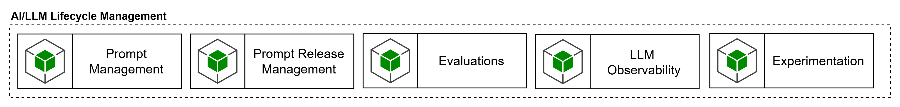

# AI/LLM Lifecycle Management

**AI/LLM Lifecycle Management** es la capacidad encargada de gobernar el ciclo de vida de prompts, configuraciones, evaluaciones, experimentos, trazas de calidad y decisiones de promoción entre entornos. Su función es asegurar que los cambios en prompts, evaluadores, configuraciones de modelos y estrategias de orquestación no se desplieguen como cambios invisibles o ad hoc, sino como artefactos versionados, evaluados y trazables. Esto es coherente con la arquitectura de referencia de SURA, que reconoce la gestión de prompts, las evaluaciones de agentes y la trazabilidad de artefactos como prácticas propias del marco de LLMOps, no como simples detalles internos del runtime.

Desde el punto de vista del Control Plane, esta capacidad no sustituye al gateway ni compite con él. Su relación es complementaria. El gateway gobierna la ejecución en tiempo real; el lifecycle management gobierna cómo se diseñan, prueban, comparan, aprueban y promueven los cambios que luego serán ejecutados a través del gateway. Por esa razón, esta capacidad puede estar implementada por una herramienta separada, siempre que se integre con el resto del Control Plane y con los procesos de release. El benchmark ya advierte que el gobierno transversal no debe quedar embebido sólo en un runtime y que la arquitectura debe separar topología de enforcement y empaquetamiento funcional.

Los requerimientos que debería cumplir esta capacidad son los siguientes:

- administrar un registro central de prompts y configuraciones con versionado, aliases por entorno, comparación entre versiones y rollback controlado;
- soportar evaluaciones offline y online sobre modelos, agentes, prompts y tool use, incluyendo métricas de calidad, robustez, grounding y seguridad;
- permitir experimentación y comparación de variantes antes de su promoción;
- registrar trazabilidad de cambios, responsables, aprobaciones y evidencia de resultados;
- integrarse con pipelines de liberación y quality gates para impedir promociones sin evidencia mínima;
- soportar observabilidad sobre la calidad operativa, no sólo sobre infraestructura o costo;
- desacoplar prompts y configuraciones del código de aplicación para permitir evolución controlada.

En cuanto a herramientas, esta capacidad puede resolverse de varias formas razonables.

Una primera opción es utilizar **Microsoft Foundry** como herramienta ancla cuando la estrategia de plataforma se apoye principalmente en Azure. Foundry ya ofrece evaluaciones desde portal para modelos y agentes, con evaluadores integrados y personalizados, y además permite publicar trazas y telemetría a Azure Monitor mediante OpenTelemetry. Microsoft también posiciona evaluaciones, monitoring y tracing como capacidades del Foundry Control Plane, lo que la convierte en una alternativa particularmente coherente cuando se quiere mantener el lifecycle cerca del stack Azure. Prompt flow, aunque hoy convive con diferentes modos de proyecto, sigue descrito por Microsoft como una suite para ideación, prototipado, testing, evaluación, despliegue y monitoreo de aplicaciones LLM.

Una segunda opción es usar una plataforma **framework-agnostic** especializada, como **LangSmith**, cuando se busque independencia del proveedor de modelos o del gateway. LangSmith documenta observabilidad, evaluación, prompt engineering y despliegue en un flujo integrado, y además ofrece opciones cloud, hybrid y self-hosted, lo que encaja bien con la topología federada que el benchmark recomienda para SURA. Esto la hace especialmente útil cuando el runtime de agentes no está acoplado a un único stack cloud o cuando se quiere separar con mayor claridad el plano de lifecycle del plano de gateway.

Una tercera opción es **Langfuse,** esta puede considerarse como una de las herramientas objetivo para materializar la capacidad de **A**I/LLM Lifecycle Management, especialmente cuando se busque una alternativa agnóstica al proveedor, con foco en trazabilidad operativa, gestión de prompts, evaluaciones, datasets y experimentación, y con posibilidad de despliegue self-hosted. Esta combinación la hace adecuada para escenarios donde SURA quiera desacoplar el lifecycle del gateway y del proveedor cloud, manteniendo integración con el Control Plane mediante trazabilidad, quality gates y procesos de liberación.

La recomendación arquitectónica es tratar AI/LLM Lifecycle Management como una capacidad que puede ser asumida por otra herramienta distinta al AI Gateway, siempre que cumpla los requisitos de versionado, evaluación, trazabilidad y gates de liberación. Si la estrategia de plataforma privilegia cercanía con Azure y Foundry, puede asumirse desde Foundry; si se busca más neutralidad tecnológica, conviene separarla en una herramienta especializada y framework-agnostic.
