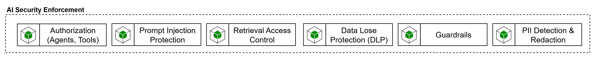

# AI Security Enforcement

La capacidad de **AI Security Enforcement** agrupa los controles de seguridad específicos para IA que deben aplicarse sobre prompts, respuestas, retrieval, tools y exposición de agentes. El blueprint la reconoce como una capacidad propia dentro del Control Plane e incluye en ella subcapacidades como **PII Detection & Redaction**, **Data Loss Protection**, **Guardrails**, **Retrieval Access Control** y mecanismos de protección del plano agéntico. Esto implica que la seguridad de IA no puede quedar reducida a autenticación de API o a controles tradicionales de red, requiere controles especializados sobre el comportamiento de los modelos y el uso de herramientas.

Desde la arquitectura del Control Plane, esta capacidad debe operar como una combinación de políticas del gateway y servicios especializados. El gateway es el mejor lugar para forzar autenticación, autorización, allow-lists, scopes, límites y trazabilidad. Pero los controles de seguridad semántica o de contenido —por ejemplo, detectar jailbreak, riesgo en inputs, groundedness, PII o material protegido— suelen requerir servicios especializados de análisis y moderación. El benchmark de selección del gateway de IA se alinea con esta visión cuando recomienda no habilitar MCP o A2A sin identidad fuerte, trazabilidad, políticas y observabilidad end-to-end, y cuando incorpora OWASP Top 10 for LLM Applications, NIST AI RMF y estándares abiertos como MCP y A2A dentro del marco de control.

Los requerimientos mínimos de AI Security Enforcement deberían incluir:

- autenticación y autorización contextual para modelos, tools, knowledge products y agentes expuestos.
- DLP y PII detection/redaction sobre prompts, resultados intermedios y respuestas.
- Guardrails para filtrar contenido dañino, unsafe output, excessive agency y uso indebido de tools.
- protección frente a prompt injection, jailbreak, data exfiltration e insecure output handling.
- Retrieval access control para asegurar que el contexto recuperado respete permisos y clasificación de datos;
- integración con observabilidad y SIEM para dejar evidencia de policy enforcement.
- soporte a políticas reutilizables y verificables, no solo configuración manual por agente.

Para el control de contenido y riesgo sobre prompts y respuestas,los tres grandes Cloud Providers ofrecen sus herramientas. **Azure AI Content Safety** ofrece detección de contenido dañino, groundedness detection, prompt shields, blocklists y protected material detection. **Amazon Bedrock Guardrails** ofrece safeguards configurables y puede usarse con cualquier foundation model dentro de Bedrock, así como con Bedrock Agents y Knowledge Bases. **Google Cloud Model Armor** está orientado a screening proactivo de prompts y respuestas, protección contra riesgos en runtime y aplicación de políticas de seguridad de IA, incluso en escenarios multicloud.

Para protección de PII y redacción, Azure Language PII Redaction documenta identificación, extracción y redacción de PII en texto, lo que encaja bien como servicio especializado de sanitización en el Control Plane. A un nivel más corporativo de DLP, Microsoft Purview DLP permite proteger información sensible mediante políticas y ciclos de vida de DLP más amplios. Esto resulta útil cuando se quiere conectar la seguridad específica de IA con el marco corporativo de protección de datos y cumplimiento.

Para enforcement desde el gateway, Apigee puede integrar Model Armor y combinarlo con cuotas y límites por token, mientras que Azure API Management permite políticas de token limiting y cuotas sobre tráfico de modelos. En otras palabras, el gateway puede ser el punto de enforcement operativo, pero la capacidad completa de AI Security Enforcement normalmente se logra integrando políticas del gateway con servicios de seguridad de IA y herramientas corporativas de DLP/compliance.

AI Security Enforcement se debe tratar como una capacidad compuesta. No debería resolverse sólo con el AI Gateway ni sólo con un producto de moderación. Debe combinar identidad/autorización, DLP/PII redaction, guardrails, retrieval control y observabilidad de enforcement.
