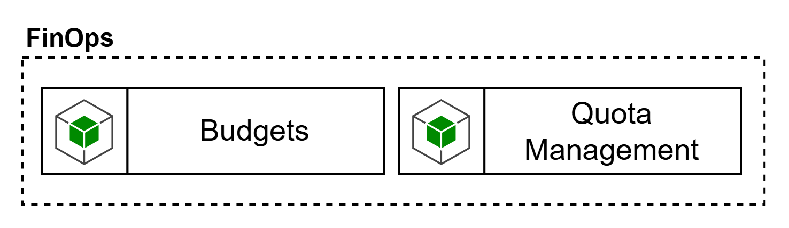

# FinOps

La capacidad de **FinOps** en el Control Plane tiene como objetivo gobernar el consumo económico de modelos, tools y capacidades agénticas, asegurando que el crecimiento del uso de IA no derive en costos opacos, runaway token usage o imposibilidad de atribuir gasto a dominios, productos o iniciativas. El blueprint ubica **Budgets** y **Quota Management** como capacidades explícitas del Control Plane.

Aquí es importante diferenciar dos niveles. El primero es el FinOps de enforcement en tiempo real, que sí debe quedar cerca del gateway y del data plane, porque es el que limita tokens, controla cuotas, aplica budgets operativos y ejecuta fallback o throttling. El segundo es el FinOps de análisis y reporting corporativo, que normalmente se apoya en herramientas de costo y observabilidad del cloud o en la plataforma corporativa de FinOps. Por tanto, esta capacidad no suele resolverse con una sola herramienta, sino con una combinación de mecanismos de enforcement en gateway más herramientas de costo y analítica corporativa.

Los requerimientos mínimos de esta capacidad deberían ser:

- definir y aplicar quotas por usuario, aplicación, agente, dominio, modelo o entorno.
- soportar budgets por producto, unidad organizacional o caso de uso.
- medir consumo en tokens, requests, tool calls, latencia y costo estimado/real.
- habilitar showback/chargeback por dominio o producto.
- integrar alertas, umbrales y políticas de reacción cuando se excedan límites.
- correlacionar el gasto con identidad, agente, modelo, tool y entorno.
- integrarse con la observabilidad de la plataforma y con la herramienta corporativa de costos del cloud.

En el plano de herramientas, el primer bloque debe estar en el propio gateway o muy cerca de él. Azure API Management ya documenta una política específica para limitar el uso de tokens de Azure OpenAI en Foundry Models mediante tasas por minuto, cuotas por período y headers/variables de cuota remanente. Apigee documenta integración con Model Armor y políticas como LLMTokenQuota y PromptTokenLimit para enforcement preciso del consumo por tokens. En AWS, el benchmark interno destaca el patrón con LiteLLM como referencia válida para budgets, rate limits, fallback, caching y operación multi-tenant, aunque no como AI Gateway integral por sí mismo.

El segundo bloque debe apoyarse en herramientas corporativas de costo y analítica. En Azure, Microsoft Cost Management se presenta como la suite de FinOps para analizar, monitorear y optimizar costos cloud. En AWS, el tagging y los cost allocation tags son la base para atribución y seguimiento del gasto. En GCP, la exportación de billing a BigQuery permite análisis detallado de costo, uso y pricing. Estas herramientas no reemplazan el enforcement del gateway, pero sí cubren la parte corporativa de showback, análisis, alertas y reporting financiero.
