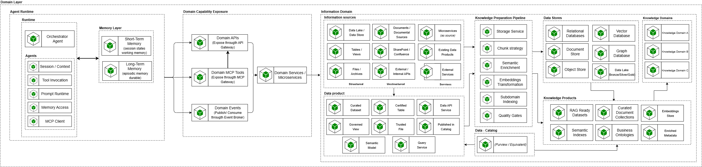

# Domain Layer

Esta capa agrupa las capacidades que materializan una solución agéntica alineada a un dominio de negocio. Su propósito es separar claramente el **runtime del agente**, la **exposición de capacidades del dominio** y el **dominio de información y conocimiento**, de forma que cada solución pueda desplegarse y evolucionar por dominio sin mezclar razonamiento agéntico, lógica transaccional y preparación del conocimiento. Esta separación es coherente con la arquitectura de referencia de SURA, donde el agente singular concentra planeación, razonamiento, memoria e invocación de herramientas, mientras el conocimiento empresarial y las herramientas reutilizables se consumen como capacidades externas y gobernadas.

### 1. Agent Runtime

El **Agent Runtime** representa la unidad de ejecución del agente dentro del dominio. Su intención es concentrar las capacidades necesarias para interpretar la intención, construir el plan de acción, administrar memoria, invocar herramientas y consolidar la respuesta final, sin absorber la lógica de negocio transaccional del dominio. En este nivel, el runtime mantiene el principio de que el agente **orquesta**, pero no se convierte en dueño de los procesos de negocio ni del conocimiento corporativo. Esto está alineado con la definición de agente singular y con la responsabilidad del orquestador en la arquitectura de referencia.

#### Runtime

Corresponde al núcleo operativo del agente. Contiene el **Orchestrator Agent**, responsable de coordinar la ejecución del flujo agéntico y de administrar la interacción entre contexto, memoria, herramientas y capacidades externas.

#### Session / Context

Mantiene el contexto inmediato de ejecución del agente. Su propósito es conservar el estado de sesión, variables temporales y elementos necesarios para sostener la continuidad de la interacción durante el ciclo activo.

#### Tool Invocation

Agrupa la capacidad de invocar herramientas y capacidades externas de forma controlada. Su intención es desacoplar la selección y ejecución de tools del resto de la lógica del runtime.

#### Prompt Runtime

Contiene la ejecución de prompts y la composición contextual necesaria para que el agente interactúe con modelos y herramientas dentro del flujo de razonamiento.

#### Memory Access

Representa la capacidad del runtime para consultar y actualizar memorias persistentes o fuentes de conocimiento, según las necesidades del plan de acción.

#### MCP Client

Es la capacidad del runtime para consumir tools expuestas mediante MCP Gateway. Su propósito es permitir que el agente use herramientas gobernadas sin quedar acoplado a implementaciones específicas.

---

### 2. Memory Layer

La **Memory Layer** agrupa las capacidades de memoria del agente, diferenciando explícitamente la memoria de corto plazo de la memoria de largo plazo. Esta separación sigue el modelo conceptual definido en SURA, donde la memoria de corto plazo sostiene la tarea o sesión actual, y la memoria de largo plazo habilita persistencia, continuidad y aprendizaje contextual. El agente parte de la memoria de corto plazo, decide si necesita consultar memoria persistente y luego actualiza o recupera información según el caso.

#### Short-Term Memory

Corresponde a la memoria de trabajo del agente. Su función es sostener el estado activo de la sesión, el contexto inmediato y la información transitoria necesaria para resolver la interacción actual.

#### Long-Term Memory

Corresponde a la memoria durable del agente. En esta versión del blueprint se modela principalmente como **memoria episódica persistente**, aunque puede evolucionar para incluir otras formas de memoria de largo plazo cuando el caso de uso lo requiera. Su intención es dar continuidad y trazabilidad a la experiencia sin confundir esta memoria con el conocimiento empresarial gobernado del dominio de información.

note5b7b4aae-f376-420b-8455-9b3ebac63548
La memoria episódica del agente pertenece al runtime, el conocimiento semántico empresarial pertenece al dominio de información y se consume mediante productos y servicios gobernados.

La memoria episódica del agente pertenece al runtime, el conocimiento semántico empresarial pertenece al dominio de información y se consume mediante productos y servicios gobernados.

---

### 3. Domain Capability Exposure

Esta subcapa representa la forma en que el dominio expone sus capacidades para ser consumidas por el runtime del agente y por otros actores del ecosistema. Su intención es mantener un contrato claro entre el agente y el dominio, separando la lógica de exposición de la lógica interna de los servicios de negocio.

#### Domain APIs

Las **Domain APIs** constituyen el contrato canónico de exposición síncrona del dominio. Se publican a través del API Gateway y representan la forma principal y gobernada de exponer capacidades de negocio para consumo programático. Esto está alineado con la estrategia API-LED mencionada en la referencia de SURA.

#### Domain MCP Tools

Las **Domain MCP Tools** representan aquellas capacidades del dominio que, además de existir como APIs, necesitan exponerse como herramientas consumibles por agentes a través del MCP Gateway. Su objetivo es habilitar un consumo agent-friendly de ciertas funciones, sin implicar que toda API del dominio deba convertirse en MCP. En este modelo, MCP actúa como fachada o proxy de APIs seleccionadas cuando el caso de uso requiere semántica de tool, descubrimiento o reutilización gobernada.

#### Domain Events

Los **Domain Events** representan la integración asíncrona del dominio. Su intención es habilitar publicación y consumo de eventos mediante el broker para flujos reactivos, integración desacoplada y coordinación basada en eventos.

#### Domain Services / Microservices

Corresponden a la implementación interna de la lógica de negocio del dominio. En este bloque viven las capacidades transaccionales, reglas, integraciones y servicios del dominio que son expuestos a través de APIs, MCP Tools o eventos. El principio arquitectónico se mantiene: la lógica de negocio reside en el dominio; el agente la consume y orquesta.

note34b0b4fe-5c5d-4980-b700-d050672216a7
- Las APIs del dominio son el contrato base.
- Los MCP Tools del dominio se usan para exponer ciertas capacidades como tools.
- Los eventos del dominio soportan integración asíncrona.
- No toda API del dominio requiere un MCP asociado.

- Las APIs del dominio son el contrato base.
- Los MCP Tools del dominio se usan para exponer ciertas capacidades como tools.
- Los eventos del dominio soportan integración asíncrona.
- No toda API del dominio requiere un MCP asociado.

---

### 4. Information Domain

El **Information Domain** agrupa los activos y servicios necesarios para transformar información gobernada en conocimiento utilizable por agentes. Su intención es separar la propiedad de la fuente, el almacenamiento, la preparación del conocimiento y la publicación de productos de conocimiento, evitando que el runtime del agente quede acoplado al detalle de la infraestructura de datos. Esta separación está alineada con la arquitectura de referencia y con la decisión de implementación que ubica el procesamiento de conocimiento fuera del dominio del agente.

#### Knowledge Products

Los **Knowledge Products** representan los activos gobernados y servibles que el dominio pone a disposición del consumo agéntico. Su objetivo es disponibilizar información curada y preparada en formatos adecuados para búsqueda, razonamiento y retrieval.

- **RAG Ready Datasets:** datasets preparados para escenarios de retrieval y grounding.
- **Curated Document Collections:** colecciones documentales seleccionadas, curadas y listas para consumo.
- **Semantic Indexes:** índices preparados para búsqueda semántica o híbrida.
- **Business Ontologies:** modelos semánticos y conceptuales del dominio, útiles para razonamiento, clasificación y futuras capacidades como Graph RAG.

#### Data Stores

Los **Data Stores** representan la infraestructura de almacenamiento que soporta tanto la fuente como los activos transformados.

- **Relational Databases:** almacenamiento estructurado, metadatos, catálogos y datos transaccionales.
- **Document Store:** persistencia documental y artefactos semiestructurados.
- **Object Store:** almacenamiento de archivos, binarios, documentos y artefactos fuente.
- **Vector Database:** almacenamiento de embeddings y estructuras de retrieval semántico.
- **Graph Database:** soporte para relaciones semánticas, ontologías y patrones como Graph RAG.

**Nota de gobierno:** el gobierno de la fuente y de los datos originales permanece en el dominio de información; el dominio de conocimiento consume, adapta y publica activos curados para uso agéntico. Esto evita trasladar la propiedad de la fuente al runtime o al dominio de conocimiento.

---

### 5. Knowledge Preparation Pipeline

El **Knowledge Preparation Pipeline** representa el flujo lógico de preparación del conocimiento dentro del dominio de información. A diferencia de otros bloques del blueprint, aquí sí se modela una secuencia de transformación, porque su propósito es convertir información cruda o dispersa en productos de conocimiento gobernados y reutilizables por agentes.

#### Storage Service

Gestiona el acceso a las fuentes, repositorios y mecanismos base de persistencia necesarios para la ingestión y publicación de activos.

#### Chunk Strategy

Define cómo se segmenta y estructura el contenido para su posterior indexación y retrieval. Su objetivo es adaptar los artefactos fuente al patrón de consumo esperado por el dominio.

#### Semantic Enrichment

Agrega clasificación, metadatos, atributos de seguridad, contexto y enriquecimiento semántico sobre los contenidos procesados.

#### Embeddings Transformation

Genera representaciones vectoriales y artefactos de indexación semántica para soportar retrieval avanzado.

#### Subdomain Indexing

Materializa la indexación y publicación por subdominio, permitiendo aislar contexto, reglas y estructuras de recuperación según las necesidades del dominio.

#### Quality Gates

Aplica validaciones automáticas y umbrales de calidad antes de publicar productos de conocimiento. Su intención es asegurar consistencia, grounding, cobertura mínima y condiciones de publicación alineadas con los principios de calidad y gobierno de SURA. Esto conversa bien con el énfasis de la arquitectura en evals, observabilidad y quality gates dentro de la práctica de LLMOps.

note544f43ef-0ad0-432c-9368-1c4305b1eff0
- El pipeline publica resultados tanto hacia **Knowledge Products** como hacia **Data Stores**.
- No debe verse como un flujo que escribe únicamente sobre la **Vector Database**, dependiendo del caso, puede persistir o actualizar artefactos también en **Graph Database**, **Document Store**, **Object Store** y, cuando aplique, en **Relational Databases**.
- El runtime del agente no se conecta directamente al pipeline, consume productos y capacidades ya publicadas y gobernadas.

- El pipeline publica resultados tanto hacia **Knowledge Products** como hacia **Data Stores**.
- No debe verse como un flujo que escribe únicamente sobre la **Vector Database**, dependiendo del caso, puede persistir o actualizar artefactos también en **Graph Database**, **Document Store**, **Object Store** y, cuando aplique, en **Relational Databases**.
- El runtime del agente no se conecta directamente al pipeline, consume productos y capacidades ya publicadas y gobernadas.
