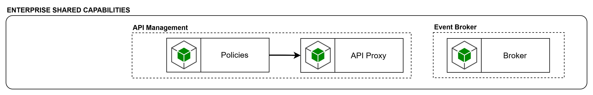
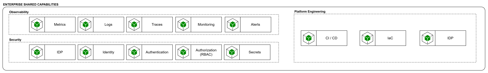

# Enteprise Shared Capabilities

La capa de Enterprise Shared Capabilities representa las capacidades corporativas internas que no pertenecen exclusivamente a la plataforma agéntica, pero que ésta necesita para operar de forma empresarial. Son capacidades ya existentes o gobernadas a nivel organizacional, reutilizables por múltiples soluciones, que proporcionan servicios comunes de integración, identidad, seguridad, observabilidad y plataforma de ingeniería. En lugar de reimplementarlas dentro de la plataforma agéntica, el blueprint las posiciona como dependencias corporativas compartidas sobre las que la plataforma se apoya. Es enfoque general insiste en desacoplar el núcleo del agente de las plataformas tecnológicas que proveen capacidades compartidas.

**API Management**

La capacidad de API Management, compuesta por Policies y API Proxy, concentra el gobierno de las APIs corporativas expuestas o consumidas por la plataforma.

Su presencia es pertinente porque:

- Centraliza autenticación, rate limiting, versionado y enforcement de políticas.
- Desacopla el gobierno de integración respecto de la implementación de agentes o servicios.
- Estandariza la exposición de capacidades de dominio a consumidores internos y externos.

**Event Broker**

El Event Broker representa la capacidad organizacional para integración asíncrona, intercambio de eventos y coordinación desacoplada.

Su incorporación es necesaria para:

- Soportar flujos asíncronos de larga duración.
- Permitir consumo y emisión de eventos de dominio.
- Reducir acoplamiento temporal entre la plataforma agéntica y los sistemas empresariales.

**Observability**

La capa de Observability incluye:

- Metrics
- Logs
- Traces
- Monitoring
- Alerts

Esta capacidad es obligatoria en una plataforma agéntica empresarial, dado que la operación debe ser trazable extremo a extremo y no solo a nivel de infraestructura.

**Security**

La capa de Security incluye:

- IDP
- Identity
- Authentication
- Authorization (RBAC)
- Secrets.

Su propósito es proveer una base corporativa común para identidad, autenticación, autorización y manejo de secretos, evitando implementaciones ad hoc por agente o por canal.

**Platform Engineering**

Incluye:

- CI / CD
- IDP
- IaC

Su función es proporcionar los mecanismos de automatización, promoción y operación necesarios para ejecutar la plataforma bajo criterios enterprise. En caso de incorporar modelos on-premise, esta capa es también el lugar natural para incluir Model Serving Platform, Inference Platform o GPU Platform.
