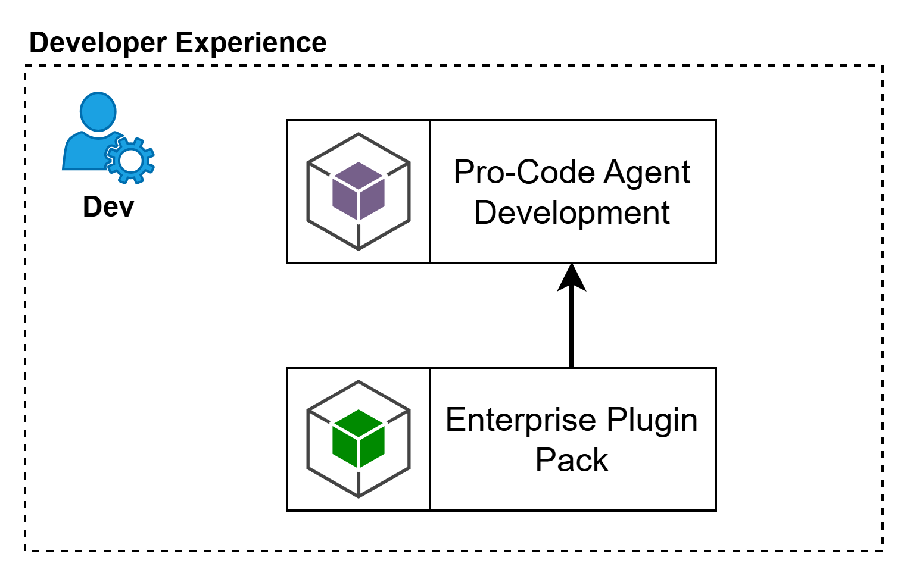
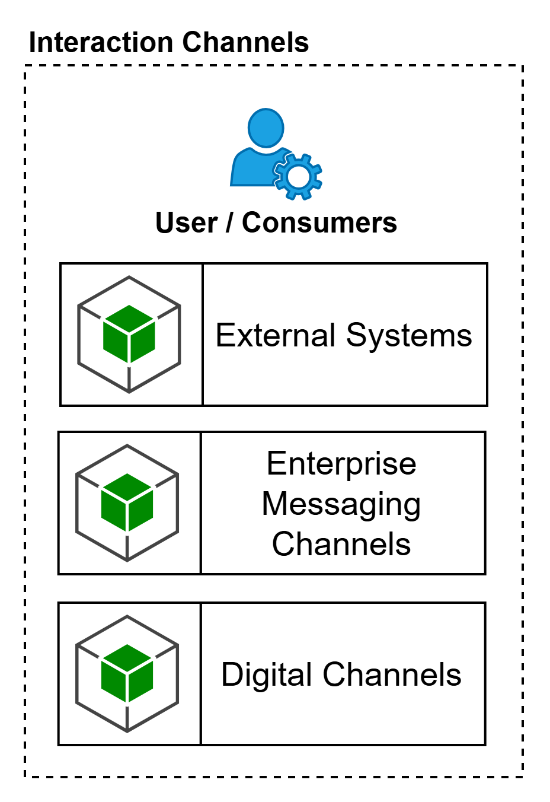
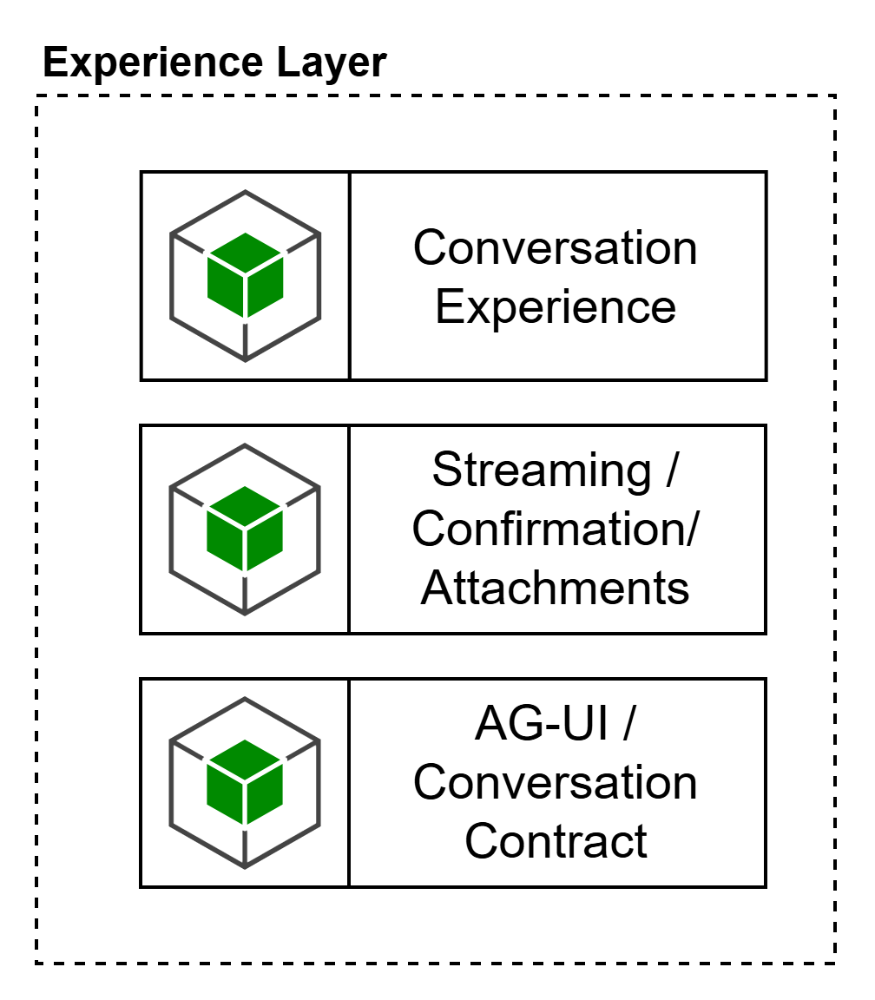

# External Access, Experience & Development

### **Development Experience**

Esta capa representa la experiencia de desarrollo pro-code para la construcción, configuración y aceleración de agentes sobre la plataforma agéntica. Su propósito es habilitar a los equipos técnicos para diseñar, probar, empaquetar e integrar agentes usando herramientas de desarrollo especializadas, sin convertir el IDE en el plano de ejecución de la plataforma. La intención de esta capa es concentrar la experiencia del desarrollador y la distribución de extensiones corporativas, manteniendo el consumo gobernado de capacidades transversales de la plataforma, especialmente modelos, herramientas y activos reutilizables.

**Pro-Code Agent Development**

Corresponde al espacio de trabajo donde el desarrollador implementa agentes, flujos, prompts, herramientas, memoria e integraciones usando frameworks y SDKs de desarrollo. Su intención no es ejecutar el despliegue operativo final, sino acelerar la construcción del runtime, el scaffolding inicial, las pruebas locales y el empaquetado listo para integrarse con CI/CD y Platform Engineering.

**Enterprise Plugin Pack**

Corresponde al conjunto de extensiones corporativas que enriquecen la experiencia de desarrollo con lineamientos empresariales, plantillas, skills, modes, configuraciones base, patrones de integración y activos reutilizables. Su objetivo es estandarizar la forma en que los equipos construyen agentes, reducir variabilidad técnica y acelerar la adopción de buenas prácticas de arquitectura, seguridad y gobierno.

notedcbd4de5a194

**Agentic IDE clients:** Existen IDE Agenticos como GitHub Copilot, RooCode, Cline, Codex (validar aprobados por LBA).
**Frameworks / SDKs para Pro-Code Agent Development:** LangGraph, LangChain, Semantic Kernel, SDKs de Azure AI Foundry / Azure OpenAI, SDKs de proveedores aprobados, Python, Java.
**Realizaciones para Enterprise Plugin Pack:** extensión corporativa para VS Code, starter kits, repositorios template, packs de prompts, modes, skills, configuraciones MCP, lineamientos de arquitectura y seguridad embebidos.

**Agentic IDE clients:** Existen IDE Agenticos como GitHub Copilot, RooCode, Cline, Codex (validar aprobados por LBA).
**Frameworks / SDKs para Pro-Code Agent Development:** LangGraph, LangChain, Semantic Kernel, SDKs de Azure AI Foundry / Azure OpenAI, SDKs de proveedores aprobados, Python, Java.
**Realizaciones para Enterprise Plugin Pack:** extensión corporativa para VS Code, starter kits, repositorios template, packs de prompts, modes, skills, configuraciones MCP, lineamientos de arquitectura y seguridad embebidos.

---

### **Interaction Channels**

Esta capa representa a los actores y sistemas que consumen capacidades de la plataforma agéntica. No describe herramientas concretas ni productos específicos, sino los tipos de consumidores que interactúan con agentes o servicios conversacionales. Su propósito es separar claramente los medios de interacción de la experiencia conversacional y del plano de ejecución agéntico, evitando mezclar canales, frontends y APIs de consumo en un mismo concepto. Esta separación es consistente con la arquitectura de referencia, donde la interacción puede originarse desde interfaces externas y desacoplarse del núcleo del agente mediante un gateway.

#### External Systems

Representa consumidores sistema-a-sistema que integran la plataforma agéntica mediante APIs o contratos de invocación sin requerir una experiencia conversacional rica. Su objetivo es habilitar integración programática desde aplicaciones, servicios o agentes externos.

**Enterprise Messaging Channels**

Representa canales empresariales de mensajería donde la experiencia del agente se entrega dentro de un entorno conversacional preexistente. Su intención es habilitar interacción conversacional en canales corporativos sin asumir que esos canales contienen por sí mismos la lógica de experiencia o gobierno del agente.

**Digital Channels**

Representa canales digitales propios o embebidos, como portales, aplicaciones móviles, widgets o experiencias web. Su intención es habilitar interfaces más ricas y controladas, donde la organización puede definir completamente la experiencia conversacional, el manejo de archivos, el streaming y los puntos de confirmación.

note0ec4823149b0

**Enterprise Messaging Channels:** Microsoft Teams, WhatsApp Business, otros canales corporativos aprobados.
**Digital Channels:** portal web corporativo, widget embebido, app móvil, portal interno de negocio.
**External Systems:** APIs consumidoras, aplicaciones corporativas, sistemas internos, agentes externos autorizados.

**Enterprise Messaging Channels:** Microsoft Teams, WhatsApp Business, otros canales corporativos aprobados.
**Digital Channels:** portal web corporativo, widget embebido, app móvil, portal interno de negocio.
**External Systems:** APIs consumidoras, aplicaciones corporativas, sistemas internos, agentes externos autorizados.

---

### **Experience Layer**

Esta capa representa la experiencia de interacción entre el consumidor y la plataforma agéntica. Su función es orquestar la entrega conversacional, normalizar la interacción entre distintos canales y exponer un contrato consistente hacia el AI Gateway. En esta capa viven las capacidades de presentación, manejo conversacional, streaming, confirmaciones y adjuntos, sin mezclar todavía la lógica de razonamiento del agente. En términos arquitectónicos, esta capa cumple el papel de desacoplar la interfaz externa del plano agéntico gobernado, en línea con la separación entre interfaz de usuario, interfaz externa y gateway.

**Conversation Experience**

Es la capacidad encargada de materializar la interacción conversacional para el usuario final. Administra el flujo visible de la conversación, la presentación de respuestas, el contexto inmediato de la interacción y la adaptación de la experiencia al canal o interfaz específica.

#### Streaming / Confirmation / Attachments

Agrupa las capacidades de experiencia enriquecida necesarias para escenarios agénticos reales: respuesta en streaming, pasos de confirmación para interacción humano-en-el-loop, manejo de adjuntos y artefactos de entrada/salida. Su intención es soportar interacciones más seguras, auditables y útiles que un simple request/response.

#### AG-UI / Conversation Contract

Representa el contrato de interacción entre la capa de experiencia y el AI Gateway. Su propósito es normalizar cómo la experiencia conversa con la plataforma agéntica, incluyendo eventos conversacionales, estructura de mensajes, streaming, confirmaciones, metadatos de sesión y manejo de artefactos. Esta capacidad no debe interpretarse como un canal, sino como la interfaz de acoplamiento entre la experiencia y el plano agéntico gobernado.

note7af72163a658

**Conversation Experience:** Frameworks de desarrollo Front, experiencias embebidas en canales corporativos, frontends web/mobile aprobados por LBA.
**AG-UI / Conversation Contract sugerido:** AG-UI, APIs HTTP conversacionales, SSE, WebSockets, contratos JSON estructurados.
**Streaming / Confirmation / Attachments sugerido:** SSE, WebSockets, confirmaciones explícitas de usuario, manejo de archivos, componentes de carga/descarga, tarjetas enriquecidas del canal cuando aplique.

**Conversation Experience:** Frameworks de desarrollo Front, experiencias embebidas en canales corporativos, frontends web/mobile aprobados por LBA.
**AG-UI / Conversation Contract sugerido:** AG-UI, APIs HTTP conversacionales, SSE, WebSockets, contratos JSON estructurados.
**Streaming / Confirmation / Attachments sugerido:** SSE, WebSockets, confirmaciones explícitas de usuario, manejo de archivos, componentes de carga/descarga, tarjetas enriquecidas del canal cuando aplique.

---

> **[INFO]**
> Los consumidores humanos o conversacionales acceden a la plataforma a través de la Experience Layer, mientras que los consumidores sistema-a-sistema pueden integrarse directamente con el AI Gateway. La Experience Layer no sustituye el gobierno del AI Gateway, lo complementa, entregando una experiencia de interacción homogénea, rica y desacoplada del runtime agéntico.
