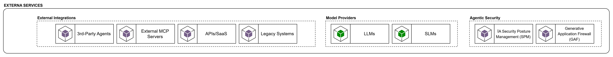

# External Services

La capa de External Services representa los servicios, proveedores y sistemas que están fuera del límite de control principal de la organización o de la propia plataforma agéntica, pero que resultan necesarios para operar el ecosistema. Su papel en el blueprint es mostrar que la plataforma no vive aislada: depende de modelos externos, herramientas de terceros, servicios SaaS, sistemas legacy y servicios especializados de seguridad agéntica que no pertenecen a los dominios internos ni a las capacidades compartidas corporativas. Esta distinción es importante porque refuerza el principio de desacoplamiento: los agentes no deben integrarse directamente con estas dependencias de forma ad hoc, sino a través de las capacidades de plataforma y gobierno definidas en el blueprint. La referencia ya trataba LLMs, servicios MCP, conocimiento y otros sistemas empresariales como Software Systems externos que el agente consume, no como componentes internos del runtime.

### **External Integrations**

Esta capa agrupa proveedores, plataformas y sistemas externos que la plataforma agéntica necesita consumir o integrar, como model providers, servicios SaaS, sistemas legacy, external MCP servers y controles especializados de seguridad agéntica. Su propósito es hacer explícito que estos elementos no forman parte del núcleo interno de la plataforma y que su consumo debe estar mediado por las capacidades de acceso, gobierno y seguridad definidas en el blueprint.

**3rd-Party Agents**

Estos componentes permiten la federación o integración con agentes operados por terceros. Son relevantes cuando la plataforma requiere orquestar o invocar capacidades externas que ya encapsulan lógica especializada.

**External MCP Servers**

Corresponden a capacidades expuestas mediante MCP fuera del perímetro de la organización. Su presencia es coherente con una arquitectura extensible basada en contratos de tools desacoplados del runtime central.

**APIs / SaaS**

Este grupo agrupa servicios de terceros y capacidades SaaS consumidas por la plataforma o por los agentes. Su inclusión reconoce que una plataforma empresarial debe integrarse con ecosistemas externos sin asumir control directo sobre su ciclo de vida.

**Legacy Systems**

Los sistemas heredados representan una condición estructural del entorno empresarial. Su presencia en la arquitectura es esencial, ya que muchos casos de uso dependen de información y procesos que continúan residiendo en plataformas preexistentes.

---

**Model Providers**

La capa de Model Providers abstrae los modelos consumidos por la plataforma. En el diagrama se contemplan LLMs y SLMs, Esto se define para poder soportar estrategias diferenciadas de costo, latencia, soberanía y criticidad de uso.

Desde el punto de vista arquitectónico, estos modelos deben ser consumidos de forma gobernada a través del LLM Gateway. En caso de incorporar modelos alojados internamente u on-premise, se recomienda complementar esta capa con una capacidad explícita de Model Serving Platform o Inference Platform dentro de Platform Engineering, manteniendo el gateway como punto unificado de acceso.

---

**Agentic Security**

agrupa los controles especializados de seguridad para sistemas agénticos y consumo de IA generativa. Su propósito es complementar la seguridad corporativa base con mecanismos específicos para proteger el uso de modelos, tools, retrieval y salidas del agente, incluyendo autorización sobre agentes y herramientas, protección frente a prompt injection, control de acceso al conocimiento recuperado, prevención de fuga de datos, guardrails de comportamiento y detección o redacción de información sensible. En conjunto, esta capa busca que la plataforma agéntica opere bajo principios de cumplimiento, trazabilidad y uso seguro de capacidades cognitivas, reduciendo riesgos propios de la interacción con LLMs y agentes autónomos.
