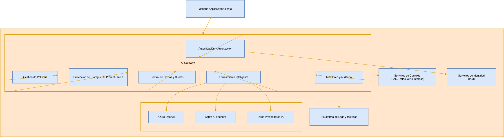

# Mapa de Dominios

<!-- [macro: tabla de contenido] -->

# 1. Estrategia

Dominio encargado de definir la visión, prioridades, modelo operativo y criterios de valor para la adopción y evolución de la plataforma agéntica, asegurando además la alineación con los objetivos de negocio. Su propósito se centra en:

- Asegurar que la plataforma de agentes responda a los objetivos estratégicos de negocio.
- Priorización de los casos de uso.
- Optimización para la inversión en modelos, infraestructura y capacidades.

Las definiciones realizadas bajo este dominio se realizan en conjunto (SURA+NTT Data) en la Comunidad de IA, en el HUB de AI First.

El dominio de Estrategia está a cargo de las siguientes responsabilidades clave:

- Definición del roadmap estratégico de la plataforma.
- Determinar el nivel de madurez deseada para la plataforma.
- Asegurar la alineación con los objetivos empresariales.

# 2. Gobierno

Conjunto de capacidades, políticas y controles transversales que aseguran que la plataforma agéntica trabaje de forma segura, controlada y auditable alineada al negocio, gestionando riesgos de tipo técnico, regulatorios y operativos. Es un dominio transversal que impacta:

- AI Gateway.
- Plataforma Core.
- LLM Providers.
- Seguridad.
- Observabilidad.

Los componentes relacionados directamente con el dominio de Gobierno son:

- **Gobierno y Riesgo IA:**Aplicación de la matriz de IA vigente antes de avanzar, junto con la definición del RACI y la existencia de un comité o instancia formal de gobierno de inteligencia artificial.
- **Control Plane Agéntico:** Servicio central con configuración y monitoreo, pero sin enforcement obligatorio.
- **Agent Registry:** Servicio que registra owner, versión, riesgo, políticas.

Dentro de la arquitectura agéntica el dominio de Gobierno cuenta con varios objetivos:

- A nivel de seguridad, asegurar que solo actores autorizados puedan ejecutar, modificar o desplegar agentes y promtps.
- En cuanto a gobierno de modelos LLM, brinda control de los LLMs que pueden ser usados, políticas de uso, versionamiento y evaluación continua de calidad y riesgo, evitando así el uso no controlado de modelos o fuga de datos.
- Frente al gobierno de Prompts, brinda el control de las versiones de prompts, control de cambios sobre los prompts, tratando así los prompts como activos *críticos* versionables y también auditables (trazabilidad de ejecuciones).

El dominio de Gobierno está a cargo de varias responsabilidades clave:

- Definir políticas de uso de IA.
- Establecer controles técnicos obligatorios.
- Asegurar trazabilidad completa de decisiones.
- Medir impacto y desempeño de agentes.

# 3. FinOps & Cost Management

Dominio responsable de gestionar, optimizar y gobernar los costos asociados con el uso de la plataforma agéntica, asegurando sostenibilidad económica, transparencia y eficiencia financiera respecto al use de IA.

Su propósito se centra en controlar el gasto de los modelos, infraestructura y almacenamiento, así como optimizar la relación costo/rendimiento por cada caso de uso y apoyar la toma de decisiones basándose en datos financieros.

Es un dominio transversal que tiene como alcance:

- Gestión de costos de modelos LLM (Incluyendo LLM Providers y LLM Gateway).
- Gestión de costos en RAG y almacenamiento (Bases de datos Vectoriales).
- Observabilidad financiera.

A su vez, con el dominio de FinOps & Cost Management se espera mitigas algunos riesgos como pueden ser:

- **Escalamiento no controlado de gastos en LLMs:**incremento exponencial del consumo de tokens y llamadas a modelos de lenguaje sin mecanismos de monitoreo, límites presupuestarios o políticas de uso definidas. En entornos agénticos, donde múltiples agentes pueden invocar modelos de manera autónoma, la falta de control puede generar sobrecostos significativos en cortos periodos de tiempo.
- **Uso ineficiente de modelos premium:** utilización de modelos de alto costo (por ejemplo, modelos de última generación o con capacidades avanzadas) en escenarios donde un modelo más pequeño o económico podría cumplir adecuadamente la tarea. Sin una estrategia de enrutamiento y selección de modelos, se desperdician recursos financieros sin una mejora proporcional en calidad o desempeño.
- **Crecimiento desmedido de embeddings:** aumento continuo del volumen de vectores almacenados en bases de datos vectoriales sin estrategias de depuración, retención o consolidación. Esto impacta directamente en costos de almacenamiento, indexación y consulta, especialmente en arquitecturas RAG donde el conocimiento puede crecer rápidamente si no se gestiona adecuadamente su ciclo de vida.
- **Costos ocultos por llamadas redundantes:** invocaciones innecesarias o repetidas a modelos, herramientas o servicios externos, ya sea por falta de caching, mala orquestación o diseño ineficiente de prompts y flujos agénticos. Estas redundancias no siempre son visibles a nivel funcional, pero generan un consumo incremental que impacta el gasto total.
- **Falta de trazabilidad financiera:** ausencia de mecanismos que permitan atribuir el gasto a agentes, áreas de negocio, casos de uso o usuarios específicos. Sin visibilidad granular del consumo, es difícil establecer presupuestos, aplicar modelos de showback/chargeback o tomar decisiones estratégicas basadas en datos financieros confiables.

# 4. Integración Empresarial

Es el encargado de habilitar la conexión segura, escalable y gobernada entre la plataforma agéntica y el ecosistema tecnológico de la organización a través de MCP (Model Context Protocol), donde se incluyen sistemas code, aplicaciones SaaS, APIs y aplicaciones externas. Para la arquitectura de referencia, MCP es el mecanismo principal de integración, permitiendo que los agentes consuman funcionalidades de negocio sin depender de implementaciones específicas ni integraciones punto a punto (A2A).

Algunos de sus propósitos son:

- Desacoplar agentes de los sistemas empresariales.
- Estandarizar el acceso a herramientas y servicios.
- Facilitar la reutilización de conectores.
- Seguridad, trazabilidad y gobierno en el acceso.

Las capacidades clave del dominio incluyen:

- **Diseño de contratos MCP:**Definición formal de las interfaces mediante las cuales una capacidad empresarial es expuesta como herramienta MCP, incluyendo parámetros de entrada, esqueams de datos, validaciones, estructura de respuestas, manejos de errores, etc.
- **Desarrollo de conectores internos y externos:** Implementación de componentes técnicos que permiten que una herramienta MCP se comunique de manera efectiva con otros sistemas, tanto internos como externos.
- **Versionamiento de herramientas MCP:** Gestión controlada de cambios en los contratos y/o comportamientos de herramientas MCP. El versionamiento permite la coexistencia de múltiples versiones, migraciones progresivas y trazabilidad histórica, reduciendo los riesgos operativos y facilitando la auditoría.
- **Catálogo empresarial:** Consiste en mantener un repositorio centralizado y gobernado de todas las herramientas MCP disponibles en la organización; incluyendo documentación funcional y técnica, dominio al que pertenece cada herramienta, responsables, versiones disponibles, políticas de acceso y métricas de uso.
- **Monitoreo de uso:** Implica la observabilidad completa de las invocaciones a herramientas MCP, incluyendo métricas de latencia, frecuencia, errores, consumo y agente invocador. Este monitoreo permite la detección de fallas, cuellos de botella, usos indebidos o sobreconsumo; aportanto información tanto para la optimización técnica como para control financiero y gobierno.
- **Gestión de ciclo de vida de integraciones:** Administración integral de herramientas MCP desde el diseño inicial hasta el retiro o finalización. Incluye etapas de definición, desarrollo, pruebas, validación, despliegue, monitoreo, evolución y finalmente la desactivación. Esta gestión evita integraciones obsoletas, reduce la deuda técnica, y asegura que las capacidades expuestas a los agentes se mantengan alineadas con la arquitectua y necesidades de negocio.

En conclusión, el dominio de Integración Empresarial, estandariza, abtrae y gobierna el acceso de los agentes a las capacidades del negocio mediante herramientas MCP reutilizables, seguras y desacopladas, garantizando la interoperabilidad, trazabilidad y escalabilidad dentro del ecosistema corporativo. Finalmente mitigando algunos riesgos:

- Integraciones directas y frágiles desde los agentes.
- Acoplamiento a sistemas específicos (Internos y Externos).
- Duplicación de conectores.
- Poco control sobre acciones críticas.
- Inconsitencias en contratos de integración.

# 5. AI Gateway

El AI Gateway actúa como una capa centralizada de control que estandariza y gobierna el acceso a modelos y servicios de inteligencia artificial dentro de la organización, asegurando el cumplimiento de políticas de seguridad y gobernanza. Facilita la integración con múltiples proveedores de IA mediante mecanismos uniformes de autenticación, autorización y gestión de políticas. Asimismo, proporciona visibilidad operativa integral a través de capacidades de monitoreo, auditoría y métricas de consumo de tokens. A nivel de rendimiento, optimiza la operación mediante balanceo de carga, enrutamiento inteligente y mecanismos de caché semántico. Finalmente, habilita una gestión eficiente de costos mediante el control del consumo y la aplicación de límites operativos que garantizan un uso seguro, escalable y sostenible de la inteligencia artificial.

Dentro de la arquitectura agéntica este componente cuenta con varios objetivos:

- **Control de acceso centralizado:** Autenticación y autorización para evitar accesos no autorizados a modelos de IA.
- **Protección de datos sensibles:** Políticas y filtros que previenen fugas de información en prompts y respuestas.
- **Gestión y control de costos:** Límites de uso, cuotas y monitoreo del consumo de tokens para evitar gastos inesperados.
- **Protección contra ataques a la IA:** Mitigación de *prompt injection* y manipulación del modelo mediante controles como *AI Prompt Shield*.
- **Visibilidad y auditoría:** Monitoreo y trazabilidad para detectar comportamientos anómalos y asegurar cumplimiento normativo.

notede066c39-619d-4af0-adbe-48178b84bf31
Las definiciones de AI Gateway se alinearan con el equipo de seguridad y los proyectos que se encuentran en curso para este componente critico de la arquitectura.

Las definiciones de AI Gateway se alinearan con el equipo de seguridad y los proyectos que se encuentran en curso para este componente critico de la arquitectura.

# 6. Plataforma Core

Dominio que constituye el núcleo operativo de la plataforma agéntica, proporcionando las capacidades fundamentales para la gestión de prompts, memoria (corto y largo plazo) y coordinación multiagente. Este dominio reconoce que los prompts, el estado conversacional y la orquestación de agentes son activos críticos que impactan directamente la calidad, consistencia y capacidad de los agentes para resolver tareas complejas.

- Prompt Layer.
- Short-Term Memory / Memory Layer.
- Long-Term Memory / Memory Layer.
- Multi-Agent Coordination Layer.

Los componentes relacionados directamente con el dominio de Plataforma Core son:

**Prompt Layer:**Capacidad responsable de gestionar los prompts como activos críticos de software. Incluye Prompt Registry (fuente de verdad con versionado semántico, estados del ciclo de vida y metadata estructurada), Prompt Compiler (compilación determinística con templates, variables y generación de Prompt Manifest auditable), Prompt-as-Code Pipeline (CI/CD automatizado con gates de calidad, evaluaciones y promoción controlada) y Evaluation Service (evals con golden sets para validar calidad, seguridad y adherencia a formato).

**Short-Term Memory / Memory Layer:** Gestión del contexto conversacional y estado de sesión del agente. Incluye Session Manager formal con contexto estructurado, variables explícitas y capacidad de compartir estado entre subagentes. Permite mantener coherencia en conversaciones multi-turno y coordinar información entre componentes del agente durante la ejecución.

**Long-Term Memory / Memory Layer:**Persistencia estructurada de información entre sesiones con tipología diferenciada (memoria episódica, semántica y procedimental). Utiliza vector databases con metadata para recuperación semántica, aplica políticas de retención y anonimización, y habilita que los agentes "recuerden" interacciones pasadas, aprendizajes y contexto histórico del usuario.

**Multi-Agent Coordination Layer:**Orquestación formal de múltiples agentes con coordinación gobernada, tracing de delegaciones y registro de políticas. Implementa patrones como AutoGen, CrewAI o graph-based orchestration para habilitar colaboración entre agentes especializados, handoffs controlados y flujos de trabajo complejos que requieren múltiples capacidades.

Dentro de la arquitectura agéntica el dominio de Plataforma Core cuenta con varios objetivos:

- Gestionar prompts como activos críticos versionables y auditables, con trazabilidad completa de ejecuciones y capacidad de rollback rápido.
- Mantener contexto conversacional coherente mediante gestión estructurada de memoria de corto plazo (sesión).
- Habilitar persistencia de conocimiento y aprendizaje mediante memoria de largo plazo con recuperación semántica.
- Coordinar múltiples agentes especializados para resolver tareas complejas que requieren colaboración y delegación controlada.
- Asegurar calidad y consistencia mediante evaluaciones automatizadas de prompts antes de promoción a producción.

El dominio de Plataforma Core está a cargo de varias responsabilidades clave:

- Gestión del ciclo de vida completo de prompts (diseño, versionado, evaluación, promoción, rollback).
- Administración de memoria conversacional (corto plazo) y persistente (largo plazo).
- Orquestación y coordinación de arquitecturas multiagente.
- Integración con LLM Gateway, Data & Knowledge Layer y Observabilidad.

# 7. Data & Knowledge Layer

Dominio responsable de proporcionar acceso estructurado y gobernado al conocimiento empresarial, habilitando que los agentes augmenten sus capacidades mediante Retrieval Augmented Generation (RAG) y gestión eficiente de embeddings. Este dominio asegura que los agentes accedan a información actualizada, certificada y relevante, reduciendo alucinaciones y mejorando la precisión de las respuestas.

- Retrieval Augmented Generation (RAG).
- Gestión de embeddings.

Los componentes relacionados directamente con el dominio de Data & Knowledge Layer son:

**Retrieval Augmented Generation (RAG):**Capacidad de augmentar las respuestas del LLM con información recuperada de fuentes certificadas. Incluye pipeline de ingesta con fuentes gobernadas, indexación híbrida (vector + keyword + grafo) para recuperación precisa, chunking strategies optimizadas por tipo de documento, reranking para mejorar relevancia y monitoreo de calidad de recuperación (recall, precision, MRR). Evoluciona desde RAG básico (índice vectorial simple) hacia RAG gobernado con fuentes certificadas y métricas de calidad.

**Gestión de embeddings:** Administración del ciclo de vida de embeddings (vectores semánticos) con selección de modelos de embedding apropiados por dominio, versionado de índices vectoriales, estrategias de actualización (incremental vs full refresh), optimización de dimensionalidad y costo, y monitoreo de drift semántico. Incluye gestión de vector databases (Pinecone, Weaviate, Qdrant, pgvector) con políticas de retención, backup y recuperación.

Dentro de la arquitectura agéntica el dominio de Data & Knowledge Layer cuenta con varios objetivos:

- Reducir alucinaciones de LLMs mediante augmentación con información factual y actualizada de fuentes certificadas.
- Proporcionar acceso gobernado a conocimiento empresarial con trazabilidad de fuentes y control de acceso.
- Optimizar relevancia de recuperación mediante indexación híbrida y reranking.
- Asegurar frescura de información mediante pipelines de ingesta automatizados y actualizaciones incrementales.
- Medir y mejorar calidad de recuperación mediante métricas de recall, precision y relevancia.

# 8. Seguridad

Este dominio constituye un pilar esencial dentro del marco referencia de arquitectura de inteligencia artificial agentica, asegurando la protección de datos, la integridad de los procesos, el cumplimiento normativo y lineamiento organizativo.

En esta sección se presentan los componentes clave de seguridad en cada capa de la arquitectura, junto con los servicios y controles fundamentales que aseguran una protección integral: gestión de accesos, cifrado, protección integral, monitoreo continuo, entre otros.

Los componentes relacionados directamente con el dominio:

**Protección de identidad**

La protección de identidad asegura que el acceso a recursos se realice únicamente por usuarios válidos y bajo condiciones controladas de SURA. Para lo anterior, se utilizan tecnologías como autenticación multifactor, políticas condicionales, límites de sesión y revisión continua de accesos privilegiados. SEUS, Microsoft Entra ID y otros componentes integra flujos de acceso internos, autenticación multifactor adaptable, y control de sesiones persistentes.

Dentro de la arquitectura agéntica este item tiene como objetivos:

- **Control de Capacidades:** Restringir el uso de herramientas de IA exclusivamente al personal autorizado.
- **Prevención de Exfiltración:** Bloquear fugas de información sensible derivadas de accesos indebidos.
- **Cumplimiento Normativo:** Asegurar la alineación con las leyes de privacidad y protección de datos.

Finalmente se pueden mitigar riesgos:

- **"Shadow AI":** Usar modelos o APIs no autorizadas por fuera del control de SURA, lo que expone datos corporativos a terceros.
- **Abuso de API Keys:** Si las credenciales de conexión al modelo se filtran, terceros podrían consumir tu cuota o acceder a logs de consultas privadas.
- **Escalada de Privilegios en el Modelo:** Un usuario con permisos básicos de consulta que logra acceder a funciones de administración o re-entrenamiento del sistema.
- **Suplantación por Robo de Sesión:** Si un atacante roba un "token" de sesión persistente, puede saltarse el MFA y actuar como el usuario legítimo.

**Protección de red**

La capa de protección de red está diseñada para salvaguardar la confidencialidad, integridad y disponibilidad del ecosistema mediante el aislamiento estratégico del tráfico entre servicios, zonas de confianza y dominios. Su función principal es garantizar que la comunicación de datos ocurra bajo perímetros de seguridad estrictos y visibilidad total.

Dentro de la arquitectura agéntica este item tiene como objetivos:

- **Aislamiento de Flujos Críticos:** Establecer canales de comunicación privados y cifrados entre el usuario, la interfaz y el modelo de IA, neutralizando cualquier intento de interceptación externa.
- **Contención de Amenazas:** Prevenir la propagación de vectores de ataque (*movimiento lateral*) entre los diferentes microservicios y componentes de la arquitectura.
- **Inspección Inteligente:** Garantizar la supervisión del tráfico, tanto cifrado como en texto claro, para identificar anomalías sin comprometer la integridad operativa.

Finalmente se pueden mitigar riesgos:

- **Exfiltración vía Prompts:** Detectamos y bloqueamos la salida no autorizada de datos sensibles o información de identificación personal (PII) hacia nubes públicas o entidades externas.
- **Intercepción de Inferencia:** Neutralizamos ataques de interceptación (*Man-in-the-Middle*) mediante protocolos robustos que protegen el intercambio de información entre la aplicación y el motor de IA.
- **Impacto Operativo por Inspección:** Minimizamos el impacto en el rendimiento mediante técnicas de inspección de seguridad en tiempo real, equilibrando la detección de *malware* con la baja latencia requerida para la experiencia del usuario.

**Protección de aplicación**

La protección de aplicaciones establece el conjunto de controles necesarios para asegurar la lógica de negocio y los servicios expuestos (incluyendo front-ends web, APIs, entre otros), frente a interacciones provenientes de usuarios, componentes y otros sistemas. En arquitecturas basadas en Azure App Service, como las utilizadas en portales de autoservicio, la superficie de exposición se amplía debido a la heterogeneidad de automatizaciones, orígenes de tráfico y validaciones externas. Esta capa permite integrar y asegurar que únicamente se procesen solicitudes legítimas, correctamente estructuradas, autenticadas, autorizadas y sujetas a un monitoreo continuo y centralizado.

Dentro de la arquitectura agéntica este item tiene como objetivos:

- **Gobierno Centralizado de Secretos:** Orquestar de forma segura la gestión de llaves de API y credenciales, eliminando la exposición de identidades técnicas en el código o interfaces.
- **Integridad de la "Materia Prima":** Asegurar que los datos destinados al procesamiento de IA se mantengan íntegros, disponibles y libres de riesgos de fuga o manipulación externa.
- **Saneamiento de Interacciones:** Implementar controles de validación en los puntos de entrada y salida para evitar que el modelo sea utilizado como vector de ataque contra la infraestructura corporativa.

Finalmente se pueden mitigar riesgos:

- **Inyección de Prompts (*****Prompt Injection*****):** Bloqueamos intentos de manipulación en las entradas del usuario diseñados para eludir las directivas de seguridad o extraer información privilegiada de las bases de datos.
- **Gestión de Salidas Inseguras (*****Insecure Output Handling*****):** Supervisamos las respuestas generadas por el modelo para prevenir la ejecución automática de código malicioso o scripts que pudieran comprometer la estabilidad de los servidores.
- **Riesgos de Orquestación y Agentes (SSRF):** Mitigamos vulnerabilidades donde la IA, al interactuar con recursos externos o archivos internos, pueda ser redirigida de forma malintencionada para atacar segmentos privados de la infraestructura de **SURA**.

**Protección de datos y modelo**

La capa de Protección de Datos asegura la confidencialidad, integridad, disponibilidad, trazabilidad y cumplimiento de los datos estructurados y no estructurados gestionados en la arquitectura. En este entorno, los datos residen principalmente en servicios de almacenamiento (Datalake, bases de datos, etc), mientras que los secretos, claves y credenciales críticas se custodian.

Dentro de la arquitectura agéntica este item tiene como objetivos:

- **Garantía de Fiabilidad:** Asegurar que los procesos de inferencia y análisis generados por la IA sean precisos, íntegros y estén protegidos contra manipulaciones malintencionadas.
- **Preservación Ética y Operativa:** Detectar y contener amenazas en etapas tempranas para evitar impactos en el desempeño del modelo o desviaciones en sus lineamientos éticos corporativos.
- **Resiliencia ante Explotación:** Blindar el entorno contra la explotación de vulnerabilidades específicas de modelos de lenguaje, protegiendo la calidad y reputación de los servicios de **SURA**.

Finalmente se pueden mitigar riesgos:

- **Envenenamiento de Datos (*****Data Poisoning*****):** Prevenimos la introducción de información falsa o sesgada en el *Datalake* o en las etapas de entrenamiento, evitando que el modelo tome decisiones incorrectas o comprometidas.
- **Exposición del*****System Prompt*****:** Protegemos las "instrucciones maestras" y la lógica de negocio subyacente, evitando que actores externos extraigan la propiedad intelectual que define el comportamiento del agente.
- **Extracción de Datos de Entrenamiento:** Implementamos controles para neutralizar ataques de ingeniería social o consultas malintencionadas que busquen forzar al modelo a revelar fragmentos de información privada o confidencial utilizada en su creación.

**Protección de monitoreo**

La Protección contra Amenazas se refiere a la capacidad del entorno para detectar, investigar, contener y responder ante comportamientos anómalos, accesos no autorizados, explotación de vulnerabilidades, movimientos laterales y ataques persistentes avanzados (APT).

El uso de soluciones como QRadar, Tenable, Cortex Cloud, y algunos componentes de la familiar de Defender para recursos específicos, permite un enfoque de defensa en profundidad con visibilidad multicapas.

Dentro de la arquitectura agéntica este item tiene como objetivos:

- **Optimización de Respuesta (MTTR):** Automatizar la detección de anomalías para reducir drásticamente los tiempos de respuesta, minimizando el impacto económico y operativo ante cualquier evento de seguridad.
- **Visibilidad Unificada:** Centralizar la telemetría del SOC y herramientas avanzadas para facilitar una toma de decisiones informada, basada en datos en tiempo real.
- **Gobierno del Desempeño:** Supervisar no solo la infraestructura técnica, sino también la salud y el comportamiento ético de los agentes de IA desplegados.

Finalmente se pueden mitigar riesgos:

- **Identificación de Alucinaciones Críticas:** Implementamos controles de monitoreo para detectar cuando el modelo genera información falsa o incoherente con altos niveles de confianza, evitando que dichas salidas lleguen al usuario final o afecten procesos de negocio.
- **Degradación del Modelo (*****Model Drift*****):** Establecemos alertas tempranas para identificar caídas en el rendimiento o precisión del modelo debido a la evolución de los datos en el mundo real, asegurando la vigencia y calidad del servicio.
- **Detección de Sesgos y Toxicidad:** Supervisamos continuamente las interacciones para mitigar proactivamente la generación de respuestas discriminatorias o inapropiadas que puedan comprometer la reputación de marca y los valores de **SURA**.

# 9. Observabilidad IA

Dominio transversal responsable de proveer trazabilidad, monitoreo y evidencia operativa del comportamiento de agentes, modelos y tool‑calls. La observabilidad en IA no se limita a métricas técnicas; incluye además señales de calidad, costo y riesgo para soportar operación, auditoría y mejora continua.

Componentes y prácticas clave:

- Trazas distribuidas end‑to‑end (canal → orquestador → LLM Gateway → MCP/Tools → RAG) con correlación por request/agent/version.
- Logs estructurados con metadatos de prompt, modelo, versión, tool invocada, decisiones de ruteo y resultado de guardrails.
- Métricas operativas (latencia, errores, disponibilidad), métricas de negocio (task success, tool‑use success) y métricas de costo (tokens, costo por caso de uso).
- Integración con monitoreo corporativo y SIEM para detección de anomalías, alertas y respuesta a incidentes.
- Recolección estándar (p. ej., OpenTelemetry) y dashboards/alertas basadas en SLOs por agente y por flujo.
- Responsabilidades clave: definir estándar de telemetría, establecer SLOs por agente/caso de uso, habilitar auditoría y correlación, y asegurar observabilidad mínima obligatoria en releases.

# 10. Modelo de excelencia

Dominio transversal encargado de medir, validar y mejorar de manera continua la calidad, confiabilidad y el desempeño de los agentes, modelos y flujos agénticos, para asegurar que se cumplan los estándares técnicos, funcionales y además de negocio, tanto antes como después del despliegue. En resumen, el dominio de Quality & Evaluation asegura que el resultado realmente cumpla con los estándares definidos además de los siguientes propósitos:

- Validar que los agentes funcionen correctamente.
- Medir calidad de respuestas y de razonamiento.
- Detectar degradaciones en cuanto al desempeño del agente.
- Reducción de errorers.
- Habilitar la mejora continua de agentes basada en evidencias.

Algunas capacidades clave para este dominio son:

- Framework de evaluación estandarizado.
- Datasets de pruebas.
- Métricas (Cuantitativas y Cualitativas).
- Trazabilidad completa de ejecuciones.

Se mitigan algunos riesgos que pueden presentarse tales como:

- Despliegue de agentes inestables.
- Degradación de calidad silenciosa.
- Uso de prompts defectuosos.

Es el dominio que evalúa otros dominios en cuanto a seguridad, desempeño de agentes, versiones de prompts y modelos LLM, incluyendo las capacidades de AI Gateway, memoria, métricas, trazabilidad y orquestación.
