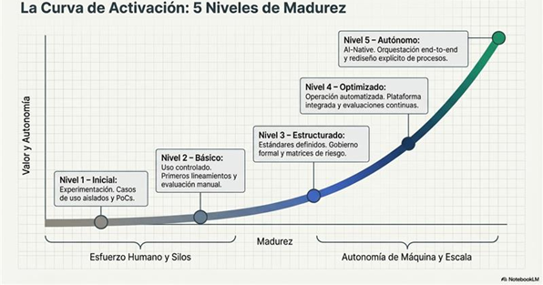

# Matriz de Madurez

Con el objetivo de evolucionar la plataforma de manera estructurada y medible, se ha definido una **Matriz de evaluación de Madurez** que permite evaluar el nivel actual frente a la arquitectura de IA de SURA en cuanto a capacidades, identificar brechas y establecer una hoja de ruta clara de mejora continua. Un modelo de madurez proporciona un marco sistemático para responder tres preguntas clave:

1. ¿Dónde estamos hoy?
2. ¿Qué capacidades nos faltan para operar a escala y de forma sostenible?
3. ¿Cuál es el siguiente nivel lógico de evolución?

En el contexto de una plataforma agéntica empresarial, la madurez no se limita a la tecnología. Abarca múltiples dimensiones, tales como:

- Estrategia y alineación con el negocio.
- Gobierno y gestión de riesgos.
- FinOps y control de costos.
- Seguridad, cumplimiento, observabilidad y privacidad.

El modelo de madurez permite:

- Estandarizar criterios de evaluación entre dominios.
- Priorizar inversiones de forma objetiva.
- Reducir riesgos asociados al crecimiento acelerado.
- Facilitar conversaciones ejecutivas basadas en evidencia.
- Medir progreso de forma periódica.

Cada nivel de madurez representa un estado evolutivo en términos de formalización, automatización, medición y optimización de capacidades. A medida que la organización avanza en los niveles, la plataforma transita desde un enfoque experimental o táctico hacia un modelo industrializado, gobernado y optimizado a escala empresarial.

Para ver mayor detalle en cuanto al modelo de madurez ver el archivo:
> **[Archivo adjunto]** [MatrizModeloMadurez.xlsx](../../recursos/5823463429/MatrizModeloMadurez.xlsx)
