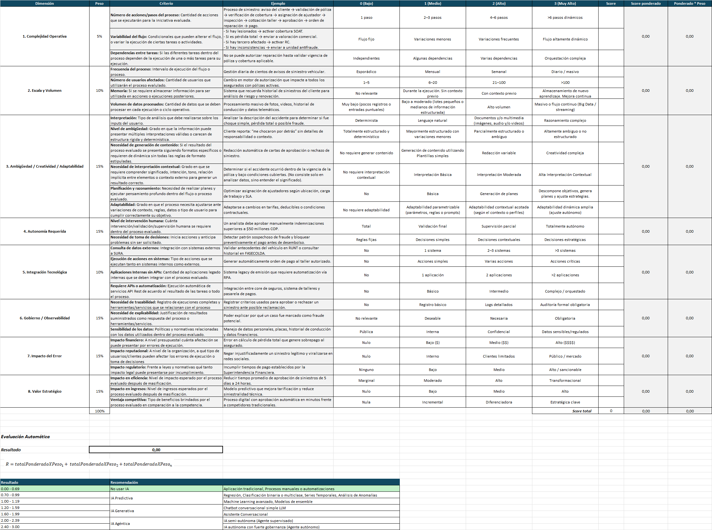

# Modelo de toma de decisiones

Modelo estructurado cuyo objetivo es apoyar el proceso de evaluar, seleccionar e implementar soluciones con Inteligencia Artificial, alineado a objetivos de negocio y gestionado bajo criterios de riesgo y gobernanza.

Por definición de la comunidad de IA, este modelo debe ser ejecutado en cada una de las nuevas soluciones propuestas para implementación, siguiendo el principio del marco “AI First”.

Las responsabilidades respecto a los roles que se deben encargar de realizar cada una de las actividades del modelo de toma de decisiones se encuentra detallada en la Matriz RACIVD (*ver*[Arquitectura Plataforma Agentica](../../paginas/Arquitectura-Plataforma-Agentica.md))

Se consideran varias actividades dentro del flujo para la toma de decisión del uso de IA:

- ***Determinar información relevante:*** Hace referencia a la recopilación de información relevante para la necesidad presentada (objetivo de negocio). En este punto es importante definir los requerimientos funcionales de la solución propuesta, es decir, segmentar las funcionalidades esperadas ya que la evaluación de uso de IA se realizará por cada una de ellas. Por ejemplo, si el objetivo es solucionar solicitudes específicas de los usuarios se debería evaluar: cantidad de solicitudes de la misma naturaleza presentadas en un rango determinado de tiempo, flujo actual con el cual se brinda respuesta a la solicitud, etc.
- ***Evaluación de uso de IA Base:*** Alineado a las definiciones de gobierno por parte de la Comunidad de IA, se incluye la evaluación *inicial* del uso de IA para una necesidad en primera instancia, siguiendo el modelo de toma de decisiones de uso de IA actual documentado en confluence (ver página [Arquitectura de Referencia V1.1.](../../paginas/ARQ-AI-First-Arquitectura-de-referencia/Arquitectura-Agentes-V1.1/Arquitectura-de-Referencia-V1.1.md)*).*
- ***Evaluación de riesgos:*** Posteriormente, de acuerdo a la sugerencia del punto anterior si el resultado es usar IA, se debe realizar la respectiva evaluación de riesgos, definida igualmente por la comunidad de IA; esta evaluación es fundamental, ya que de acuerdo a los riesgos presentes en la solución propuesta la conclusión de uso de IA de la evaluación puede variar.
- ***Pre-requisitos para las iniciativas de arquitectura:*** Comprende todas aquellas definiciones, documentos, diagramas (blueprint) necesarios para una propuesta de solución de acuerdo a las políticas actuales de SURA, apoyadas por el resultado de la evaluación de uso de IA Base realizada anteriormente. (*ver página*[Mínimos de Arquitectura (Obligatorios)](https://segurosti.atlassian.net/wiki/spaces/AFGLYP/pages/))
- ***Matriz de evaluación de uso de IA:*** En este punto, con toda la información recopilada en pasos anteriores es posible realizar una evaluación más detallada frente al uso de IA, contando con una herramienta que de acuerdo a algunos valores de entrada para ciertos criterios puede sugerir una evaluación más precisa en cuanto a las posibilidades de uso de IA en la necesidad abordada. La evaluación deberá ser realizada por cada una de las funcionalidades esperadas dentro de la solución o iniciativa propuesta. (ver [1. Matriz de Decisión](https://segurosti.atlassian.net/wiki/spaces/AFGLYP/pages/edit-v2/5822087179#1.-Matriz-de-Decisi%C3%B3n)).
- ***Evaluación de riesgos:*** Posteriormente, se debe ejecutar de nuevo la evaluación de riesgos desde la fase de estructuración.
- ***Definición de supervisión humana:*** Teniendo en cuenta el resultado de la evaluación de uso de IA, y la evaluación de riesgos es posible establecer de forma clara, confiable y segura el nivel de intervención humana que requiere la solución.
- ***Decisión final en cuanto a la elección del uso de IA:*** Finalmente recopilando la información de todos los pasos anteriores se concluirá el uso de IA, incluyéndola dentro de la solución, con controles específicos, supervisión, riesgos y una visión más clara del uso de agentes y/o IA generativa/predictiva para las necesidades presentadas en la organización.

El modelo de toma de decisiones espera acelerar el proceso de decisión respecto al uso de IA en diferentes escenarios, pero no excluye dentro de sus resultados de evaluación que la conclusión obtenida tras el ejercicio sea la implementación o desarrollo de plataformas tradicionales.

# 1. Matriz de Decisión

Su funcionamiento se divide en tres etapas principales:

1. ***Evaluación por Dimensiones:*** Se analiza el proceso bajo las dimensiones clave, cada una con un peso específico sobre el total (100%). Estas incluyen:

- Complejidad y Autonomía: Miden el número de pasos, la variabilidad del flujo y cuánta intervención humana se requiere.
- Riesgo e Impacto: Evalúan el impacto financiero, reputacional y regulatorio de posibles errores.
- Capacidad Técnica y Estratégica: Analizan el volumen de datos, la necesidad de integración con APIs y el valor estratégico para la eficiencia del negocio.
- Gobierno y observabilidad: Evalúa la necesidad de registrar logs y la sensibilidad de la información tratada.

1. ***Calificación de Criterios:*** Dentro de cada dimensión, se asignan puntajes basados en criterios objetivos. Por ejemplo, en la "Complejidad Operativa", se evalúa si el proceso es de un solo paso o si requiere interpretaciones subjetivas y múltiples condicionales.
2. ***Resultado y Recomendación:*** Según el puntaje final obtenido (en una escala de 0.0 a 3.0), el sistema emite una recomendación técnica frente al tipo de IA que se debería utilizar en el caso evaluado.

Para ver mayor detalle en cuanto a la matriz de decisión de uso de IA ver el archivo
> **[Archivo adjunto]** [MatrizDecision_v2.0.xlsx](../../recursos/5822087179/MatrizDecision_v2.0.xlsx)
