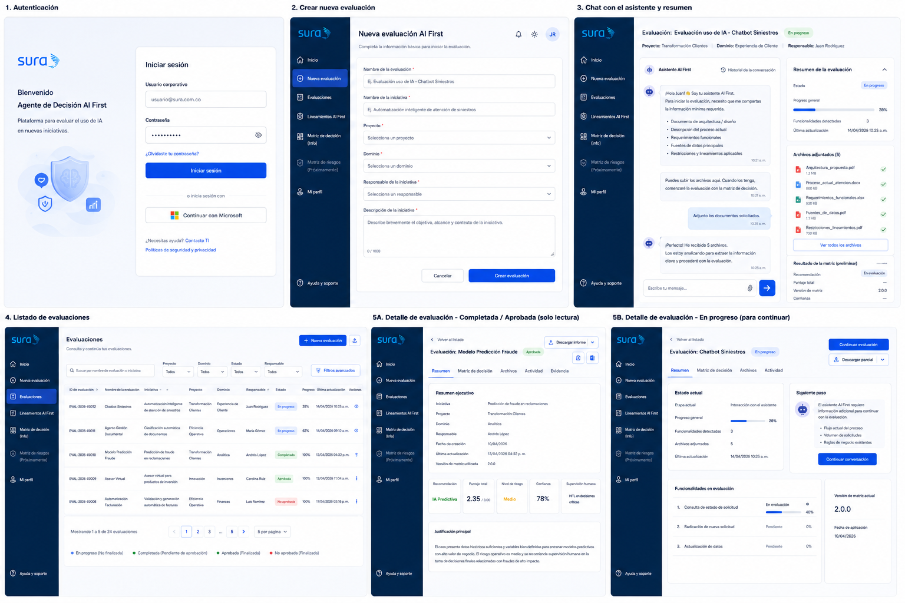
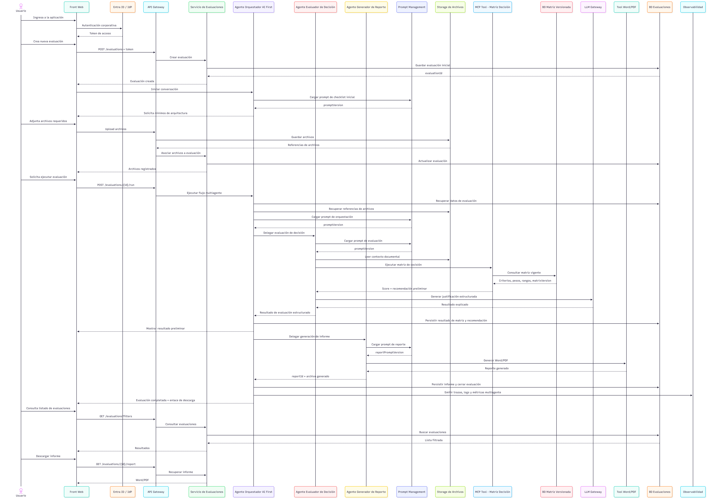

# PoC Implementación Capacidades Plataforma Agentica - Control Plane

## Contexto y alcance de la PoC

La iniciativa se enmarca en la evolución de la arquitectura agéntica de SURA, cuyo propósito es pasar de definiciones conceptuales y arquitectónicas a una validación práctica de las capacidades necesarias para construir, exponer, operar y gobernar agentes de IA en un entorno empresarial. Hasta el momento, se han definido elementos clave como el blueprint de capacidades, la arquitectura de referencia, la arquitectura de implementación, los patrones de agentes, los mecanismos de gobierno, la gestión de prompts, la observabilidad, el uso de gateways, la integración con tools/MCP, la memoria y los controles de seguridad. La PoC busca corroborar estas definiciones mediante una implementación real, acotada y trazable, que permita validar su aplicabilidad técnica y operativa.

El proyecto no pretende construir todavía una plataforma agéntica completa ni desplegar todas las capacidades del blueprint en estado productivo. Su objetivo es implementar un primer caso de uso representativo que permita demostrar cómo las capacidades definidas se articulan entre sí para formar una base gobernada de plataforma. En este sentido, la PoC funciona como un “corte vertical” de la arquitectura: implementa un flujo real de extremo a extremo, pasando por canal, gateway, orquestador, workers, modelo, prompts, tools, memoria, seguridad, observabilidad y generación de evidencia.

El caso de uso seleccionado es el **Agente de Decisión AI First para Evaluación de Uso de IA**, implementado bajo un patrón **orquestador–worker**. Este agente asistirá el proceso de toma de decisiones para determinar si una nueva iniciativa o funcionalidad debe resolverse mediante una solución tradicional, IA predictiva, IA generativa o IA agéntica, considerando criterios de negocio, complejidad, autonomía, riesgo, datos, supervisión humana y alineación arquitectónica. La elección de este caso es estratégica porque permite validar simultáneamente capacidades funcionales, técnicas y de gobierno, además de estar directamente relacionado con el marco AI First definido por la organización.

## Objetivo de la PoC

El objetivo principal de la PoC es validar que las definiciones arquitectónicas y de gobierno planteadas para la plataforma agéntica pueden materializarse en una implementación real, usando un caso de uso concreto que permita evaluar la toma de decisiones sobre el uso de IA dentro de nuevas soluciones.

La PoC busca demostrar que es posible:

- Orquestar un flujo agéntico de decisión mediante un agente coordinador y workers especializados.
- Separar razonamiento, tools, prompts, memoria, conocimiento y controles de seguridad.
- Ejecutar reglas determinísticas, como la matriz de decisión, sin delegar completamente el resultado al LLM.
- Gestionar prompts de forma externa y versionada, evitando que queden embebidos en el código.
- Consumir modelos mediante un gateway gobernado.
- Registrar trazabilidad extremo a extremo de cada decisión.
- Aplicar controles mínimos de seguridad, autorización, guardrails y supervisión humana.
- Generar evidencia auditable para comités, arquitectura, seguridad, datos y gobierno de IA.

En otras palabras, la PoC no solo validará si el agente “funciona”, sino si puede operar bajo los principios esperados de una plataforma empresarial: **gobernabilidad, trazabilidad, seguridad, mantenibilidad, explicabilidad y evolución controlada**.

## Alcance funcional de la PoC

La PoC implementará el flujo de evaluación de una iniciativa o funcionalidad a partir del modelo de decisión AI First. El usuario podrá describir una necesidad de negocio, y el agente guiará la captura de información relevante, descompondrá la solución en funcionalidades evaluables, ejecutará la matriz de decisión, identificará riesgos preliminares, recomendará el nivel de supervisión humana y generará una recomendación técnica justificada.

El flujo funcional mínimo incluye:

1. Definición de la iniciativa.
2. Identificación de funcionalidades a evaluar.
3. Recolección de criterios requeridos por la matriz.
4. Ejecución de la matriz de decisión.
5. Recomendación de tipo de solución: No IA, IA predictiva, IA generativa, agente singular o patrón agéntico más avanzado.
6. Generación de informe de decisión.
7. Registro de evidencia y trazabilidad.

Este alcance permite validar el proceso de gobierno de una iniciativa de IA desde la etapa de caracterización hasta la recomendación final, sin automatizar de manera ciega la aprobación. La decisión final continuará siendo responsabilidad humana.

## Alcance técnico de la PoC

Desde el punto de vista técnico, la PoC implementará una versión acotada de las capacidades definidas en el blueprint y en la arquitectura de implementación. No se implementará la plataforma completa, pero sí los componentes necesarios para demostrar cómo las capacidades se conectan y soportan el gobierno del ciclo de vida de una decisión agéntica.

| Capa / capacidad | Alcance en la PoC |
| --- | --- |
| Canal / Experience Layer | Interfaz web o chat simple para capturar la necesidad y presentar resultados. |
| API / AI Gateway | Entrada controlada, propagación de identidad, correlación y gobierno básico de llamadas. |
| Orquestador | Agente principal responsable de coordinar el flujo, workers, memoria y respuesta final. |
| Workers | Workers especializados para caracterización, matriz, riesgos, arquitectura y reporte. |
| LLM Gateway | Consumo gobernado del modelo, evitando llamadas directas desde el runtime. |
| Prompt Management | Uso de prompts versionados desde Langfuse. |
| MCP / Tools | Exposición de la matriz de decisión como tool determinística. |
| Memoria | Persistencia de sesión, evaluación, decisión y evidencia. |
| Observabilidad | Logs, trazas, métricas, correlationId, spans por worker y tool calls. |
| Seguridad | Autenticación, autorización básica, restricciones de tools, guardrails y HITL. |
| Evidencia | Registro auditable de score, recomendación, riesgos, prompts, matriz y aprobación humana. |

La arquitectura de implementación ya define el runtime del agente como la unidad desplegable que concentra razonamiento, ejecución de herramientas, manejo de memoria y observabilidad, con componentes como orquestador, cliente LLM, cliente MCP, manejador de sesión, memory manager y telemetría. La PoC tomará esta estructura como base para validar su aplicabilidad en un caso real.

## Capacidades del blueprint que se validarán

Aunque la PoC no implementará todas las capacidades del blueprint, sí permitirá demostrar cómo estas capacidades conforman el gobierno de la plataforma. La validación se hará mediante una implementación parcial pero representativa.

| Capacidad del blueprint | Cómo se demostrará en la PoC |
| --- | --- |
| Control Plane | Mediante gateway, control de acceso, prompts versionados, trazabilidad y políticas básicas. |
| AI Gateway / LLM Gateway | Todo consumo del modelo pasará por una capa gobernada. |
| Prompt Management | Los prompts serán gestionados como artefactos versionados, no como archivos internos. |
| AI Security Enforcement | Se implementarán guardrails básicos, validación de entrada/salida y control de tools. |
| Observability | Se instrumentará el flujo completo con logs, métricas y trazas. |
| FinOps inicial | Se capturarán tokens, modelo usado y estimación básica de costo por evaluación. |
| Agent Runtime | Se validará el patrón orquestador–worker con estado, memoria y tool invocation. |
| Memory Layer | Se separará contexto de sesión, memoria de evaluación y evidencia persistente. |
| Domain Capability Exposure | La matriz y reglas de decisión se expondrán como tools/APIs gobernadas. |
| Information Domain | El agente podrá consultar lineamientos o definiciones autorizadas como conocimiento de soporte. |
| Human-in-the-loop | La recomendación final requerirá validación humana, especialmente en escenarios de riesgo. |

Con esto, la PoC permitirá observar cómo el gobierno no es un componente aislado, sino una suma de capacidades distribuidas: gateway, identidad, prompts, políticas, matriz, tools, trazabilidad, memoria, evaluación, seguridad y supervisión humana.

## Capacidades fuera del alcance inicial

Para mantener la PoC controlada, algunas capacidades del blueprint quedarán fuera del alcance o se implementarán solo de forma simulada o mínima:

| Capacidad | Tratamiento en PoC |
| --- | --- |
| Catálogo MCP corporativo completo | Se implementará una tool específica para la matriz, no un catálogo enterprise completo. |
| Agent Registry completo | Se podrá registrar el agente de forma básica, pero no se implementará un registry corporativo maduro. |
| Marketplace de tools | Fuera de alcance. |
| Gateway Completo de IA | Se probaran capacidades particulares para gateways de A2A, MCP y LLM, pero no sé definirá dentro de esta PoC cuál es el gateway de IA a usar. Los resultados de esta pueden ayudar a validar capacidades para una posterior selección. |
| Multiagente abierto o federado | El patrón será orquestador–worker acotado, no agent mesh. |
| CI/CD completo de prompts | Se validará versionado/carga externa, pero no todo el pipeline de promoción. |
| FinOps avanzado | Solo métricas básicas de tokens y costo estimado. |
| AI Security Posture completo | Se implementarán controles mínimos, no una plataforma completa de postura de seguridad. |
| GraphRAG / conocimiento avanzado | Fuera del alcance inicial, salvo consulta simple a fuentes autorizadas. |
| Operación productiva | La PoC será una validación controlada, no una salida productiva. |

Esta delimitación es importante para evitar que la PoC sea evaluada como si fuera la plataforma final. Su valor está en validar la integración, los patrones y los principios de gobierno, no en agotar todas las capacidades desde el primer ciclo.

## Hipótesis que se buscan corroborar

La PoC permitirá validar varias hipótesis arquitectónicas:

1. **El patrón orquestador–worker es adecuado** para casos donde se requiere separación entre caracterización, evaluación, riesgo, arquitectura y reporte.
2. **La matriz de decisión debe operar como tool determinística**, mientras el LLM apoya interpretación, explicación y guía conversacional.
3. **El gobierno de prompts es necesario desde el inicio**, porque las recomendaciones deben poder explicarse y auditarse por versión de prompt.
4. **La observabilidad E2E es indispensable**, ya que una decisión agéntica debe reconstruirse por usuario, sesión, agente, worker, modelo, tool y fuente.
5. **La seguridad debe aplicarse en varios puntos del flujo**, no solo en el endpoint de entrada.
6. **El HITL es un mecanismo estructural de gobierno**, especialmente para decisiones con impacto alto o riesgo regulatorio.
7. **La plataforma puede evolucionar incrementalmente**, partiendo de un caso acotado que deja bases para capacidades transversales futuras.

## Valor esperado para la organización

El resultado de la PoC servirá como evidencia práctica para ajustar y madurar la arquitectura agéntica de SURA. Permitirá identificar qué definiciones funcionan, cuáles requieren refinamiento y qué capacidades deben priorizarse antes de escalar hacia más agentes o casos productivos. También permitirá evaluar algunas herramientas para determinar sus capacidades y conocer funcionalidades básicas en un entorno real.

Además, el caso de uso genera valor propio, porque apoya un proceso real de gobierno: la evaluación de iniciativas AI First. Esto permite que la PoC no sea un experimento aislado, sino una herramienta que ayuda a ordenar la adopción de IA dentro de la organización.

El valor esperado se resume en cuatro frentes:

| Frente | Valor esperado |
| --- | --- |
| Arquitectura | Validar patrones, componentes, integraciones y límites de responsabilidad. |
| Gobierno | Estandarizar la evaluación de uso de IA y generar evidencia auditable. |
| Seguridad | Probar controles mínimos para identidad, tools, prompts, datos y supervisión. |
| Plataforma | Demostrar cómo las capacidades del blueprint se articulan en un flujo real. |

---

## Arquitectura Definida

Diagrama de Arquitectura C4 - Nivel 3 PoC Control Plane

## Caso de uso propuesto: Agente de Decisión AI First para Evaluación de Uso de IA

### Objetivo y contexto de la PoC

La PoC tiene como objetivo implementar un sistema agéntico que apoye a equipos de arquitectura, negocio, seguridad y datos en la evaluación estructurada de nuevas iniciativas, determinando si una solución debe implementarse como **No IA**, **IA predictiva**, **IA generativa**, **IA agéntica supervisada** o **IA agéntica con mayor autonomía**.

El caso de uso toma como base el flujo de toma de decisiones definido por la comunidad de IA: caracterización, evaluación base, estructuración, evaluación detallada, análisis de riesgos, definición de supervisión humana y decisión final. La PoC no busca reemplazar la decisión humana ni automatizar el gobierno completo, sino asistir el proceso con trazabilidad, consistencia, recolección guiada de información, scoring estructurado y generación de evidencia para comités o revisiones de arquitectura.

Arquitectónicamente, el caso es pertinente porque obliga a validar varias capacidades críticas de la plataforma agéntica: orquestación de tareas, workers especializados, uso de matriz determinística, recuperación de conocimiento, manejo de memoria, prompts gestionados, controles de seguridad, trazabilidad E2E y generación de artefactos auditables. Esto se alinea con la visión AI First de SURA, donde la IA debe incorporarse desde la concepción de las soluciones, integrando memoria, razonamiento, herramientas, seguridad, observabilidad y gobierno desde el inicio.

El resultado esperado de la PoC es un **asistente conversacional y estructurado** que guíe al usuario durante la evaluación de una iniciativa o funcionalidad específica, complete la matriz de decisión, identifique riesgos preliminares, recomiende el tipo de solución y genere un resumen justificable para revisión humana.

---

## Prototipos propuestos:

---

# Épicas dentro del alcance de la PoC

## Épica 1. Autenticación y acceso a la aplicación

**Objetivo:** permitir que el usuario ingrese a la aplicación usando credenciales corporativas o integración con identidad empresarial.

**Incluye:**

- Pantalla de autenticación.
- Login corporativo.
- Identificación del usuario autenticado.
- Asociación del usuario como creador o responsable de la evaluación.
- Control básico de sesión.

**Entregables:**

- Pantalla de login.
- Flujo de autenticación.
- Sesión de usuario activa.
- Registro de usuario creador en cada evaluación.

---

## Épica 2. Creación de nueva evaluación AI First

**Objetivo:** permitir que el usuario inicialice una evaluación con información mínima de contexto.

**Campos requeridos:**

- Nombre de la evaluación.
- Nombre de la iniciativa.
- Proyecto.
- Dominio.
- Responsable de la iniciativa.
- Descripción de la iniciativa.

**Comportamiento esperado:**

Al hacer clic en **Crear evaluación**, el sistema debe:

- Crear un identificador único de evaluación.
- Guardar la evaluación en estado **En progreso**.
- Asociar usuario, proyecto, dominio y responsable.
- Redirigir al usuario a la pantalla de interacción con el asistente.

**Entregables:**

- Formulario de nueva evaluación.
- Validaciones de campos obligatorios.
- Persistencia inicial de la evaluación.
- Estado inicial de la evaluación.

---

## Épica 3. Interacción con asistente AI First

**Objetivo:** implementar la pantalla principal de trabajo donde el usuario interactúa con el agente para entregar la información requerida.

Esta pantalla se divide en dos bloques:

| Bloque | Propósito |
| --- | --- |
| Chat con asistente AI First | Guiar al usuario, solicitar archivos, hacer preguntas y comunicar avances. |
| Resumen de evaluación | Mostrar estado, progreso, archivos adjuntos, versión de matriz y resultado preliminar/final. |

**Incluye:**

- Saludo inicial del asistente.
- Checklist conversacional de información requerida.
- Solicitud guiada de mínimos de arquitectura.
- Carga de archivos desde el chat.
- Registro visible de archivos adjuntos.
- Mensajes de avance de la evaluación.
- Estado de evaluación en tiempo real.

**Ejemplo de archivos mínimos solicitados:**

- Documento de arquitectura o diseño.
- Descripción del proceso actual.
- Requerimientos funcionales.
- Fuentes de datos principales.
- Restricciones o lineamientos aplicables.

**Entregables:**

- Vista de chat con adjuntos.
- Checklist guiado por prompt.
- Panel lateral de resumen.
- Registro de archivos adjuntos.
- Estados: en carga de información, en evaluación, completada.

---

## Épica 4. Gestión de archivos mínimos de arquitectura

**Objetivo:** permitir al usuario adjuntar documentos requeridos para que el agente tenga contexto suficiente para ejecutar la evaluación.

**Incluye:**

- Adjuntar archivos desde el chat.
- Visualizar archivos en panel lateral.
- Validar tipos permitidos.
- Validar tamaño máximo.
- Asociar archivos a la evaluación.
- Consultar archivos adjuntos al reabrir una evaluación.

**Tipos sugeridos:**

- PDF.
- DOCX.
- XLSX.
- PPTX.
- TXT/MD, si aplica.

**Entregables:**

- Carga de archivos.
- Listado de archivos por evaluación.
- Estado de archivo cargado.
- Asociación archivo–evaluación.
- Evidencia de archivos usados en la evaluación.

---

## Épica 5. Consulta y ejecución de matriz de decisión versionada

**Objetivo:** permitir que el agente ejecute la evaluación con base en una matriz estructurada, versionada y consultada mediante una tool/MCP.

**Principio clave:** la matriz no debe estar embebida en el prompt ni en lógica libre del LLM. Debe estar modelada como información estructurada.

**Incluye:**

- Consulta de criterios, dimensiones, pesos y rangos desde base de datos o fuente estructurada.
- Exposición de la matriz mediante MCP/tool.
- Cálculo del puntaje de evaluación.
- Registro de versión de matriz usada.
- Persistencia del resultado asociado a la versión.

**Entregables:**

- Modelo de datos inicial de matriz.
- Tool/MCP para consultar matriz.
- Tool/MCP para ejecutar scoring.
- Resultado calculado.
- Registro de `matrixVersion`.

---

## Épica 6. Generación de resultado y resumen de evaluación

**Objetivo:** presentar al usuario el resultado de la evaluación generada por el agente.

**Incluye:**

- Resultado recomendado: No IA, IA predictiva, IA generativa o IA agéntica.
- Puntaje total.
- Justificación principal.
- Características identificadas.
- Supuestos considerados.
- Archivos utilizados.
- Versión de matriz.
- Estado final de la evaluación.

**Entregables:**

- Panel de resultado en resumen lateral.
- Vista de detalle de evaluación finalizada.
- Persistencia de resultado.
- Trazabilidad de insumos usados.

---

## Épica 7. Listado y administración de evaluaciones

**Objetivo:** permitir consultar las evaluaciones creadas y filtrar por atributos relevantes.

**Incluye filtros por:**

- Nombre de evaluación.
- Nombre de iniciativa.
- Proyecto.
- Dominio.
- Responsable.
- Estado.
- Fecha.
- Recomendación.

**Estados sugeridos:**

- En progreso.
- Completada.
- Aprobada.
- No aprobada.
- Cancelada.

**Acciones disponibles:**

| Estado | Acción |
| --- | --- |
| En progreso | Continuar evaluación. |
| Completada | Ver detalle. |
| Aprobada / No aprobada | Ver detalle y descargar informe. |

**Entregables:**

- Pantalla de listado.
- Filtros básicos.
- Tabla de evaluaciones.
- Acción para continuar.
- Acción para ver detalle.
- Paginación básica.

---

## Épica 8. Detalle de evaluación generada

**Objetivo:** permitir consultar una evaluación terminada o en progreso.

**Para evaluaciones terminadas incluye:**

- Resumen ejecutivo.
- Información general.
- Resultado recomendado.
- Puntaje.
- Justificación.
- Archivos adjuntos.
- Versión de matriz usada.
- Historial de actividad.
- Opción de descarga.

**Para evaluaciones en progreso incluye:**

- Estado actual.
- Siguiente paso sugerido.
- Archivos cargados.
- Funcionalidades o información pendiente.
- Botón para continuar conversación con el asistente.

**Entregables:**

- Vista detalle de evaluación completada.
- Vista detalle de evaluación en progreso.
- Acceso a descarga de informe.
- Acceso a continuar evaluación.

---

## Épica 9. Generación y descarga de informe

**Objetivo:** permitir descargar el resultado de una evaluación finalizada.

**Formatos sugeridos para PoC:**

- PDF.
- Word.

**Contenido mínimo del informe:**

- Nombre de evaluación.
- Iniciativa.
- Proyecto.
- Dominio.
- Responsable.
- Fecha.
- Resultado recomendado.
- Puntaje total.
- Justificación.
- Archivos usados.
- Versión de matriz.
- Estado final.
- Evidencia de trazabilidad básica.

**Entregables:**

- Generación de informe.
- Descarga en PDF o Word.
- Plantilla base del informe.
- Asociación del informe a la evaluación.

# Épicas fuera del alcance de la PoC / fases posteriores

## Fase posterior 1. Administración de matriz de decisión

**Objetivo futuro:** permitir a usuarios autorizados administrar criterios, pesos, dimensiones y versiones de la matriz.

**Incluye:**

- CRUD de dimensiones.
- CRUD de criterios.
- Configuración de pesos.
- Publicación de nuevas versiones.
- Comparación entre versiones.
- Control de vigencia.
- Auditoría de cambios.

**No se implementa en PoC**, pero la PoC debe dejar la matriz versionada para soportarlo más adelante.

---

## Fase posterior 2. Matriz de riesgos y controles

**Objetivo futuro:** incorporar evaluación de riesgos posterior al resultado de uso de IA.

**Incluye:**

- Clasificación de riesgos.
- Evaluación de impacto y probabilidad.
- Controles sugeridos.
- Riesgo residual.
- Asociación con HITL/HOTL.
- Evidencia para gobierno de IA.

---

## Flujo E2E del caso de uso

---

## Escenarios a validar

### Escenarios funcionales

| Escenario | Descripción | Resultado esperado |
| --- | --- | --- |
| Definición Evaluación | El usuario describe un objetivo de negocio y el agente guía la captura de contexto, alcance, funcionalidades, actores, datos y sistemas involucrados. | Ficha estructurada de la iniciativa. |
| Descomposición funcional | El agente identifica o solicita las funcionalidades que deben evaluarse individualmente. | Lista de funcionalidades evaluables. |
| Evaluación por matriz | El agente ejecuta la matriz de decisión por cada funcionalidad usando criterios ponderados. | Score, recomendación y justificación por funcionalidad. |
| Identificación de información faltante | El agente detecta criterios no respondidos o ambiguos. | Preguntas de aclaración al usuario. |
| Decisión final asistida | El agente consolida recomendación técnica, riesgos, controles y evidencia. | Informe de decisión AI First. |
| Comparación entre alternativas | El agente compara si conviene app tradicional, IA generativa, IA predictiva o agente. | Justificación explícita de alternativa recomendada. |
| Revisión humana | Un arquitecto, seguridad o negocio confirma, ajusta o rechaza la recomendación. | Decisión final con aprobación humana trazada. |

### Escenarios técnicos

| Escenario | Descripción | Validación |
| --- | --- | --- |
| Orquestación multi-worker | El orquestador delega tareas a workers especializados. | Flujo trazable por cada worker. |
| Uso de tools determinísticas | La matriz se ejecuta como tool o servicio MCP, no como razonamiento libre del LLM. | Score reproducible. |
| Prompt management | Los prompts se cargan desde Langfuse o prompt management, no desde archivos internos del runtime. | Versionado y trazabilidad del prompt usado. |
| Retrieval / conocimiento | El agente consulta definiciones, lineamientos, catálogo de tecnologías y criterios de arquitectura. | Respuestas grounded en fuentes autorizadas. |
| Integración con Gateway LLM | Todas las invocaciones al modelo pasan por el LLM Gateway / LiteLLM / AI Foundry según el despliegue. | Control de modelo, consumo y trazabilidad. |
| Integración MCP | Workers consumen tools mediante MCP o APIs gobernadas. | Tool calls auditables. |
| Persistencia de sesión | La conversación mantiene contexto durante la evaluación. | Estado recuperable. |
| Persistencia de evidencia | Se guarda resultado, score, justificación, riesgos y decisión. | Evidencia consultable posteriormente. |
| Manejo de errores | Fallos en tools, modelo o retrieval generan degradación controlada. | Retries, timeouts y mensajes de error claros. |
| Observabilidad E2E | Cada interacción se correlaciona desde canal hasta modelo, tool y respuesta. | TraceId/correlationId presente en todo el flujo. |

### Escenarios no funcionales

| Atributo | Escenario a validar |
| --- | --- |
| Trazabilidad | Reconstruir una evaluación completa: usuario, funcionalidad, criterios, score, workers, prompts, tools y decisión. |
| Seguridad | Validar autenticación, autorización, roles y restricciones de acceso por perfil. |
| Cumplimiento | Evidenciar que el agente no emite una aprobación final sin revisión humana cuando hay riesgo alto. |
| Explicabilidad | La recomendación debe incluir razones asociadas a criterios de la matriz. |
| Consistencia | Mismos insumos deben producir el mismo score determinístico. |
| Mantenibilidad | La matriz, prompts y reglas deben evolucionar sin modificar el core del agente. |
| Escalabilidad | El runtime debe soportar evaluaciones concurrentes de distintas iniciativas. |
| Eficiencia | Controlar tokens, latencia y costos por evaluación. |
| Resiliencia | Continuar la evaluación ante fallos parciales de retrieval o workers no críticos. |
| Auditabilidad | Guardar evidencia suficiente para revisión posterior por arquitectura, seguridad o gobierno. |

---

## Criterios de éxito medibles

| Dimensión | Criterio | Meta inicial PoC |
| --- | --- | --- |
| Cobertura funcional | El agente guía el flujo completo desde caracterización hasta decisión asistida. | 100% del flujo mínimo implementado. |
| Exactitud del scoring | El resultado de la matriz coincide con el cálculo esperado. | ≥ 95% en casos de prueba controlados. |
| Consistencia | Mismos inputs generan la misma recomendación estructurada. | ≥ 95% de reproducibilidad. |
| Trazabilidad | Cada evaluación tiene correlationId, sessionId, userId hash, agentId, workerId, promptVersion y toolCallId. | 100% de ejecuciones trazadas. |
| Latencia | Tiempo de respuesta para pasos conversacionales simples. | < 5 segundos p95. |
| Latencia de evaluación completa | Tiempo para generar recomendación consolidada con workers. | < 60 segundos p95 en PoC. |
| Reducción de esfuerzo | Disminución del tiempo requerido para preparar una evaluación inicial. | ≥ 30% frente a ejecución manual. |
| Calidad de justificación | Evaluadores humanos consideran útil la recomendación. | ≥ 80% de aceptación en revisión piloto. |
| Seguridad | No se permite acceso sin token válido ni ejecución de tools no autorizadas. | 0 bypass exitosos en pruebas. |
| Observabilidad | Dashboards muestran trazas, errores, latencia, costo y uso de tools. | 100% de métricas mínimas disponibles. |
| Human-in-the-loop | Toda recomendación de riesgo alto requiere confirmación humana. | 100% de casos críticos con gate humano. |
| Prompt governance | Prompts versionados y asociados a cada ejecución. | 100% de ejecuciones con promptVersion. |

---

## Restricciones identificadas

### Restricciones tecnológicas

La PoC debe alinearse con las tecnologías habilitadas en la arquitectura adjunta: canal web o chat, APIM/API Gateway, runtime agéntico en contenedores, LLM Gateway, Prompt Layer, observabilidad, almacenamiento y servicios de dominio. La arquitectura de implementación de SURA define el runtime del agente como la unidad que concentra razonamiento, ejecución de herramientas, manejo de memoria y observabilidad, con componentes como adaptador API, planeador/orquestador, cliente LLM, cliente MCP, manejador de sesión, memory manager y telemetría.

Restricciones específicas:

| Restricción | Implicación |
| --- | --- |
| La matriz no debe quedar embebida como lógica no gobernada en el prompt. | Debe exponerse como tool determinística, servicio interno o componente MCP. |
| Los prompts no deben estar como archivos internos del proyecto. | Deben gestionarse desde Prompt Management / Langfuse. |
| El LLM no debe consumirse directamente desde el runtime. | Debe pasar por LLM Gateway / LiteLLM / AI Foundry. |
| El agente no debe conectarse directamente a todas las fuentes de datos. | Debe consumir conocimiento mediante servicios, APIs, índices o MCPs gobernados. |
| El patrón orquestador-worker aumenta latencia. | Se requiere control de pasos, paralelización selectiva y límites de iteración. |
| La PoC no debe depender de un único modelo. | El gateway debe permitir cambio o fallback de modelo. |

### Restricciones de datos

| Restricción | Implicación |
| --- | --- |
| Información sensible o regulada | Se requiere clasificación, enmascaramiento y control de acceso. |
| Datos incompletos durante caracterización | El agente debe preguntar y marcar supuestos explícitos. |
| Fuentes documentales no gobernadas | No deben usarse como grounding sin validación. |
| Evidencia de decisión | Debe persistirse con versionado de matriz, prompts, reglas y fuentes. |
| Evaluación por funcionalidad | No se debe emitir una única recomendación global sin descomposición funcional. |

### Restricciones de seguridad

| Restricción | Implicación |
| --- | --- |
| Autenticación corporativa | Uso de Entra ID / token corporativo. |
| Autorización por rol | Arquitectura, seguridad, datos y negocio pueden tener permisos distintos. |
| Acceso a tools | Cada worker solo puede invocar tools permitidas. |
| Prompt injection | Validación de entradas y separación entre instrucciones del sistema, datos del usuario y conocimiento recuperado. |
| DLP / PII | Detección y redacción de información sensible antes de enviar al modelo cuando aplique. |
| Aprobación humana | Decisiones de alto impacto no pueden quedar completamente automatizadas. |
| Auditoría | Registro inmutable o trazable de decisiones, aprobaciones y cambios. |

---
