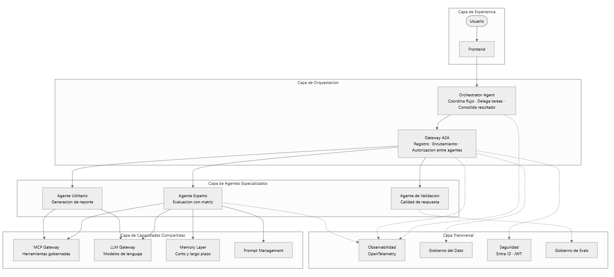
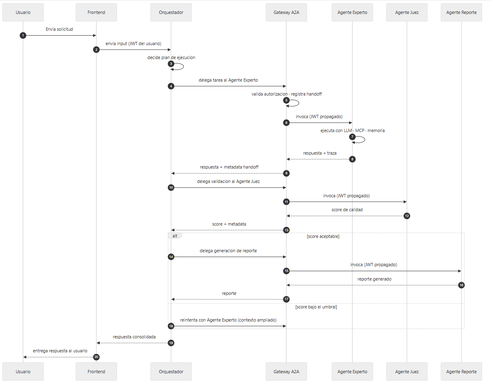

# Arquitectura de Referencia  Multiagente V1.0

# Documentos relacionados

| Documento | Relación |
| --- | --- |
| Arquitectura de Referencia Multimodal V1.0 | Canales de entrada que alimentan al Orquestador definido en este documento |
| Arquitectura de Referencia Voz V1.0 | Especialización del canal de audio sobre el mismo Agent Runtime. |

Tabla de contenido

- [Control de versiones](#)
- [Documentos relacionados](#)
- [Resumen ejecutivo](#)
- [1. Alcance del diseño](#)

    - [1.1 Cubre](#)
    - [1.2 Fuera de alcance](#)
- [2. Principio arquitectónico](#)

    - [2.1 Alcance de la primitiva de comunicación](#)
- [3. Tipos de agente](#)
- [4. Capas arquitectónicas](#)
- [5. Arquitectura de referencia](#)
- [6. Componentes del diseño](#)

    - [6.1 Orchestrator Agent](#)
    - [6.2 Gateway A2A (Agent-to-Agent)](#)
    - [6.3 Agentes especializados](#)
    - [6.4 Capacidades compartidas](#)
- [7. Orquestación](#)

    - [7.1 Modelos de orquestación soportados](#)
    - [7.2 Grafo de orquestación](#)
- [8. Comunicación entre agentes](#)

    - [8.1 Modelos de comunicación](#)
    - [8.2 Contrato de comunicación](#)
    - [8.3 Handoff](#)
    - [8.4 Flujo end-to-end de referencia](#)
- [9. Propagación de identidad entre agentes](#)

    - [9.1 Modelo aplicado](#)
    - [9.2 Consecuencias del modelo](#)
    - [9.3 Antipatrón evitado](#)
- [10. Responsabilidades por agente](#)
- [11. Stack tecnológico permitido](#)
- [12. Criterios de adopción](#)

    - [12.1 Casos de uso donde aplica](#)
    - [12.2 Casos de uso donde no es necesaria](#)
    - [12.3 Antipatrones a evitar](#)
- [13. Consideraciones de calidad](#)
- [14. Correspondencia con la implementación actual](#)

    - [14.1 Componentes que soportan el diseño sin modificación](#)
    - [14.2 Componentes a evolucionar](#)
- [15. Glosario](#)

# Resumen ejecutivo

Esta arquitectura de referencia habilita soluciones donde múltiples agentes especializados colaboran para resolver una necesidad de negocio. Define cómo se orquestan los agentes entre sí, cómo se comunican, qué responsabilidades tiene cada uno y qué componentes de plataforma soportan la coordinación.

El patrón mantiene coherencia con la arquitectura de agente individual del proyecto y la extiende con capacidades de coordinación, delegación y observabilidad entre agentes.

El contrato de invocación entre agentes —`POST /invoke` con publicación de `agent-card.json`— constituye el punto de estabilidad del diseño. La evolución hacia un gateway A2A formal se construye sobre ese contrato sin reescribir los agentes existentes.

# 1. Alcance del diseño

## 1.1 Cubre

- Modelo de orquestación entre agentes.
- Modelo de comunicación síncrona y asíncrona.
- Responsabilidades por tipo de agente.
- Capas arquitectónicas y componentes.
- Stack tecnológico permitido.
- Criterios de adopción, con casos donde aplica y donde no aplica.

## 1.2 Fuera de alcance

- Auto-descubrimiento dinámico de agentes en tiempo de ejecución.
- Agent Registry corporativo completo.
- Negociación autónoma entre agentes sin gobierno intermedio.

# 2. Principio arquitectónico

> **Coordinación centralizada, ejecución delegada.**

Un Orquestador coordina el flujo y delega tareas a agentes especializados. Los agentes especializados no invocan directamente a otros agentes: toda comunicación entre agentes atraviesa el Orquestador o pasa por un gateway A2A gobernado.

Consecuencias del principio:

- La trazabilidad de extremo a extremo se preserva.
- La lógica de negocio queda concentrada en el Orquestador, no dispersa entre agentes.
- La incorporación de un agente nuevo se resuelve registrándolo en el catálogo de agentes, sin rediseñar los existentes.
- El gobierno del dato y las políticas se aplican en los puntos de invocación, no en cada agente.

## 2.1 Alcance de la primitiva de comunicación

En la implementación actual está construida la primitiva mínima de comunicación entre agentes: cada agente expone `POST /invoke` y publica su `agent-card.json`. El componente formal de gateway A2A —con registro, descubrimiento y autorización cruzada— constituye el diseño target al que evoluciona esta primitiva.

La sección 6.2 detalla la diferencia entre ambos estados.

# 3. Tipos de agente

| Tipo | Rol | Ejemplo en la implementación |
| --- | --- | --- |
| Orquestador | Coordina el flujo completo, delega tareas y consolida resultados | Orchestrator Agent |
| Agente experto | Resuelve una tarea especializada dentro de su dominio | Agente Evaluador de matriz de decisión |
| Agente utilitario | Ejecuta operaciones auxiliares: formateo, extracción, generación de reportes | Agente generador de reporte |
| Agente de validación | Verifica calidad o cumplimiento de las respuestas de otros agentes | LLM-as-Judge sobre la justificación del agente experto |

# 4. Capas arquitectónicas

| Capa | Responsabilidad |
| --- | --- |
| Capa de Experiencia | Punto de entrada del usuario. Envía el input al Orquestador |
| Capa de Orquestación | Coordinación del flujo entre agentes. Aplicación de políticas y gobierno |
| Capa de Agentes Especializados | Ejecución de tareas específicas por parte de cada agente |
| Capa de Capacidades Compartidas | Memoria, herramientas MCP, LLM Gateway y prompt management |
| Capa Transversal | Observabilidad, gobierno del dato, seguridad y evaluación |

# 5. Arquitectura de referencia

# 6. Componentes del diseño

## 6.1 Orchestrator Agent

Componente central que coordina el flujo. Sus responsabilidades son:

- Recibir el input del usuario.
- Determinar qué agentes especializados intervienen y en qué orden.
- Delegar tareas a través del gateway A2A.
- Consolidar los resultados de los agentes especializados.
- Retornar la respuesta unificada al usuario.
- Registrar la traza completa con la secuencia de agentes invocados.

## 6.2 Gateway A2A (Agent-to-Agent)

Punto único de invocación entre agentes. Sus responsabilidades como diseño target son:

- Registrar los agentes disponibles con su capacidad declarada en el `agent-card`.
- Enrutar las delegaciones desde el Orquestador a cada agente especializado.
- Aplicar autorización antes de invocar un agente.
- Registrar cada handoff con metadata para observabilidad.
- Propagar la identidad del usuario en cada delegación.

**Diferencia entre el estado actual y el diseño target:**

| Capacidad | Estado actual | Diseño target |
| --- | --- | --- |
| Contrato de invocación entre agentes | `POST /invoke` implementado por cada agente | Contrato mantenido, con validación de esquema centralizada |
| Publicación de capacidades | `agent-card.json` publicado por cada agente | Registro centralizado con descubrimiento gobernado |
| Enrutamiento | Directo entre agente y agente conocido en configuración | Enrutamiento por identificador de capacidad a través del gateway |
| Autorización | Basada en la identidad propagada por el Orquestador | Reglas de autorización cruzada aplicadas en el gateway |
| Observabilidad del handoff | Traza en cada agente vía OpenTelemetry | Traza consolidada del handoff en el gateway como span dedicado |

Esta separación permite evolucionar la solución sin reescribir agentes. El contrato `POST /invoke` con `agent-card.json` es el punto de estabilidad que se preserva.

## 6.3 Agentes especializados

Cada agente especializado es autónomo dentro de su dominio pero no invoca directamente a otros agentes. Sus responsabilidades son:

- Publicar su `agent-card` con la capacidad que ofrece: skills, esquema de entrada y esquema de salida.
- Recibir tareas del Orquestador vía el gateway A2A.
- Ejecutar la tarea usando el LLM Gateway, el MCP Gateway y su propia memoria.
- Retornar el resultado al Orquestador con la traza completa.

## 6.4 Capacidades compartidas

Los agentes reutilizan las mismas capacidades transversales de la arquitectura de agente individual: memoria, herramientas MCP, LLM Gateway y prompt management. Esto garantiza consistencia y evita duplicar lógica en cada agente.

# 7. Orquestación

## 7.1 Modelos de orquestación soportados

| Modelo | Descripción | Cuándo aplica |
| --- | --- | --- |
| Secuencial | El Orquestador invoca agentes en un orden predefinido | Flujos con dependencias claras entre pasos |
| Paralelo | El Orquestador invoca varios agentes simultáneamente y consolida | Cuando las tareas son independientes y se busca menor latencia |
| Condicional | El Orquestador decide en runtime qué agente invocar según el estado | Flujos que requieren ramificación por caso de negocio |
| Iterativo | El Orquestador vuelve a invocar un agente hasta cumplir un criterio | Refinamiento progresivo o validación multi-paso |

## 7.2 Grafo de orquestación

El Orquestador se implementa como un grafo de estados donde cada nodo representa una decisión o una delegación a un agente. Este patrón está alineado con la implementación del Orchestrator Agent en el proyecto.

# 8. Comunicación entre agentes

## 8.1 Modelos de comunicación

| Modelo | Descripción | Uso típico |
| --- | --- | --- |
| Síncrono request/response | El Orquestador espera la respuesta del agente antes de continuar | Delegaciones bloqueantes donde el resultado es requerido para el siguiente paso |
| Asíncrono con notificación | El agente responde por evento cuando termina | Tareas largas donde la latencia no debe bloquear al Orquestador |
| Streaming parcial | El agente envía respuestas parciales durante la ejecución | Escenarios donde el usuario espera feedback temprano |

## 8.2 Contrato de comunicación

Cada agente publica un `agent-card` con la especificación de sus capacidades:

- Identificador del agente.
- Skills disponibles con esquema de entrada y salida.
- Requisitos de autenticación.
- SLA declarado: latencia esperada y tasa de error tolerada.

Este contrato es el punto único de verdad para que el Orquestador decida a qué agente invocar y con qué parámetros.

## 8.3 Handoff

Cada invocación entre agentes se registra como un evento de handoff con:

- Agente origen y agente destino.
- Intent y task type.
- Esquema del input y del output.
- Latencia de la invocación.
- Estado del resultado: éxito, error o timeout.
- Correlación con la traza de la evaluación.

## 8.4 Flujo end-to-end de referencia

Ejemplo de un flujo multiagente donde el Orquestador delega en un agente experto para producir la respuesta, valida la calidad con un agente juez y genera el reporte final con un agente utilitario.

El flujo combina dos de los modelos de orquestación de la sección 7.1: secuencial en la cadena experto → juez → reporte, y condicional en el reintento cuando el score queda bajo el umbral. El modelo paralelo aplica cuando el Orquestador invoca varios agentes en un mismo paso.

# 9. Propagación de identidad entre agentes

La identidad del usuario debe estar disponible en cada punto de la cadena para que las políticas de gobierno del dato y las autorizaciones se apliquen sobre quien realmente inició la solicitud, y no sobre la identidad técnica del agente que invoca.

## 9.1 Modelo aplicado

- El usuario se autentica ante el frontend con Entra ID y obtiene un JWT.
- El frontend adjunta el JWT en cada request al Orquestador.
- El Orquestador propaga el JWT en cada delegación hacia los agentes especializados a través del gateway A2A.
- Cada agente valida el JWT antes de ejecutar la tarea.
- Los accesos a datos, herramientas MCP y memoria persistente usan siempre la identidad del usuario, no la del agente que ejecuta.

## 9.2 Consecuencias del modelo

- Las políticas de acceso al dato aplican de forma consistente sin importar por qué agente pase la solicitud.
- La trazabilidad permite reconstruir qué usuario disparó cada llamada al LLM y a cada herramienta.
- El gobierno auditor cuenta con la identidad real del solicitante en toda la cadena.
- Los agentes utilitarios que ejecutan operaciones auxiliares sin necesidad de contexto de usuario —por ejemplo, la generación de reporte— reciben el JWT únicamente para trazabilidad, y no lo usan para autorizar acceso a datos del usuario.

## 9.3 Antipatrón evitado

Delegación con identidad de servicio del Orquestador, sin usuario. Ese modelo pierde la traza de quién ejecutó qué y complica la auditoría del acceso al dato.

# 10. Responsabilidades por agente

Cada agente tiene un contrato de responsabilidad claro para evitar solapamientos.

| Agente | Responsabilidad primaria | Fuera de su responsabilidad |
| --- | --- | --- |
| Orchestrator | Coordinar, delegar y consolidar | Ejecutar lógica de dominio |
| Agente experto | Ejecutar la tarea especializada en su dominio | Coordinar otros agentes o interactuar con el usuario |
| Agente utilitario | Ejecutar operaciones auxiliares con entrada y salida bien definidas | Interpretar contexto de negocio |
| Agente de validación | Evaluar la calidad de la respuesta de otro agente | Modificar la respuesta o retornarla al usuario directamente |

Esta separación previene tres antipatrones: agentes que orquestan a otros agentes, agentes con múltiples responsabilidades, y agentes que interactúan directamente con el usuario saltándose al Orquestador.

# 11. Stack tecnológico permitido

Stack aprobado para la construcción de soluciones multiagente sobre la plataforma del proyecto.

| Capa | Componente | Tecnología habilitada |
| --- | --- | --- |
| Frontend | SPA de interacción | Angular con MSAL para Entra ID |
| Orchestrator | Runtime de coordinación | Python + LangGraph |
| Agentes especializados | Runtime de agente | Python + LangGraph |
| Gateway A2A | Enrutamiento entre agentes | HTTP con `agent-card.json` |
| MCP Gateway | Herramientas gobernadas | Azure APIM |
| LLM Gateway | Modelos de lenguaje | LLM Gateway del proyecto |
| Memoria | Corto y largo plazo | LangGraph state, persistencia en la base de datos del proyecto y Langfuse |
| Prompt Management | Prompts versionados | Langfuse Prompt Management |
| Observabilidad | Trazas y métricas | OpenTelemetry con exportación a Dynatrace |
| Seguridad | Autenticación e identidad | Microsoft Entra ID con JWT |
| Gobierno del dato | Políticas y clasificación | Governance API |

# 12. Criterios de adopción

## 12.1 Casos de uso donde aplica

- Procesos que requieren especialización real por dominio, donde un único agente con múltiples responsabilidades produce prompts sobrecargados.
- Flujos con validación cruzada donde un agente evalúa la respuesta de otro: LLM-as-Judge o agentes de auditoría.
- Escenarios que requieren ramificación por caso de negocio con lógica de decisión compleja.
- Procesos donde la escalabilidad independiente de cada agente aporta valor, ya sea por costo, por volumen o por latencia.
- Iniciativas que integran capacidades de dominios diferentes que ya tienen su propio agente construido.

## 12.2 Casos de uso donde no es necesaria

- Casos donde un único agente resuelve el flujo completo sin necesidad de delegación.
- Procesos batch simples que no requieren ramificación ni especialización.
- Escenarios donde la latencia adicional de la coordinación entre agentes es prohibitiva y el volumen es alto.
- Casos donde el equipo aún no tiene un catálogo mínimo de herramientas MCP maduro. Sin herramientas bien definidas, múltiples agentes solo replican los mismos problemas.

## 12.3 Antipatrones a evitar

| Antipatrón | Descripción | Alternativa |
| --- | --- | --- |
| **Agente hace de todo** | Un solo agente con múltiples responsabilidades | La solución no es multiagente, sino un mejor prompt o una mejor descomposición interna |
| **Agentes que se invocan entre sí sin orquestación** | Cadenas de invocación sin coordinación central | Toda delegación pasa por el Orquestador o el gateway A2A. Se pierde trazabilidad y gobierno de otro modo |
| **Duplicación de conocimiento** | Agentes distintos que resuelven la misma tarea con lógica ligeramente diferente | Consolidar antes de multiplicar |
| **Sobrediseño temprano** | Convertir un flujo simple en multiagente por elegancia arquitectónica | Solo se justifica cuando la complejidad real lo exige |

# 13. Consideraciones de calidad

- Cada agente se evalúa individualmente con su propio golden set.
- El flujo end-to-end se evalúa con un golden set integrado que valida el resultado consolidado del Orquestador.
- La latencia se mide por handoff y de forma agregada.
- Los agentes de validación (LLM-as-Judge) se evalúan periódicamente contra respuestas verificadas por humanos.
- Las métricas de calidad se registran en Langfuse Scores.

# 14. Correspondencia con la implementación actual

Relación entre los componentes definidos en este diseño y el estado de la implementación, con el grado de cambio requerido en cada caso.

## 14.1 Componentes que soportan el diseño sin modificación

| Componente del diseño | Estado en la implementación | Rol en la arquitectura multiagente |
| --- | --- | --- |
| Orchestrator Agent | En operación con grafo de 15 nodos coordinando el flujo completo | Cumple el rol de coordinador centralizado del diseño |
| Agent-Expert | En operación con grafo de 4 nodos, LLM real y publicación de `/.well-known/agent-card.json` | Ejemplo del patrón de agente especializado con contrato A2A |
| Contrato de invocación entre agentes | `POST /invoke` implementado por ambos servicios | Base sobre la cual se construye la capa de gateway A2A del diseño |
| Circuit breaker en handoffs | Implementado en 7 adaptadores HTTP salientes: 4 en el orquestador y 3 en el agente | Aplica al patrón de invocación entre agentes del diseño |
| Observabilidad de handoffs | OpenTelemetry cableado con Traceloop y contexto estructurado por request | Habilita la traza consolidada del flujo multiagente |
| Seguridad e identidad | Entra ID con JWT en frontend y backend | Base para la propagación de identidad del usuario descrita en la sección 9 |

## 14.2 Componentes a evolucionar

| Componente | Evolución requerida | Grado de cambio |
| --- | --- | --- |
| Gateway A2A | Formalizar el mecanismo de invocación como componente con registro, descubrimiento y autorización cruzada, según la sección 6.2 | Componente nuevo sobre contrato existente |
| Propagación de identidad entre agentes | Extender el JWT del usuario en cada delegación entre agentes. La propagación actual es directa entre Orquestador y Agent-Expert | Extensión del mecanismo existente |
| Registro de handoffs como span dedicado | Las trazas actuales cubren el request end-to-end. Se agrega el handoff como span propio en el gateway | Evolución de observabilidad |
| Catálogo de `agent-card` | Cada agente lo publica hoy en su ruta `well-known`. Evoluciona a registro centralizado consultable por el Orquestador | Consolidación sobre lo existente |

# 15. Glosario

| Término | Definición |
| --- | --- |
| **A2A** | Agent-to-Agent. Protocolo y patrón de comunicación entre agentes. |
| **Agent Card** | Documento publicado por cada agente que declara su identificador, skills, esquemas de entrada y salida, requisitos de autenticación y SLA. |
| **APIM** | Azure API Management. Servicio de gateway de APIs. |
| **Golden set** | Conjunto de casos de referencia con resultado esperado, usado para medir la calidad de un componente. |
| **Handoff** | Evento de delegación de una tarea de un agente a otro, registrado con su metadata de trazabilidad. |
| **JWT** | JSON Web Token. Formato de token utilizado para transportar la identidad autenticada del usuario. |
| **LangGraph** | Framework de orquestación de agentes basado en grafos de estados. |
| **LLM-as-Judge** | Patrón en el que un modelo de lenguaje evalúa la calidad de la respuesta producida por otro agente. |
| **MCP** | Model Context Protocol. Protocolo de exposición de herramientas gobernadas a los agentes. |
| **MSAL** | Microsoft Authentication Library. Librería de autenticación contra Entra ID. |
| **SLA** | Service Level Agreement. Compromiso declarado de latencia y tasa de error de un agente. |
