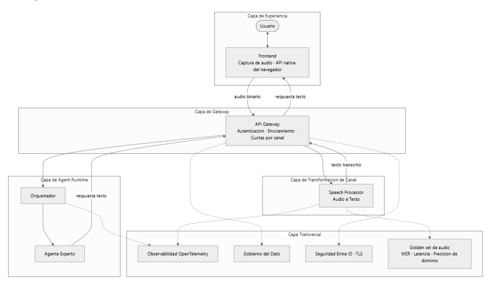
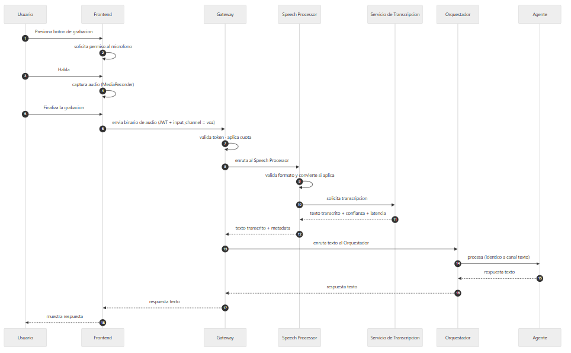

# Arquitectura de Referencia Voz V1.0

# Documentos relacionados

| Documento | Relación |
| --- | --- |
| Arquitectura de Referencia Multimodal V1.0 | Diseño general del que este documento es una especialización para el canal de voz |
| Arquitectura de Referencia Multiagente V1.0 | Diseño de coordinación entre agentes sobre el mismo Agent Runtime. |

Tabla de contenido

- [Control de versiones](#)
- [Documentos relacionados](#)
- [Resumen ejecutivo](#)
- [1. Alcance del diseño](#)

    - [1.1 Cubre](#)
    - [1.2 Fuera de alcance](#)
- [2. Principio arquitectónico](#)
- [3. Capas arquitectónicas](#)
- [4. Arquitectura de referencia](#)
- [5. Componentes del diseño](#)

    - [5.1 Captura de audio](#)
    - [5.2 Speech Processor](#)
    - [5.3 Gateway](#)
    - [5.4 Agent Runtime](#)
- [6. Flujo end-to-end](#)
- [7. Componentes tecnológicos requeridos](#)

    - [7.1 Alternativas para el servicio de transcripción](#)
    - [7.2 Formato de audio soportado](#)
- [8. Integración con plataformas corporativas](#)
- [9. Gobierno y restricciones de uso](#)

    - [9.1 Gobierno del dato](#)
    - [9.2 Seguridad](#)
    - [9.3 Restricciones de uso](#)
- [10. Casos de uso habilitados](#)

    - [10.1 Casos donde aplica](#)
    - [10.2 Casos donde no aplica](#)
- [11. Calidad de la transcripción](#)
- [12. Observabilidad del canal de voz](#)
- [13. Consideraciones de calidad de servicio](#)
- [14. Correspondencia con la implementación actual](#)

    - [14.1 Componentes que soportan el diseño sin modificación](#)
    - [14.2 Componentes a evolucionar](#)
- [15. Glosario](#)

# Resumen ejecutivo

Esta arquitectura de referencia habilita agentes conversacionales por voz sobre la plataforma del proyecto. Define cómo se captura el audio, cómo se convierte a texto, cómo el agente lo procesa y cómo la respuesta llega al usuario. Constituye una especialización de la arquitectura multimodal para el canal de voz.

El principio arquitectónico es el mismo: la voz se transforma a texto antes de llegar al agente. El agente no requiere lógica específica para voz; recibe siempre texto.

La incorporación del canal se resuelve agregando la captura de audio en el frontend y el Speech Processor detrás del gateway. Los componentes de gateway, Agent Runtime, observabilidad y seguridad se preservan sin modificación estructural.

# 1. Alcance del diseño

## 1.1 Cubre

- Captura de audio en el frontend.
- Speech-to-Text para conversión a texto.
- Procesamiento por parte del agente.
- Respuesta al usuario en texto.
- Integración con plataformas corporativas donde aplique.
- Gobierno y restricciones de uso.

## 1.2 Fuera de alcance

- Respuesta del agente en voz sintetizada (Text-to-Speech). Se contempla como evolución posterior.
- Streaming de audio en tiempo real.
- Reconocimiento de voz en múltiples idiomas simultáneos.
- Análisis prosódico o emocional del audio.

# 2. Principio arquitectónico

> **Normalización del input en la capa de experiencia.**

La conversión de audio a texto ocurre antes de llegar al agente. El agente recibe siempre texto y no conoce que el input original provino de voz.

Este principio garantiza que el agente no cambia por incorporar el canal de voz, y que cualquier ajuste al proveedor de transcripción se resuelve en el Speech Processor sin impactar el resto de la arquitectura.

# 3. Capas arquitectónicas

| Capa | Responsabilidad |
| --- | --- |
| Capa de Experiencia | Captura del audio del usuario en el frontend |
| Capa de Gateway | Autenticación, enrutamiento y cuotas. Punto único de entrada |
| Capa de Transformación de Canal | Conversión de audio a texto detrás del gateway |
| Capa de Agent Runtime | Procesamiento del texto por el agente |
| Capa Transversal | Observabilidad, gobierno del dato, seguridad y calidad |

# 4. Arquitectura de referencia

# 5. Componentes del diseño

## 5.1 Captura de audio

Componente en el frontend responsable de grabar el audio del usuario usando la API nativa `MediaRecorder` del navegador.

**Responsabilidades:**

- Solicitar permiso al micrófono.
- Grabar el audio en formato soportado por el navegador.
- Enviar el blob de audio al gateway al finalizar la grabación.

No requiere librerías externas. Funciona en navegadores modernos con permisos otorgados.

## 5.2 Speech Processor

Componente backend responsable de transcribir el audio a texto. Se ubica detrás del gateway como componente independiente.

**Responsabilidades:**

- Recibir el binario de audio desde el gateway.
- Validar el formato de audio y aplicar conversión previa si el servicio de transcripción lo requiere (ver sección 7.2).
- Invocar el servicio de transcripción seleccionado.
- Retornar el texto transcrito junto con metadata: confianza, latencia y proveedor.
- Encapsular el detalle del proveedor de transcripción.

Esta ubicación aísla la capacidad del ciclo de vida del agente y permite su reutilización por otros clientes, como Teams, aplicaciones móviles o el canal telefónico.

## 5.3 Gateway

Punto único de entrada al backend. Sus responsabilidades para el canal de voz son:

- Validar el token JWT emitido por Entra ID.
- Aplicar cuotas por canal, considerando que la voz consume más tokens que el texto directo.
- Enrutar el flujo de audio hacia el Speech Processor.
- Enrutar el texto transcrito hacia el Agent Runtime.
- Enrutar la respuesta del agente de vuelta al frontend.
- Propagar la identidad del usuario en cada request hacia el Speech Processor y el agente.

## 5.4 Agent Runtime

Recibe siempre texto y no conoce que el input proviene de voz. La modalidad se registra en la metadata de la traza.

# 6. Flujo end-to-end

La respuesta del agente regresa al usuario a través del mismo gateway. El frontend no invoca al agente por separado: el gateway consolida el ciclo transcripción → procesamiento → respuesta.

# 7. Componentes tecnológicos requeridos

Stack aprobado para el canal de voz.

| Componente | Tecnología habilitada |
| --- | --- |
| Captura de audio | Angular con API `MediaRecorder` del navegador |
| Speech Processor | Componente backend en el runtime del proyecto |
| Servicio de transcripción | Ver sección 7.1 |
| Gateway | Azure APIM |
| Agent Runtime | Python + LangGraph |
| LLM Gateway | LLM Gateway del proyecto |
| Observabilidad | OpenTelemetry con Dynatrace |
| Seguridad | Microsoft Entra ID con JWT |
| Almacenamiento, si aplica | Azure Blob Storage con clasificación heredada |

## 7.1 Alternativas para el servicio de transcripción

| Opción | Descripción | Consideraciones |
| --- | --- | --- |
| **A. STT dedicado** | Servicio administrado como Azure Speech Service. Soporte nativo para español latinoamericano. Custom Speech para vocabulario del dominio. | Requiere provisionamiento. Facturación separada. Máxima madurez para producción escalada. |
| **B. Whisper vía LLM Gateway** | Reutiliza el gateway de modelos ya establecido. Facturación consolidada con el resto de invocaciones al LLM. | Latencia mayor que STT dedicado. Sin Custom Speech. |
| **C. Modelo multimodal nativo** | Procesa audio y texto en el mismo request. Elimina el paso separado de transcripción. | Disponibilidad regional variable. Sin transcripción intermedia auditable. |

La selección se determina con criterios objetivos: latencia end-to-end, costo por minuto, precisión sobre términos del dominio validada con golden set, cumplimiento con gobierno del dato y ciberseguridad, y consistencia con el stack de la plataforma.

La arquitectura absorbe cualquiera de las tres opciones sin cambios estructurales, dado que el Speech Processor encapsula al proveedor.

## 7.2 Formato de audio soportado

El navegador con `MediaRecorder` produce formatos que varían entre navegadores.

| Navegador | Formato por defecto |
| --- | --- |
| Chrome, Edge, Firefox | WebM con codec Opus |
| Safari en iOS y macOS | MP4 con codec AAC |

El Speech Processor debe cumplir una de las dos condiciones:

- Soportar directamente los formatos generados por los navegadores objetivo.
- Realizar conversión previa al formato requerido por el servicio de transcripción. WAV a 16 kHz mono es el formato más ampliamente compatible entre proveedores.

Este diseño delega la responsabilidad al Speech Processor y no la expone al frontend ni al agente. Si el proveedor seleccionado no soporta directamente WebM o MP4, la conversión se ejecuta como paso previo dentro del componente.

# 8. Integración con plataformas corporativas

El canal de voz puede integrarse con plataformas corporativas existentes en la organización cuando aplique.

| Plataforma | Modo de integración | Consideración |
| --- | --- | --- |
| Microsoft Teams (Bot Service) | El bot captura el audio del canal de Teams y lo envía al Speech Processor a través del gateway | Requiere provisionamiento del Bot Service y registro en Entra ID |
| Aplicación móvil corporativa | Uso de SDK del proveedor STT en el dispositivo, o envío del audio al backend | Depende de las capacidades del stack móvil |
| Canal telefónico (IVR) | Integración con el gateway telefónico corporativo. El audio se transmite al Speech Processor | Requiere validación de latencia adicional y calidad del audio |
| SPA web propia | Captura con `MediaRecorder` y envío al gateway | Escenario base del diseño |

En todos los casos el Speech Processor centraliza la transcripción. Las plataformas corporativas son consumidores del mismo componente backend.

# 9. Gobierno y restricciones de uso

## 9.1 Gobierno del dato

| Elemento | Tratamiento |
| --- | --- |
| **Transcripción** | Hereda la clasificación de la evaluación a la que pertenece |
| **Binario de audio** | Por defecto no se persiste. Si el negocio o la regulación exigen auditoría del audio original, aplica el modelo de gobierno de archivos del proyecto con clasificación, ACL heredada y política de retención |
| **Retención mínima operativa** | El binario se conserva solo durante el procesamiento y un período corto adicional para auditar el evento en caso de disputa |

## 9.2 Seguridad

- Transmisión del audio siempre por TLS.
- La autenticación por Entra ID con JWT aplica igual al canal de voz que al canal de texto.
- El texto transcrito pasa por sanitización previa al contexto del modelo, como protección contra prompt injection.
- El acceso al binario de audio se limita al Speech Processor mediante identidad administrada.

## 9.3 Restricciones de uso

- El agente responde en texto. La respuesta por voz no está en alcance de este diseño.
- La transcripción se ejecuta por lote al finalizar la grabación. No hay streaming en tiempo real.
- El diseño contempla un idioma por sesión, con español latinoamericano como configuración inicial.
- La calidad de la transcripción depende del entorno del usuario: micrófono y ruido ambiente.
- Los canales que consumen más tokens tienen cuotas específicas por usuario y por sesión.
- No se admite audio con contenido que pertenezca a categorías de datos restringidos definidas por el equipo de gobierno del dato.

# 10. Casos de uso habilitados

## 10.1 Casos donde aplica

- Escenarios de accesibilidad donde la escritura no es la modalidad preferente para el usuario.
- Tareas de campo donde el usuario tiene las manos ocupadas y necesita interactuar con el agente por voz.
- Reducción de fricción en flujos repetitivos donde escribir contexto extenso resulta costoso.
- Integración con canales corporativos como Teams para consultas rápidas al agente.
- Escenarios donde se requiere registrar y analizar el contenido de reuniones o entrevistas cortas.

## 10.2 Casos donde no aplica

- Procesos batch sin intervención humana en el punto de entrada.
- Escenarios con volumen que exija streaming en tiempo real.
- Casos que exigen respuesta del agente en voz sintetizada.
- Contextos con ruido ambiente extremo donde la calidad de transcripción cae por debajo del umbral operativo.
- Escenarios con requisitos regulatorios de biometría de voz, no cubiertos por este diseño.

# 11. Calidad de la transcripción

La calidad se evalúa siguiendo la metodología de gobierno de evals del proyecto.

| Componente de la evaluación | Definición |
| --- | --- |
| **Golden set de audio** | Conjunto de grabaciones representativas con transcripción esperada, construido con casos del dominio |
| **Métrica principal** | Word Error Rate sobre el golden set |
| **Métrica de dominio** | Precisión sobre términos técnicos específicos |
| **Métrica operativa** | Latencia end-to-end desde el fin de la grabación hasta que el texto está disponible |
| **Confianza reportada** | Cada transcripción incluye un score de confianza que el sistema puede usar para decidir si mostrar la transcripción al usuario para confirmación |

Las metas cuantitativas se establecen tras la primera ejecución con datos reales, siguiendo el esquema de gobierno usado para los evals del agente.

# 12. Observabilidad del canal de voz

Metadata registrada en la traza:

| Campo | Descripción |
| --- | --- |
| `input_channel` | Valor fijo `voz` para este canal |
| `transcription_latency_ms` | Latencia de la transcripción end-to-end |
| `transcription_confidence` | Score de confianza retornado por el proveedor |
| `stt_provider` | Identificador del proveedor de transcripción usado |
| `audio_duration_seconds` | Duración de la grabación |

El modelo de observabilidad estructurada del proyecto se conserva. Se incorpora únicamente la metadata anterior.

# 13. Consideraciones de calidad de servicio

| Consideración | Definición |
| --- | --- |
| **Fallback controlado** | Si la transcripción falla, el usuario puede escribir manualmente lo que quiso decir. La evaluación no se bloquea |
| **Reintentos** | El Speech Processor aplica reintentos con backoff exponencial ante fallos transitorios del proveedor |
| **Ciclo de confirmación** | Si la confianza reportada está por debajo del umbral definido, la transcripción se muestra al usuario para validación antes de enviarla al agente. Esta capacidad se planifica en iteraciones posteriores del canal |
| **Cuotas** | El gateway aplica límites por usuario y por sesión para evitar consumo desbalanceado |

# 14. Correspondencia con la implementación actual

Relación entre los componentes definidos en este diseño y el estado de la implementación, con el grado de cambio requerido en cada caso.

## 14.1 Componentes que soportan el diseño sin modificación

| Componente del diseño | Estado en la implementación | Rol en la arquitectura de voz |
| --- | --- | --- |
| Frontend | Angular funcional con captura de archivos operativa | Se amplía con captura de audio usando `MediaRecorder`, siguiendo el mismo patrón de captura |
| Gateway API | Azure APIM en operación | Punto único de entrada para el binario de audio y la respuesta al usuario |
| Agent Runtime | Orquestador y Agente Experto con LLM real | No cambia. Recibe siempre texto |
| Observabilidad | OpenTelemetry cableado con contexto estructurado | Se extiende con la metadata de voz descrita en la sección 12 |
| Gobierno del dato | Governance API construida en modalidad standalone | Se conecta cuando se requiera persistencia auditable del audio |
| Seguridad | Entra ID con JWT en frontend y backend | Aplica igual al canal de voz sin modificaciones |

## 14.2 Componentes a evolucionar

| Componente | Evolución requerida | Grado de cambio |
| --- | --- | --- |
| Captura de audio | Se agrega al frontend usando la API nativa `MediaRecorder` | Extensión sobre el frontend existente |
| Speech Processor | Componente backend nuevo detrás del gateway. Encapsula al proveedor de transcripción y aplica la conversión de formato descrita en la sección 7.2 | Componente nuevo |
| Selección del servicio de transcripción | Evaluar las tres alternativas de la sección 7.1 con los criterios objetivos definidos y formalizar la decisión | Decisión técnica pendiente |
| APIM | Nuevas rutas para el binario de audio y para el texto transcrito hacia el agente, con cuotas específicas por canal | Configuración incremental |
| Modelo de traza | Se incorporan `input_channel`, `transcription_latency_ms`, `transcription_confidence`, `stt_provider` y `audio_duration_seconds` | Extensión del modelo existente |
| Golden set de audio | Construir el conjunto de grabaciones de referencia y establecer el umbral de Word Error Rate según la sección 11 | Actividad nueva de gobierno de calidad |

# 15. Glosario

| Término | Definición |
| --- | --- |
| **ACL** | Access Control List. Lista de control de acceso que determina qué roles pueden consultar un recurso. |
| **APIM** | Azure API Management. Servicio de gateway de APIs utilizado como punto único de entrada. |
| **Golden set** | Conjunto de casos de referencia con resultado esperado, usado para medir la calidad de un componente. |
| **IVR** | Interactive Voice Response. Sistema de respuesta de voz interactiva en canales telefónicos. |
| **JWT** | JSON Web Token. Formato de token utilizado para transportar la identidad autenticada del usuario. |
| **MediaRecorder** | API nativa del navegador para la captura de audio y video. |
| **Prompt injection** | Técnica de ataque que inserta instrucciones maliciosas en el contenido que consume un modelo de lenguaje. |
| **STT** | Speech-to-Text. Conversión de audio a texto. |
| **TLS** | Transport Layer Security. Protocolo de cifrado en tránsito. |
| **TTS** | Text-to-Speech. Síntesis de voz a partir de texto. Fuera del alcance de este diseño. |
| **WER** | Word Error Rate. Métrica de calidad de transcripción basada en la tasa de palabras erróneas. |
