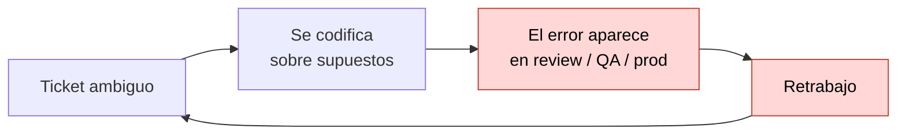
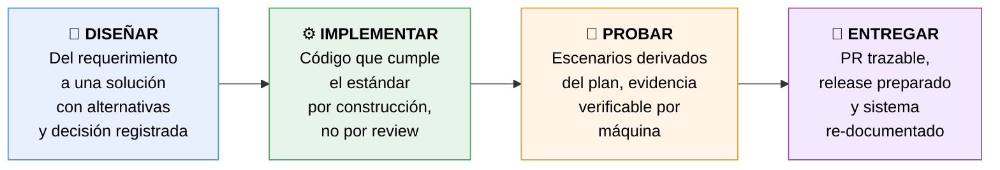
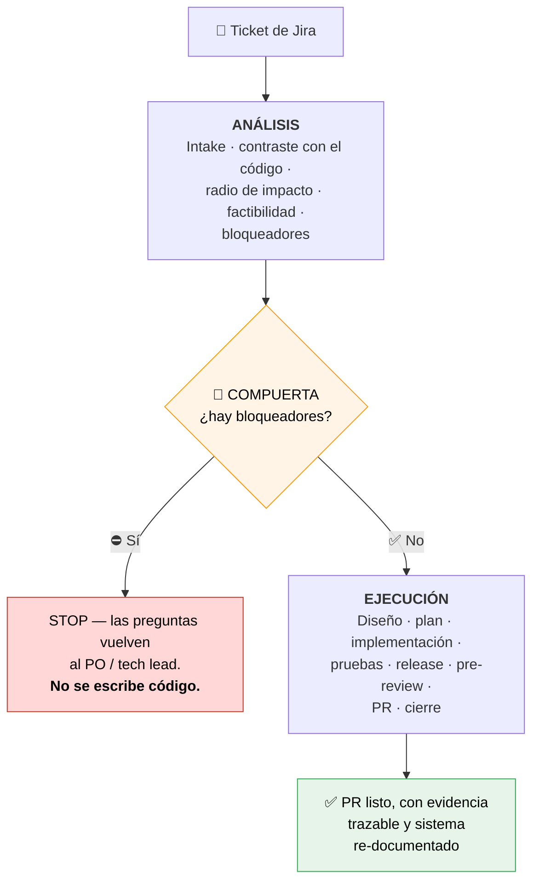
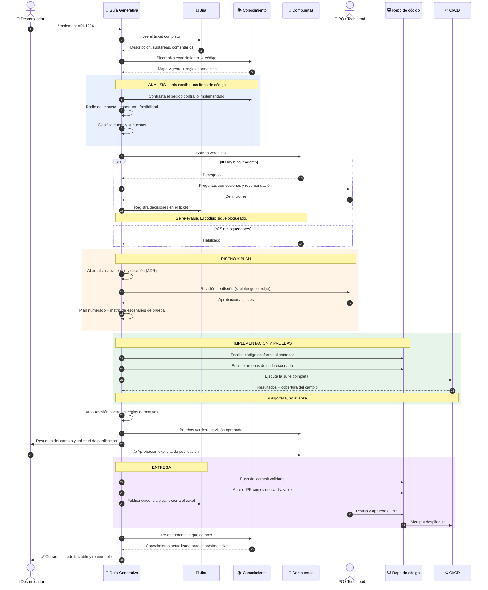
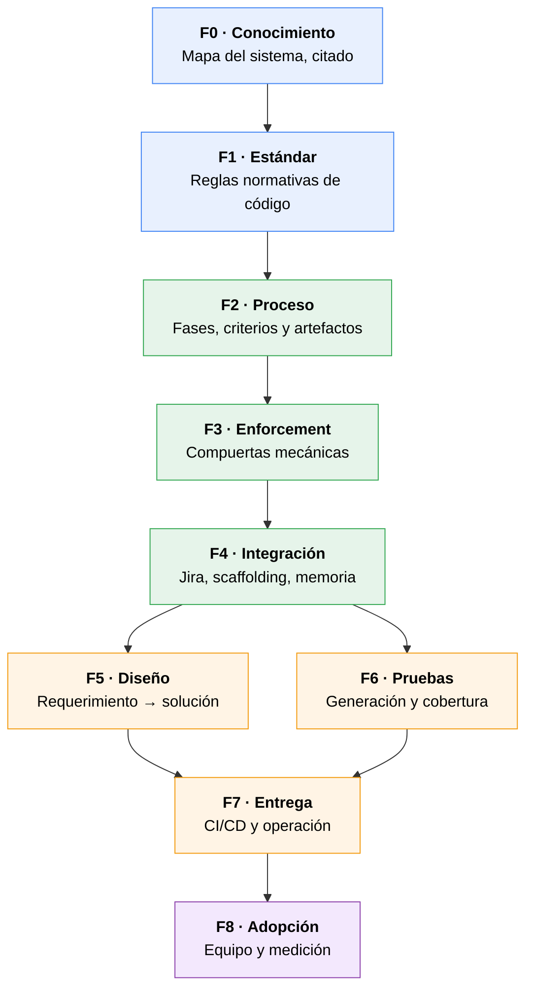
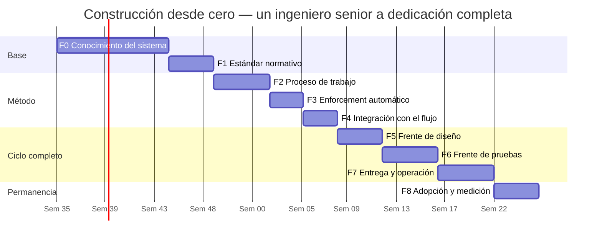

# Guía Generativa de Desarrollo — Generic API
### Propuesta de negocio · qué queremos lograr, en qué orden y cuánto cuesta

> **En una frase:** convertir el conocimiento de cómo se **diseña, implementa, prueba y entrega**
> software en el **Generic API** en un *proceso ejecutable por IA* — verificable, auditable y
> repetible — de modo que la calidad no dependa de quién tome el ticket.

**Estado:** borrador v0.2 · para iterar
**Fecha:** agosto 2026

---

## 1. Resumen ejecutivo

| | |
|---|---|
| **Qué queremos lograr** | Que un ticket de Jira pueda recorrer todo el ciclo — análisis, diseño, implementación, pruebas y entrega — asistido por IA, con evidencia citada en cada paso y con compuertas que **impiden** avanzar si falta algo. |
| **Por qué** | Hoy el costo del error se paga tarde (en review, QA o producción), el conocimiento del sistema vive en pocas cabezas y el estándar técnico se aplica a mano, PR por PR. |
| **Cómo** | 9 fases en orden de dependencia: primero el **conocimiento**, luego el **estándar**, luego el **proceso**, luego la **automatización**, y sobre esa base se cierran diseño, pruebas y entrega. |
| **Cuánto** | **≈43 semanas-persona (~10 meses-persona)** para un ingeniero senior construyéndolo desde cero. Con equipo y paralelización, ≈5–6 meses calendario. |
| **Decisión pedida** | Aprobar el alcance y el orden, y asignar un **dueño del proceso**. |

---

## 2. El problema que resolvemos

1. **El alcance se descubre codificando.** Las preguntas que debieron hacerse antes se hacen
   después, cuando cambiar cuesta mucho más.
2. **El conocimiento del sistema no está escrito.** Depende de personas; el onboarding es lento y
   el impacto de un cambio se estima "de memoria".
3. **El estándar técnico se aplica en el review, a mano.** Las mismas observaciones se repiten PR
   tras PR porque nadie las verifica antes.

> **Principio rector:** el costo de corregir un error se multiplica ~10× por cada fase que avanza.
> Todo el diseño de esta guía existe para mover el hallazgo a las fases tempranas, donde corregir
> cuesta una conversación.

---

## 3. Qué queremos lograr

Cuatro capacidades, una sola guía:

**Cómo se ve el día a día cuando esté listo:** el desarrollador abre una sesión y ejecuta un solo
comando — `/implement API-1234`. A partir de ahí:

Tres reglas que hacen que esto sea confiable y no una promesa:

- **Evidencia primero.** Toda afirmación va citada contra el código. Lo que no se sabe se escribe
  como `unknown`, nunca se inventa. La ambigüedad es una pregunta bloqueante, no una decisión
  unilateral.
- **Las compuertas son mecánicas.** No dependen de disciplina: si falta un artefacto, la escritura
  de código o el `push` quedan **denegados**.
- **Lo humano se marca como humano.** El agente nunca declara hecho un paso que le corresponde a
  una persona; lo entrega y lo dice.

---

## 4. El flujo de trabajo completo, paso a paso

Así queda la secuencia real desde que existe un ticket hasta que el sistema queda re-documentado.
Nótese quién actúa en cada momento: **la persona decide, la guía ejecuta y evidencia.**

### Lo que este flujo garantiza

| Momento | Garantía |
|---|---|
| Antes de codificar | Nadie escribe código sobre supuestos: la ambigüedad se devuelve como pregunta, no se resuelve sola. |
| Durante | El estándar se cumple por construcción; el plan y las pruebas están numerados y trazados entre sí. |
| Antes de publicar | Suite verde, revisión aprobada y **firma humana explícita**. Ninguna de las tres es opcional. |
| Al cerrar | El conocimiento se actualiza solo, así que el próximo ticket parte de un mapa vigente. |
| En cualquier punto | El trabajo está versionado: se retoma desde cualquier máquina, sin perder contexto. |

---

## 5. Las fases, y por qué en ese orden

El orden no es una preferencia: **cada fase es insumo de la siguiente.** Construir la
automatización antes que el proceso, o el proceso antes que el conocimiento, produce trabajo que
hay que rehacer.

| Bloque | Fases | Pregunta que responde |
|---|---|---|
| 🔵 **Base** | F0, F1 | *¿Qué es este sistema y cómo se escribe código en él?* |
| 🟢 **Método** | F2, F3, F4 | *¿Cómo se trabaja, y cómo se garantiza que se trabaje así?* |
| 🟠 **Ciclo completo** | F5, F6, F7 | *¿Cómo cerramos diseño, pruebas y entrega?* |
| 🟣 **Permanencia** | F8 | *¿Cómo evitamos que se apague en seis semanas?* |

---

## 6. Detalle de cada fase y estimación humana

> **Base de la estimación:** un ingeniero senior familiarizado con el dominio, trabajando **desde
> cero**, a dedicación completa. Son estimaciones de orden de magnitud para dimensionar la
> iniciativa — se afinan al arrancar.

### 🔵 F0 · Base de conocimiento del sistema — **≈10 semanas**

**Objetivo:** que el API deje de ser una caja negra. Un mapa funcional y técnico donde cada
afirmación está citada contra el código y lo desconocido está marcado como desconocido.
**Entregables:** catálogo de conceptos de negocio · mapa de integraciones externas · arquitectura y
patrones · mapa de dependencias entre módulos · catálogo de códigos de error · mecanismo de
sincronización docs ↔ código.
**Por qué primero:** todo lo demás razona sobre esto. Un proceso excelente sobre conocimiento
inexistente produce planes equivocados con mucha ceremonia.
**Por qué cuesta:** es leer un sistema grande, con integraciones a terceros, y escribir solo lo que
el código prueba. La disciplina de citar es lo que consume el tiempo — y lo que da el valor.

### 🔵 F1 · Estándar normativo de implementación — **≈4 semanas**

**Objetivo:** que "cómo se escribe código aquí" sea un conjunto de reglas explícitas y numeradas,
no criterio de quien revisa.
**Entregables:** reglas normativas de estilo, arquitectura, robustez y proceso, extraídas del
histórico real de revisiones de PR · convenciones y patrones documentados.
**Por qué aquí:** es la vara con la que se implementa (F2) y con la que se revisa (F3). Definirla
después obliga a rehacer planes y revisiones.

### 🟢 F2 · Proceso de trabajo — **≈5 semanas**

**Objetivo:** que un ticket siempre recorra los mismos pasos, con criterio de salida explícito en
cada uno y artefactos de nombre fijo.
**Entregables:** las fases del ciclo con su criterio de salida · plantillas de cada artefacto ·
taxonomía de hallazgos y severidades · trazabilidad numerada plan ↔ pruebas · escalamiento del
rigor según riesgo (trivial / normal / riesgoso) · rutas especiales (hotfix).
**Por qué aquí:** es el diseño de lo que después se automatiza. Automatizar un proceso no diseñado
es codificar el caos.

### 🟢 F3 · Enforcement automático — **≈3 semanas**

**Objetivo:** que las compuertas no dependan de la buena voluntad.
**Entregables:** guardianes que **deniegan** escribir código sin el análisis aprobado, y `push`/PR
sin pruebas verdes, revisión aprobada y **aprobación explícita de una persona** · anclaje de la
aprobación al commit validado · protección de las firmas humanas · suite de pruebas del propio
enforcement.
**Por qué aquí:** sin esto, bajo presión de entrega el proceso se salta. Con esto, no se puede.

### 🟢 F4 · Integración con el flujo real de trabajo — **≈3 semanas**

**Objetivo:** cero fricción de arranque. Un comando, y el resto ocurre.
**Entregables:** puente con Jira (lectura automática del ticket; escritura siempre detrás de
aprobación) · scaffolding del espacio de trabajo por ticket · progreso versionado y **reanudable**
desde cualquier máquina · índice de trabajos por clave de ticket · trabajo en paralelo de varios
tickets sin interferencia.
**Por qué aquí:** determina si el equipo lo usa o lo evade. Un proceso correcto con arranque
costoso no se adopta.

### 🟠 F5 · Frente de diseño — **≈4 semanas**

**Objetivo:** cubrir el tramo anterior al ticket ya definido: del requerimiento de negocio a una
solución diseñada, con alternativas evaluadas y decisión registrada.
**Entregables:** fase de diseño dentro del proceso · plantilla de decisión de arquitectura (ADR) ·
catálogo vivo de decisiones · criterio de cuándo un cambio exige revisión de diseño.
**Beneficio:** las decisiones dejan de repetirse y de discutirse dos veces.

### 🟠 F6 · Frente de pruebas — **≈5 semanas**

**Objetivo:** que la evidencia de calidad sea un resultado verificable por máquina, no un texto.
**Entregables:** generación asistida de pruebas desde la matriz de escenarios del plan · medición
de cobertura sobre lo efectivamente modificado · integración con QA · criterios de aceptación
funcional trazados al ticket.
**Beneficio:** menos defectos escapados, y la prueba deja de ser lo primero que se sacrifica.

### 🟠 F7 · Frente de entrega y operación — **≈5 semanas**

**Objetivo:** cerrar el ciclo hasta producción.
**Entregables:** compuertas conectadas al pipeline de CI/CD · *runbook* de release y plan de
rollback generados · listas de configuración y *feature flags* con ticket de limpieza · señales de
observabilidad como parte del cambio, no como tarea aparte · re-documentación automática del
sistema al cerrar el ticket.
**Beneficio:** el conocimiento (F0) se mantiene vivo solo, en vez de degradarse.

### 🟣 F8 · Adopción, formación y medición — **≈4 semanas** *(+ recurrente)*

**Objetivo:** pasar de "funciona con quien lo construyó" a "así trabaja el equipo".
**Entregables:** secuencia de adopción por etapas (plantilla de PR → Definition of Ready/Done →
matriz de impacto obligatoria → revisión de diseño → checklists → runbooks) · formación del equipo
· tablero de indicadores · retro mensual del proceso · **dueño del proceso designado**.
**Por qué al final y por qué es obligatoria:** sin dueño y sin medición, cualquier proceso se apaga
en semanas. Esta fase es la que protege toda la inversión anterior.

---

## 7. Cronograma y esfuerzo total

| Fase | Semanas-persona | Acumulado |
|---|---:|---:|
| F0 · Conocimiento del sistema | 10 | 10 |
| F1 · Estándar normativo | 4 | 14 |
| F2 · Proceso de trabajo | 5 | 19 |
| F3 · Enforcement automático | 3 | 22 |
| F4 · Integración con el flujo | 3 | 25 |
| F5 · Frente de diseño | 4 | 29 |
| F6 · Frente de pruebas | 5 | 34 |
| F7 · Entrega y operación | 5 | 39 |
| F8 · Adopción y medición | 4 | **43** |

**Total: ≈43 semanas-persona ≈ 10 meses-persona.**

**Compresión posible.** El camino crítico es F0 → F1 → F2 → F3 → F4. A partir de ahí, F5 y F6
pueden ir en paralelo, y F8 puede arrancar apenas F4 esté estable. Con **2–3 personas**, el
calendario baja a **≈5–6 meses**.

> Estas cifras dimensionan el **esfuerzo humano equivalente** de construir la guía desde cero. Son
> la referencia contra la cual se compara cualquier alternativa de ejecución.

---

## 8. Cómo mediremos que funcionó

| Indicador | Meta | Cómo se mide |
|---|---|---|
| Retrabajo por alcance mal entendido | ↓ 50% | Tickets reabiertos / cambios de alcance después del plan |
| Defectos escapados a producción | ↓ 40% | Incidentes con causa evitable |
| Tiempo de ciclo por ticket | ↓ 30% | Jira: "In progress" → "Done" |
| Tiempo hasta el primer review | ↓ 50% | PR abierto → primer comentario |
| Observaciones repetidas en PR | ↓ 70% | Hallazgos bloqueantes por PR |
| Onboarding hasta productividad | Meses → semanas | Primer PR mergeado de un nuevo integrante |

**La línea base se levanta antes de F0.** Sin ella no hay forma de demostrar el retorno.

**Regla:** se mide el **efecto**, no el cumplimiento. Si el proceso no mueve estos números, se
ajusta o se poda.

**Beneficios no numéricos, igual de reales:** el conocimiento deja de ser tácito · cada línea de
código se remonta a un plan, un análisis y un ticket · se reduce la dependencia de personas clave.

---

## 9. De qué depende

| Dependencia | Quién | Criticidad | Si no se cumple |
|---|---|---|---|
| Acceso al repositorio de código y a Jira | Cliente / DevOps | 🔴 Alta | El ciclo opera en modo manual, con fricción alta |
| **Dueño del proceso** designado, con tiempo real asignado | Dirección | 🔴 Alta | La guía se degrada en semanas (F8) |
| Disponibilidad de PO / tech lead para responder preguntas bloqueantes | Negocio | 🔴 Alta | Las compuertas detienen tickets — es el comportamiento correcto, pero frena el flujo |
| Acceso al histórico de revisiones de PR | Cliente | 🟡 Media | F1 se construye por criterio y no por evidencia |
| Suite de pruebas ejecutable local y en CI | Equipo | 🟡 Media | Bloquea F6 y F7 |
| Tickets con Definition of Ready mínima | Equipo | 🟡 Media | Más ciclos en la etapa de análisis |
| Licencias / cupo de uso de IA para el equipo | Dirección | 🟡 Media | Limita el escalamiento en F8 |
| Ventana de formación (≈4 h por persona) | Equipo | 🟢 Baja | Adopción más lenta |

---

## 10. Riesgos y mitigación

| Riesgo | Mitigación |
|---|---|
| **Se percibe como burocracia** y el equipo lo rechaza | El rigor escala al riesgo: un cambio trivial no lleva ADR ni runbook. Adopción por etapas (F8), no "todo el lunes". |
| **El conocimiento queda obsoleto** y la IA razona sobre datos viejos | Sincronización obligatoria y verificada; F7 hace que cada cierre re-documente el sistema. |
| **El agente afirma lo que no sabe** | Regla no negociable de evidencia: todo citado contra el código; lo desconocido marcado; la ambigüedad es pregunta bloqueante. |
| **Se salta una compuerta** por presión de entrega | Las compuertas deniegan la operación (F3). No dependen de disciplina. |
| **Depende de una sola persona** | F8: formación, dueño del proceso y retro mensual. Todo versionado y visible para el equipo. |
| **El enforcement genera falsos positivos** y frena el trabajo | Calibración con tickets reales antes de escalar al equipo completo. |
| **F0 se desborda** (el sistema es más grande de lo estimado) | Se prioriza por módulos de mayor tránsito; el resto se documenta bajo demanda, marcando explícitamente lo no cubierto. |

---

## 11. Próximos pasos

1. **Validar el alcance y el orden** de las 9 fases *(esta semana)*.
2. **Designar el dueño del proceso** — sin dueño, no arranca.
3. **Levantar la línea base** de los seis indicadores de la sección 8.
4. **Definir el modelo de ejecución** — equipo, dedicación y calendario objetivo.
5. **Arrancar F0.**

---

Documento vivo. Alcance de fases, indicadores y estimaciones se afinan con el equipo antes de
comprometer fechas.
